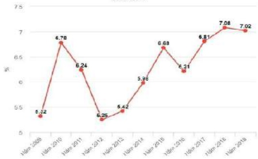
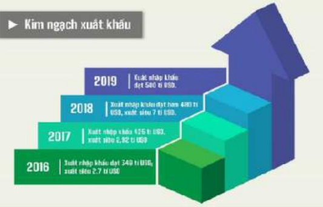
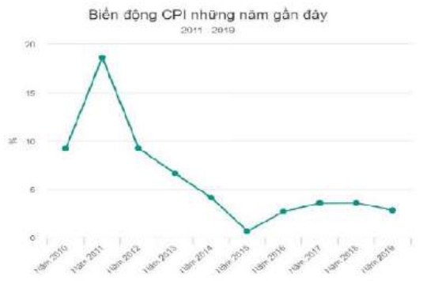
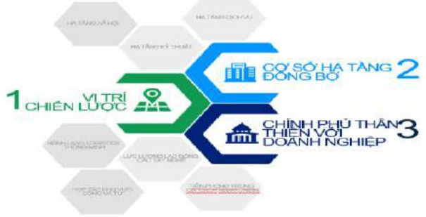
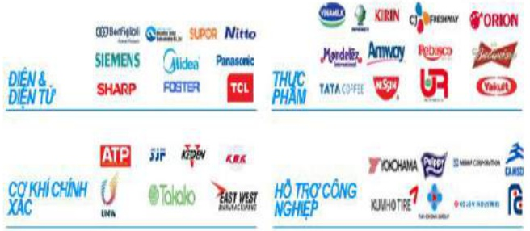

Tăng trưởng GDP 10 năm gần đây 2009 - 2019

Kim ngạch xuất khẩu

##### Báo cáo thường niên 2019

## IV. Báo cáo của Hội đồng quản trị

Năm 2019 Tổng công ty Becamex IDC bước vào năm thứ 2 hoạt động dưới hình thức công ty cổ phần. Tình hình kinh tế trong nước với những kết quả khả quan như: Tổng sản phẩm trong nước (GDP) đạt kết quả ấn tượng, với tổc độ tăng 7,02%, vượt mục tiêu của Quốc hội để ra từ 6,6-6,8%. Cơ cấu kinh tế năm 2019 cũng có những chuyển biến tích cực với tỉ trọng khu vực nông, lâm nghiệp và thủy sản giảm xuống 13,96% GDP, so với mức 14,68% của năm 2018.

Tỉ trọng khu vực công nghiệp và xây dựng chiếm 34,49%; khu vực dịch vụ chiếm 41,64%.

Chỉ số giá tiêu dùng (CPI) tháng 12.2019 tăng 1,4% so với tháng trước, mức tăng cao nhất trong 9 năm qua. Trong đó nhóm hàng ăn và dịch vụ ăn uống tăng cao nhất 3,42%. Trong khi đó, chỉ số làm phát khoảng 2,79%, thấp hơn nhiều so với tăng trưởng, giúp cho tăng trưởng càng thêm có ý nghĩa.

Với chỉ số này, làm phát năm 2019 thấp nhất trong 3 năm gần đây (2018 là 3,54% và năm 2017 là 3,53%)

Tốc độ phát triển kinh tế tại tỉnh Bình Dương trong những năm gần đây không ngừng tăng trưởng, sự đồng bộ thống nhất giữa vị trí địa lý, cơ sở hạ tầng đồng bộ và chính sách ưu đãi của chính quyền đã tạo ra môi trường đầu tư thân thiện, thu hút các đối tác có tầm cỡ trên thế giới. Những năm gần đây, Bình Dương luôn nằm trong danh sách những tỉnh, thành phố có thu hút FDI lớn nhất trong cả nước.

