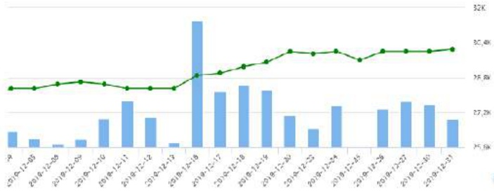

Tổng công ty Becamex IDC đã tận dụng sự tăng trưởng chung của nền kinh tế trong nước, thế mạnh của tinh nhà để đảm bảo và đảy mạnh hoạt động kinh doanh của Tổng công ty. Kết quả đạt được như sau:

<table border=1 style='margin: auto; word-wrap: break-word;'><tr><td style='text-align: center; word-wrap: break-word;'>10.087 tỷ đồng Tổng doanh thu hợp nhất tăng 12% so với kế hoạch năm 2019.</td></tr><tr><td style='text-align: center; word-wrap: break-word;'>6.069 tỷ đồng Tổng doanh thu tổng hợp tăng 6% so với kế hoạch năm 2019.</td></tr><tr><td style='text-align: center; word-wrap: break-word;'>7.106 tỷ đồng Tổng chi phí hợp nhất tăng 16% so với kế hoạch năm 2019.</td></tr><tr><td style='text-align: center; word-wrap: break-word;'>4.146 tỷ đồng Tổng chi phí tổng hợp tăng 8% so với kế hoạch năm 2019.</td></tr><tr><td style='text-align: center; word-wrap: break-word;'>2.631 tỷ đồng Lợi nhuận sau thuế hợp nhất đạt 100,6% kế hoạch năm 2019.</td></tr><tr><td style='text-align: center; word-wrap: break-word;'>1.704 tỷ đồng Lợi nhuận sau thuế tổng hợp đạt kế hoạch năm 2019.</td></tr></table>

Về tình hình giao dịch cổ phiếu: hiện tại khối lượng giao dịch cổ phiếu thực tế bên ngoài thì trường của BCM không nhiều khoảng 5% khối lượng cổ phiếu đang lưu hành. Tuy nhiên tiềm năng phát triển được kỳ vọng trong tương lai khi mà cổ phiếu được niêm yết trên Hose và tỷ lệ nắm giữ của nhà nước giảm theo lộ trình.

Giá đóng cửa cao nhất: 34.755 VNĐ

Giá đóng cửa thấp nhất: 21.030 VNĐ

KLGD/ngày: 57.184 CP

KLGD nhiều nhất: 615.935 CP