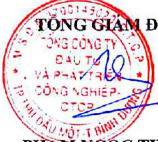

Lương, thưởng, thù lao, các khoản lợi ích:

+ Thu nhập của các thành viên chuyên trách chỉ có lương với tổng tiền lương trong năm là 13.453.524.700 VND.

+ Thu nhập của các thành viên không chuyên trách: 511.944.000 đồng

b) Giao dịch cổ phiếu của cổ động nội bộ: Không có

C) Hợp đồng hoặc giao dịch với cổ đồng nội bộ: Thể hiện tại phần V2.c thuyết minh báo cáo tài chính hợp nhất 2019 đã kiểm toán.

d) Việc thực hiện các quy định về quản trị công ty: Hội đồng quản trị, Ban kiểm soát, Ban Tổng giảm đốc tham gia đầy đủ các buổi tập huấn do Uỷ ban chứng khoản Nhà nước và Sở giao dịch chứng khoản tổ chức nhằm cấp nhất các chính sách pháp luật mới áp dụng cho công ty đại chúng.

XÁC NHẬN CỦA ĐẠI DIỆN THEO PHÁP LUẬT

CỦA TỔNG CÔNG TY

TỔNG GIẢM ĐỐC

PHẠM NGỘC THUẬN