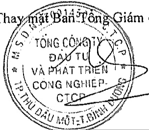
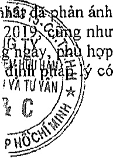

##### Trách nhiệm của Ban Tổng Giám đốc

Ban Tổng Giám độc chịu trách nhiệm lập Báo cáo tài chính hợp nhất phần ánh trung thực và hợp lý tình hình tài chính hợp nhất, kết quả hoạt động kinh doanh hợp nhất và lưu chuyển tiền tệ hợp nhất của Tập đoàn trong năm. Trong việc lập Báo cáo tài chính hợp nhất này, Ban Tổng Giám độc phải:

Chọn lựa các chính sách kế toán thích hợp và áp dụng các chính sách này một cách nhất quán;

Thực hiện các xét đoán và các ước tính một cách hợp lý và thận trọng;

Nêu rõ các chuẩn mực kế toán áp dụng cho Tập đoàn có được tuân thủ hay không và tất cả các sai lệch trọng yếu đã được trình bày và giải thích trong Báo cáo tài chính hợp nhất;

Lập Báo cáo tài chính hợp nhất trên cơ sở hoạt động liên tục trừ trường hợp không thể cho rằng Tập đoàn sẽ tiếp tục hoạt động liên tục;

Thiết lập và thực hiện hệ thống kiểm soát nội bộ một cách hữu hiệu nhằm hạn chế rủi ro có sai sót trọng yếu do gian lận hoặc nhằm lẫn trong việc lập và trình bày Báo cáo tài chính hợp nhất.

Ban Tổng Giám độc đảm bảo các sở kế toán thích hợp được lưu giữ đầy đủ để phản ánh tình hình tài chính của Tập đoàn với mức độ chính xác hợp lý tại bất kỳ thời điểm nào và các sở sách kế toán tuân thủ chế độ kế toán áp dụng. Ban Tổng Giám độc cũng chịu trách nhiệm quản lý các tài sản của Tập đoàn và do đó đã thực hiện các biện pháp thích hợp để ngăn chặn và phát hiện các hành vi gian lận và các vi phạm khác.

Ban Tổng Giám đốc cam kết đã tuân thủ các yêu cầu nêu trên trong việc lập Báo cáo tài chính hợp nhất.

##### Phê duyệt Báo cáo tài chính

Ban Tổng Giám độc phê duyệt Báo cáo tài chính hợp nhất định kèm. Báo cáo tài chính hợp nhất định ánh trung thực và hợp lý tính hình tài chính của Tập đoàn tại thời điểm ngày 31 tháng 12 năm 2019, cùng như kết quả hoạt động kinh doanh và tính hình lưu chuyển tiền tệ của năm tài chính kết thúc cùng ngày, như hợp với các Chuẩn mực Kế toán Việt Nam, Chế độ Kế toán doanh nghiệp Việt Nam và các quy định phụ ấy có liên quan đến việc lập và trình bày Báo cáo tài chính hợp nhất.

Thay mặt Bản Tổng Giám đốc

Phạm Ngọc Thuận

Tổng Giám đốc

Ngày 31 tháng 3 năm 2020

