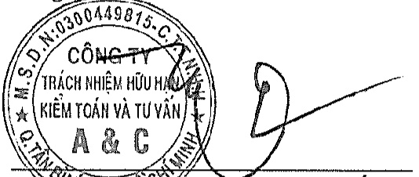

##### Kết luận của Kiểm toán viên

Theo ý kiến của chúng tôi, Báo cáo tài chính hợp nhất đã phân ánh trung thực và hợp lý, trên các khía cạnh trọng yếu tinh hình tài chính hợp nhất của Tập đoàn tại ngày 31 tháng 12 năm 2019, cũng như kết quả hoạt động kinh doanh hợp nhất và tình hình lưu chuyển tiền tệ hợp nhất cho năm tài chính kết thúc cùng ngày, phù hợp với các Chuẩn mực Kế toán Việt Nam, Chế độ Kế toán doanh nghiệp Việt Nam và các quy định pháp lý có liên quan đến việc lập và trình bày Báo cáo tài chính hợp nhất.

Công ty TNHH Kiểm toán và Tư vấn A&C

Lý Số CỨC TƯỢNG - Phó Tổng Giám đốc Số Giấy CNDKHẤN kiểm toán: 0099-2018-008-1

TP. Hồ Chí Minh, ngày 31 tháng 3 năm 2020

Đỗ Thị Mai Loan - Kiểm toán viên

Số Giấy CNDKHN kiểm toán: 0090-2018-008-1