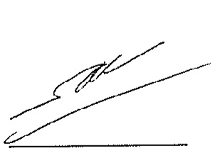
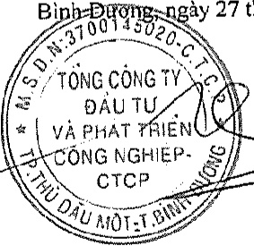

<table border=1 style='margin: auto; word-wrap: break-word;'><tr><td style='text-align: center; word-wrap: break-word;'>CHỈ TIÊU</td><td style='text-align: center; word-wrap: break-word;'>Mã số</td><td style='text-align: center; word-wrap: break-word;'>Thuyết minh</td><td style='text-align: center; word-wrap: break-word;'>Số cuối năm</td><td style='text-align: center; word-wrap: break-word;'>Số đầu năm</td></tr><tr><td style='text-align: center; word-wrap: break-word;'>D - VÓN CHỮ SỞ HỮU</td><td style='text-align: center; word-wrap: break-word;'>400</td><td style='text-align: center; word-wrap: break-word;'></td><td style='text-align: center; word-wrap: break-word;'>15,750,120,751,105</td><td style='text-align: center; word-wrap: break-word;'>13,490,782,149,015</td></tr><tr><td style='text-align: center; word-wrap: break-word;'>I. Vốn chủ sở hữu</td><td style='text-align: center; word-wrap: break-word;'>410</td><td style='text-align: center; word-wrap: break-word;'></td><td style='text-align: center; word-wrap: break-word;'>15,750,120,751,105</td><td style='text-align: center; word-wrap: break-word;'>13,490,782,149,015</td></tr><tr><td style='text-align: center; word-wrap: break-word;'>1. Vốn góp của chủ sở hữu</td><td style='text-align: center; word-wrap: break-word;'>411</td><td style='text-align: center; word-wrap: break-word;'>V.28</td><td style='text-align: center; word-wrap: break-word;'>10,350,000,000,000</td><td style='text-align: center; word-wrap: break-word;'>10,125,811,000,000</td></tr><tr><td style='text-align: center; word-wrap: break-word;'>2. Thắng dư vốn cổ phần</td><td style='text-align: center; word-wrap: break-word;'>412</td><td style='text-align: center; word-wrap: break-word;'>V.28</td><td style='text-align: center; word-wrap: break-word;'>12,261,349,840</td><td style='text-align: center; word-wrap: break-word;'>13,788,493,021</td></tr><tr><td style='text-align: center; word-wrap: break-word;'>3. Quyền chọn chuyển đổi trái phiếu</td><td style='text-align: center; word-wrap: break-word;'>413</td><td style='text-align: center; word-wrap: break-word;'></td><td style='text-align: center; word-wrap: break-word;'>-</td><td style='text-align: center; word-wrap: break-word;'>-</td></tr><tr><td style='text-align: center; word-wrap: break-word;'>4. Vốn khác của chủ sở hữu</td><td style='text-align: center; word-wrap: break-word;'>414</td><td style='text-align: center; word-wrap: break-word;'>V.28</td><td style='text-align: center; word-wrap: break-word;'>11,940,102,491</td><td style='text-align: center; word-wrap: break-word;'>28,534,403,731</td></tr><tr><td style='text-align: center; word-wrap: break-word;'>5. Cổ phiếu quỹ</td><td style='text-align: center; word-wrap: break-word;'>415</td><td style='text-align: center; word-wrap: break-word;'></td><td style='text-align: center; word-wrap: break-word;'>-</td><td style='text-align: center; word-wrap: break-word;'>-</td></tr><tr><td style='text-align: center; word-wrap: break-word;'>6. Chênh lệch đánh giá lại tài sản</td><td style='text-align: center; word-wrap: break-word;'>416</td><td style='text-align: center; word-wrap: break-word;'>V.28</td><td style='text-align: center; word-wrap: break-word;'>(185,236,096,384)</td><td style='text-align: center; word-wrap: break-word;'>(290,150,963,584)</td></tr><tr><td style='text-align: center; word-wrap: break-word;'>7. Chênh lệch tỷ giá hối đoái</td><td style='text-align: center; word-wrap: break-word;'>417</td><td style='text-align: center; word-wrap: break-word;'></td><td style='text-align: center; word-wrap: break-word;'>-</td><td style='text-align: center; word-wrap: break-word;'>-</td></tr><tr><td style='text-align: center; word-wrap: break-word;'>8. Quỹ đầu tư phát triển</td><td style='text-align: center; word-wrap: break-word;'>418</td><td style='text-align: center; word-wrap: break-word;'>V.28</td><td style='text-align: center; word-wrap: break-word;'>304,810,577,810</td><td style='text-align: center; word-wrap: break-word;'>346,979,704,951</td></tr><tr><td style='text-align: center; word-wrap: break-word;'>9. Quỹ hỗ trợ sắp xếp doanh nghiệp</td><td style='text-align: center; word-wrap: break-word;'>419</td><td style='text-align: center; word-wrap: break-word;'>V.28</td><td style='text-align: center; word-wrap: break-word;'>-</td><td style='text-align: center; word-wrap: break-word;'>-</td></tr><tr><td style='text-align: center; word-wrap: break-word;'>10. Quỹ khác thuộc vốn chủ sở hữu</td><td style='text-align: center; word-wrap: break-word;'>420</td><td style='text-align: center; word-wrap: break-word;'></td><td style='text-align: center; word-wrap: break-word;'>-</td><td style='text-align: center; word-wrap: break-word;'>-</td></tr><tr><td style='text-align: center; word-wrap: break-word;'>11. Lợi nhuận sau thuế chưa phân phối</td><td style='text-align: center; word-wrap: break-word;'>421</td><td style='text-align: center; word-wrap: break-word;'>V.28</td><td style='text-align: center; word-wrap: break-word;'>4,129,937,296,858</td><td style='text-align: center; word-wrap: break-word;'>2,096,956,452,417</td></tr><tr><td style='text-align: center; word-wrap: break-word;'>- Lợi nhuận sau thuế chưa phân phối</td><td style='text-align: center; word-wrap: break-word;'></td><td style='text-align: center; word-wrap: break-word;'></td><td style='text-align: center; word-wrap: break-word;'></td><td style='text-align: center; word-wrap: break-word;'></td></tr><tr><td style='text-align: center; word-wrap: break-word;'>lũy kế đến cuối kỳ trước</td><td style='text-align: center; word-wrap: break-word;'>421a</td><td style='text-align: center; word-wrap: break-word;'></td><td style='text-align: center; word-wrap: break-word;'>1,643,016,537,528</td><td style='text-align: center; word-wrap: break-word;'>2,096,956,452,417</td></tr><tr><td style='text-align: center; word-wrap: break-word;'>- Lợi nhuận sau thuế chưa phân phối kỳ này</td><td style='text-align: center; word-wrap: break-word;'>421b</td><td style='text-align: center; word-wrap: break-word;'></td><td style='text-align: center; word-wrap: break-word;'>2,486,920,759,330</td><td style='text-align: center; word-wrap: break-word;'>-</td></tr><tr><td style='text-align: center; word-wrap: break-word;'>12. Ngườn vốn đầu tư xây dựng cơ bản</td><td style='text-align: center; word-wrap: break-word;'>422</td><td style='text-align: center; word-wrap: break-word;'></td><td style='text-align: center; word-wrap: break-word;'>-</td><td style='text-align: center; word-wrap: break-word;'>-</td></tr><tr><td style='text-align: center; word-wrap: break-word;'>13. Lợi ích cổ đông không kiểm soát</td><td style='text-align: center; word-wrap: break-word;'>429</td><td style='text-align: center; word-wrap: break-word;'>V.28</td><td style='text-align: center; word-wrap: break-word;'>1,126,407,520,490</td><td style='text-align: center; word-wrap: break-word;'>1,168,863,058,479</td></tr><tr><td style='text-align: center; word-wrap: break-word;'>II. Ngườn kinh phí và quỹ khác</td><td style='text-align: center; word-wrap: break-word;'>430</td><td style='text-align: center; word-wrap: break-word;'></td><td style='text-align: center; word-wrap: break-word;'>-</td><td style='text-align: center; word-wrap: break-word;'>-</td></tr><tr><td style='text-align: center; word-wrap: break-word;'>1. Ngườn kinh phí</td><td style='text-align: center; word-wrap: break-word;'>431</td><td style='text-align: center; word-wrap: break-word;'></td><td style='text-align: center; word-wrap: break-word;'>-</td><td style='text-align: center; word-wrap: break-word;'>-</td></tr><tr><td style='text-align: center; word-wrap: break-word;'>2. Ngườn kinh phí đã hình thành tài sản cổ định</td><td style='text-align: center; word-wrap: break-word;'>432</td><td style='text-align: center; word-wrap: break-word;'></td><td style='text-align: center; word-wrap: break-word;'>-</td><td style='text-align: center; word-wrap: break-word;'>-</td></tr><tr><td style='text-align: center; word-wrap: break-word;'>TỔNG CỘNG NGUỒN VỐN</td><td style='text-align: center; word-wrap: break-word;'>440</td><td style='text-align: center; word-wrap: break-word;'></td><td style='text-align: center; word-wrap: break-word;'>43,515,596,287,418</td><td style='text-align: center; word-wrap: break-word;'>45,185,042,708,904</td></tr></table>

Bình Đường, ngày 27 tháng 3 năm 2020

Nguyễn Phước Đại

Người lập biểu

Nguyễn Thị Thanh Nhàn Kế toán trưởng

Phạm Ngọc Thuận

Tổng Giám đốc

