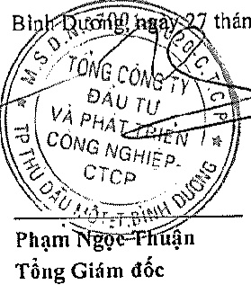

#### BÁO CÁO KẾT QUẢ HOẠT ĐỘNG KINH DOANH HỢP NHẤT Cho năm tài chính kết thúc ngày 31 tháng 12 năm 2019

<table border=1 style='margin: auto; word-wrap: break-word;'><tr><td style='text-align: center; word-wrap: break-word;'></td><td style='text-align: center; word-wrap: break-word;'>CHỈ TIÊU</td><td style='text-align: center; word-wrap: break-word;'>MẠ SỐ</td><td style='text-align: center; word-wrap: break-word;'>Thuyết minh</td><td style='text-align: center; word-wrap: break-word;'>Năm nay</td><td style='text-align: center; word-wrap: break-word;'>Năm trước</td></tr><tr><td style='text-align: center; word-wrap: break-word;'>1.</td><td style='text-align: center; word-wrap: break-word;'>Doanh thu bán hàng và cung cấp dịch vụ</td><td style='text-align: center; word-wrap: break-word;'>01</td><td style='text-align: center; word-wrap: break-word;'>VI.1</td><td style='text-align: center; word-wrap: break-word;'>9.251.533.407.510</td><td style='text-align: center; word-wrap: break-word;'>8.574.910.731.880</td></tr><tr><td style='text-align: center; word-wrap: break-word;'>2.</td><td style='text-align: center; word-wrap: break-word;'>Các khoản giảm trừ doanh thu</td><td style='text-align: center; word-wrap: break-word;'>02</td><td style='text-align: center; word-wrap: break-word;'>VI.2</td><td style='text-align: center; word-wrap: break-word;'>1.038.090.243.424</td><td style='text-align: center; word-wrap: break-word;'>2.112.849.092.878</td></tr><tr><td style='text-align: center; word-wrap: break-word;'>3.</td><td style='text-align: center; word-wrap: break-word;'>Doanh thu thuần về bán hàng và cung cấp dịch vụ</td><td style='text-align: center; word-wrap: break-word;'>10</td><td style='text-align: center; word-wrap: break-word;'></td><td style='text-align: center; word-wrap: break-word;'>8.213.443.164.086</td><td style='text-align: center; word-wrap: break-word;'>6.462.061.639.002</td></tr><tr><td style='text-align: center; word-wrap: break-word;'>4.</td><td style='text-align: center; word-wrap: break-word;'>Giá vốn hàng bán</td><td style='text-align: center; word-wrap: break-word;'>11</td><td style='text-align: center; word-wrap: break-word;'>VI.3</td><td style='text-align: center; word-wrap: break-word;'>4.826.181.247.206</td><td style='text-align: center; word-wrap: break-word;'>3.242.059.596.749</td></tr><tr><td style='text-align: center; word-wrap: break-word;'>5.</td><td style='text-align: center; word-wrap: break-word;'>Lợi nhuận gộp về bán hàng và cung cấp dịch vụ</td><td style='text-align: center; word-wrap: break-word;'>20</td><td style='text-align: center; word-wrap: break-word;'></td><td style='text-align: center; word-wrap: break-word;'>3.387.261.916.880</td><td style='text-align: center; word-wrap: break-word;'>3.220.002.042.253</td></tr><tr><td style='text-align: center; word-wrap: break-word;'>6.</td><td style='text-align: center; word-wrap: break-word;'>Doanh thu hoạt động tài chính</td><td style='text-align: center; word-wrap: break-word;'>21</td><td style='text-align: center; word-wrap: break-word;'>VI.4</td><td style='text-align: center; word-wrap: break-word;'>527.129.841.577</td><td style='text-align: center; word-wrap: break-word;'>80.154.991.018</td></tr><tr><td style='text-align: center; word-wrap: break-word;'>7.</td><td style='text-align: center; word-wrap: break-word;'>Chi phí tài chính</td><td style='text-align: center; word-wrap: break-word;'>22</td><td style='text-align: center; word-wrap: break-word;'>VI.5</td><td style='text-align: center; word-wrap: break-word;'>656.142.837.389</td><td style='text-align: center; word-wrap: break-word;'>684.296.680.060</td></tr><tr><td style='text-align: center; word-wrap: break-word;'></td><td style='text-align: center; word-wrap: break-word;'>Trong đó: chi phí lãi vay</td><td style='text-align: center; word-wrap: break-word;'>23</td><td style='text-align: center; word-wrap: break-word;'></td><td style='text-align: center; word-wrap: break-word;'>649.005.935.922</td><td style='text-align: center; word-wrap: break-word;'>680.691.068.670</td></tr><tr><td style='text-align: center; word-wrap: break-word;'>8.</td><td style='text-align: center; word-wrap: break-word;'>Phần lãi hoặc lỗ trong công ty liên doanh, liên kết</td><td style='text-align: center; word-wrap: break-word;'>24</td><td style='text-align: center; word-wrap: break-word;'>V.2c</td><td style='text-align: center; word-wrap: break-word;'>1.213.459.815.787</td><td style='text-align: center; word-wrap: break-word;'>1.114.664.470.921</td></tr><tr><td style='text-align: center; word-wrap: break-word;'>9.</td><td style='text-align: center; word-wrap: break-word;'>Chi phí bán hàng</td><td style='text-align: center; word-wrap: break-word;'>25</td><td style='text-align: center; word-wrap: break-word;'>VI.6</td><td style='text-align: center; word-wrap: break-word;'>801.918.149.009</td><td style='text-align: center; word-wrap: break-word;'>653.163.069.427</td></tr><tr><td style='text-align: center; word-wrap: break-word;'>10.</td><td style='text-align: center; word-wrap: break-word;'>Chi phí quản lý doanh nghiệp</td><td style='text-align: center; word-wrap: break-word;'>26</td><td style='text-align: center; word-wrap: break-word;'>VI.7</td><td style='text-align: center; word-wrap: break-word;'>773.427.851.053</td><td style='text-align: center; word-wrap: break-word;'>504.735.829.787</td></tr><tr><td style='text-align: center; word-wrap: break-word;'>11.</td><td style='text-align: center; word-wrap: break-word;'>Lợi nhuận thuần từ hoạt động kinh doanh</td><td style='text-align: center; word-wrap: break-word;'>30</td><td style='text-align: center; word-wrap: break-word;'></td><td style='text-align: center; word-wrap: break-word;'>2.896.362.736.793</td><td style='text-align: center; word-wrap: break-word;'>2.572.625.924.918</td></tr><tr><td style='text-align: center; word-wrap: break-word;'>12.</td><td style='text-align: center; word-wrap: break-word;'>Thu nhập khác</td><td style='text-align: center; word-wrap: break-word;'>31</td><td style='text-align: center; word-wrap: break-word;'>VI.8</td><td style='text-align: center; word-wrap: break-word;'>133.125.288.166</td><td style='text-align: center; word-wrap: break-word;'>460.389.246.536</td></tr><tr><td style='text-align: center; word-wrap: break-word;'>13.</td><td style='text-align: center; word-wrap: break-word;'>Chi phí khác</td><td style='text-align: center; word-wrap: break-word;'>32</td><td style='text-align: center; word-wrap: break-word;'>VI.9</td><td style='text-align: center; word-wrap: break-word;'>48.397.858.191</td><td style='text-align: center; word-wrap: break-word;'>448.819.502.379</td></tr><tr><td style='text-align: center; word-wrap: break-word;'>14.</td><td style='text-align: center; word-wrap: break-word;'>Lợi nhuận khác</td><td style='text-align: center; word-wrap: break-word;'>40</td><td style='text-align: center; word-wrap: break-word;'></td><td style='text-align: center; word-wrap: break-word;'>84.727.429.975</td><td style='text-align: center; word-wrap: break-word;'>11.569.744.157</td></tr><tr><td style='text-align: center; word-wrap: break-word;'>15.</td><td style='text-align: center; word-wrap: break-word;'>Tổng lợi nhuận kế toán trước thuế</td><td style='text-align: center; word-wrap: break-word;'>50</td><td style='text-align: center; word-wrap: break-word;'></td><td style='text-align: center; word-wrap: break-word;'>2.981.090.166.769</td><td style='text-align: center; word-wrap: break-word;'>2.584.195.669.075</td></tr><tr><td style='text-align: center; word-wrap: break-word;'>16.</td><td style='text-align: center; word-wrap: break-word;'>Chi phí thuế thu nhập doanh nghiệp hiện hành</td><td style='text-align: center; word-wrap: break-word;'>51</td><td style='text-align: center; word-wrap: break-word;'>V.19</td><td style='text-align: center; word-wrap: break-word;'>350.482.180.661</td><td style='text-align: center; word-wrap: break-word;'>287.023.586.101</td></tr><tr><td style='text-align: center; word-wrap: break-word;'>17.</td><td style='text-align: center; word-wrap: break-word;'>Chi phí thuế thu nhập doanh nghiệp hoản lại</td><td style='text-align: center; word-wrap: break-word;'>52</td><td style='text-align: center; word-wrap: break-word;'>V.15</td><td style='text-align: center; word-wrap: break-word;'>(277.746.830)</td><td style='text-align: center; word-wrap: break-word;'>(39.542.148.493)</td></tr><tr><td style='text-align: center; word-wrap: break-word;'>18.</td><td style='text-align: center; word-wrap: break-word;'>Lợi nhuận sau thuế thu nhập doanh nghiệp</td><td style='text-align: center; word-wrap: break-word;'>60</td><td style='text-align: center; word-wrap: break-word;'></td><td style='text-align: center; word-wrap: break-word;'>2.630.885.732.938</td><td style='text-align: center; word-wrap: break-word;'>2.336.714.231.467</td></tr><tr><td style='text-align: center; word-wrap: break-word;'>19.</td><td style='text-align: center; word-wrap: break-word;'>Lợi nhuận sau thuế của công ty mẹ</td><td style='text-align: center; word-wrap: break-word;'>61</td><td style='text-align: center; word-wrap: break-word;'></td><td style='text-align: center; word-wrap: break-word;'>2.486.920.759.330</td><td style='text-align: center; word-wrap: break-word;'>2.195.944.156.880</td></tr><tr><td style='text-align: center; word-wrap: break-word;'>20.</td><td style='text-align: center; word-wrap: break-word;'>Lợi nhuận sau thuế của cổ đồng không kiểm soát</td><td style='text-align: center; word-wrap: break-word;'>62</td><td style='text-align: center; word-wrap: break-word;'></td><td style='text-align: center; word-wrap: break-word;'>143.964.973.608</td><td style='text-align: center; word-wrap: break-word;'>140.770.074.587</td></tr><tr><td style='text-align: center; word-wrap: break-word;'>21.</td><td style='text-align: center; word-wrap: break-word;'>Lãi cơ bản trên cổ phiếu</td><td style='text-align: center; word-wrap: break-word;'>70</td><td style='text-align: center; word-wrap: break-word;'>VI.10</td><td style='text-align: center; word-wrap: break-word;'>2.332</td><td style='text-align: center; word-wrap: break-word;'>2.030</td></tr><tr><td style='text-align: center; word-wrap: break-word;'>22.</td><td style='text-align: center; word-wrap: break-word;'>Lãi suy giảm trên cổ phiếu</td><td style='text-align: center; word-wrap: break-word;'>71</td><td style='text-align: center; word-wrap: break-word;'>VI.10</td><td style='text-align: center; word-wrap: break-word;'>2.332</td><td style='text-align: center; word-wrap: break-word;'>2.030</td></tr></table>

Bình Quảng, ngày 27 tháng 3 năm 2020

Nguyễn Phước Đại

Người lập biểu

Nguyễn Thị Thanh Nhàn

Kế toán trưởng

Phạm Ngọc-Fhuận

Tổng Giám đốc

