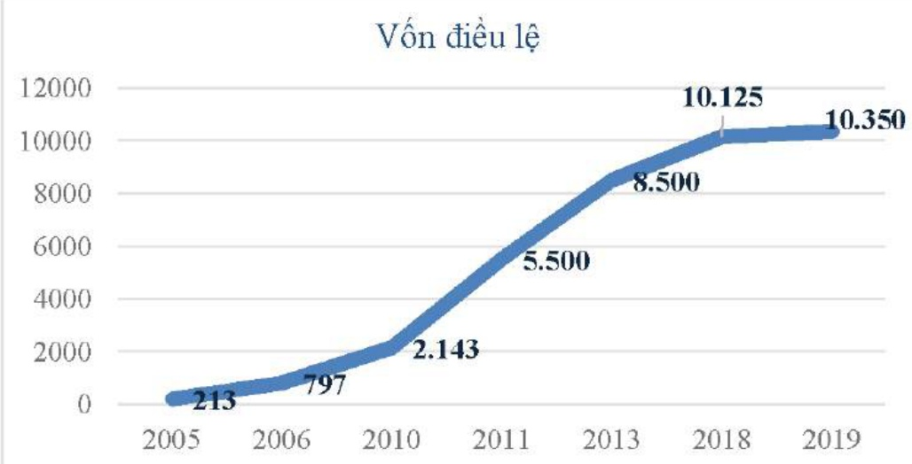

##### BECAMEX IDC Industrial Parks, Real Estate, Telecom, Healthcare, Education

### Quá trình hình thành và phát triển: Báo cáo thường niên 2019

Thành lập Cty Thương Nghiệp Tổng Hợp Bến Cát với chức năng chủ yếu là thu mua, chế biến các mặt hàng nông sản, tiêu dùng...

Công ty Thương Nghiệp Tổng hợp Bên Cát đã tiến hành sáp nhập với các công ty cấp tỉnh lấy tên chính thức là Cty Thương mại - XNK tỉnh Sông Bé (Becamex)

1999

Công ty đã chính

thức đối tên thành

Công ty Thương

Mại - Đầu Tư và

Phát Triển (tên

giao dịch là

BECAMEX Corp.)

Cty Đầu Tư và Phát Triển Cộng Nghiệp được thành lập trên cơ sở sắp xếp và tổ chức lại hoạt động của Cộng ty Thương mại Đầu tư và Phát triển.

Tổng Công ty Đầu tư và Phát triển Công nghiệp – TNHH MTV chuyển thành Tổng Công ty Đầu tư và Phát triển Công nghiệp – CTCP.

2019

Một năm sau khi hoạt động dưới mô hình công ty cổ phần và không ngừng phát triển.

Thay đổi vốn điều lệ qua các năm:

Đv: tỷ đồng

