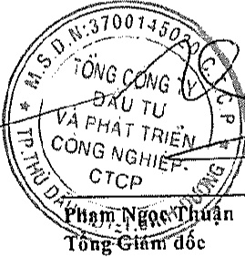

<table border=1 style='margin: auto; word-wrap: break-word;'><tr><td style='text-align: center; word-wrap: break-word;'>CHỈ TIỀU</td><td style='text-align: center; word-wrap: break-word;'>Mã số</td><td style='text-align: center; word-wrap: break-word;'>Thuyết minh</td><td style='text-align: center; word-wrap: break-word;'>Năm nay</td><td style='text-align: center; word-wrap: break-word;'>Năm trước</td></tr><tr><td style='text-align: center; word-wrap: break-word;'>III. Lưu chuyển tiền từ hoạt động tài chính</td><td style='text-align: center; word-wrap: break-word;'></td><td style='text-align: center; word-wrap: break-word;'></td><td style='text-align: center; word-wrap: break-word;'></td><td style='text-align: center; word-wrap: break-word;'></td></tr><tr><td style='text-align: center; word-wrap: break-word;'>1. Tiền thu từ phát hành cổ phiếu, nhận vốn góp của chủ sở hữu</td><td style='text-align: center; word-wrap: break-word;'>31</td><td style='text-align: center; word-wrap: break-word;'>V.28a</td><td style='text-align: center; word-wrap: break-word;'>224.189.000.000</td><td style='text-align: center; word-wrap: break-word;'>-</td></tr><tr><td style='text-align: center; word-wrap: break-word;'>2. Tiền trả lại vốn góp cho các chủ sở hữu, mua lại cổ phiếu của doanh nghiệp đã phát hành</td><td style='text-align: center; word-wrap: break-word;'>32</td><td style='text-align: center; word-wrap: break-word;'></td><td style='text-align: center; word-wrap: break-word;'></td><td style='text-align: center; word-wrap: break-word;'></td></tr><tr><td style='text-align: center; word-wrap: break-word;'>3. Tiền thu từ di vay</td><td style='text-align: center; word-wrap: break-word;'>33</td><td style='text-align: center; word-wrap: break-word;'>V.24</td><td style='text-align: center; word-wrap: break-word;'>7.621.334.179.091</td><td style='text-align: center; word-wrap: break-word;'>8.393.567.901.285</td></tr><tr><td style='text-align: center; word-wrap: break-word;'>4. Tiền trả nợ gốc vay</td><td style='text-align: center; word-wrap: break-word;'>34</td><td style='text-align: center; word-wrap: break-word;'>V.24</td><td style='text-align: center; word-wrap: break-word;'>(12.614.306.137.313)</td><td style='text-align: center; word-wrap: break-word;'>(10.453.758.477.642)</td></tr><tr><td style='text-align: center; word-wrap: break-word;'>5. Tiền trả nợ gốc thuê tài chính</td><td style='text-align: center; word-wrap: break-word;'>35</td><td style='text-align: center; word-wrap: break-word;'></td><td style='text-align: center; word-wrap: break-word;'></td><td style='text-align: center; word-wrap: break-word;'></td></tr><tr><td style='text-align: center; word-wrap: break-word;'>6. Cổ tức, lợi nhuận đã trả cho chủ sở hữu</td><td style='text-align: center; word-wrap: break-word;'>36</td><td style='text-align: center; word-wrap: break-word;'>V.23a, V.28a</td><td style='text-align: center; word-wrap: break-word;'>(608.811.493.650)</td><td style='text-align: center; word-wrap: break-word;'>-</td></tr><tr><td style='text-align: center; word-wrap: break-word;'>Lưu chuyển tiền thuần từ hoạt động tài chính</td><td style='text-align: center; word-wrap: break-word;'>40</td><td style='text-align: center; word-wrap: break-word;'></td><td style='text-align: center; word-wrap: break-word;'>(5.377.594.451.872)</td><td style='text-align: center; word-wrap: break-word;'>(2.060.190.576.357)</td></tr><tr><td style='text-align: center; word-wrap: break-word;'>Lưu chuyển tiền thuần trong năm</td><td style='text-align: center; word-wrap: break-word;'>50</td><td style='text-align: center; word-wrap: break-word;'></td><td style='text-align: center; word-wrap: break-word;'>(2.160.898.316.124)</td><td style='text-align: center; word-wrap: break-word;'>(11.192.351.673)</td></tr><tr><td style='text-align: center; word-wrap: break-word;'>Tiền và tương đương tiền đầu năm</td><td style='text-align: center; word-wrap: break-word;'>60</td><td style='text-align: center; word-wrap: break-word;'>V.1</td><td style='text-align: center; word-wrap: break-word;'>2.577.622.049.939</td><td style='text-align: center; word-wrap: break-word;'>2.588.814.401.612</td></tr><tr><td style='text-align: center; word-wrap: break-word;'>Ảnh hướng của thay đổi tỷ giá hỏi đoái quy dổi ngoại tệ</td><td style='text-align: center; word-wrap: break-word;'>61</td><td style='text-align: center; word-wrap: break-word;'></td><td style='text-align: center; word-wrap: break-word;'></td><td style='text-align: center; word-wrap: break-word;'></td></tr><tr><td style='text-align: center; word-wrap: break-word;'>Tiền và tương đương tiền cuối năm</td><td style='text-align: center; word-wrap: break-word;'>70</td><td style='text-align: center; word-wrap: break-word;'>V.1</td><td style='text-align: center; word-wrap: break-word;'>416.723.733.815</td><td style='text-align: center; word-wrap: break-word;'>2.577.622.049.939</td></tr></table>

Bình Dương, ngày 27 tháng 3 năm 2020

飞

Nguyễn Phước Đại

Người lập biểu

Nguyễn Thị Thanh Nhàn Kế toán trưởng

Phạm Ngọc Thuan Tổng Giám đốc