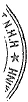

# BẢN THUYẾT MINH BÁO CÁO TÀI CHÍNH HỢP NHÁT Cho năm tài chính kết thúc ngày 31 tháng 12 năm 2019

## I. ĐẶC ĐIỂM HOẠT ĐỘNG

### 1. Hình thức sở hữu vốn

Tổng Công ty Đầu tư và Phát triển Công nghiệp – CTCP (gợi tất là “Tổng Công ty” hay “Công ty mẹ”) là Công ty cổ phần được chuyển đổi từ Tổng Công ty Đầu tư và Phát triển Công nghiệp – TNHH MTV theo Quyết định số 849/QĐ-TTg ngày 12 tháng 6 năm 2017 của Thủ tướng Chính phủ.

### 2. Lĩnh vực kinh doanh

Tổng Cộng ty kinh doanh trong nhiều lĩnh vực khác nhau.

### 3. Ngành nghề kinh doanh

Hoạt động kinh doanh chính của Tông Công ty là: Kinh doanh bất động sản; Đầu tư xây dựng và kinh doanh cơ sở hạ tầng kỹ thuật Khu Công nghiệp, khu dân cư và khu đô thị; Dịch vụ cho thuê, quản lý và xử lý nước thải Khu Công nghiệp, khu dân cư và khu đô thị; Quản lý các dự án, giám sát thi công công trình; Sản xuất, mua bán các mặt hàng điện tử, máy móc thiết bị, phụ tùng phục vụ cho sản xuất công nghiệp và tiêu dùng; Đầu tư tài chính vào các doanh nghiệp khác trong và ngoài nước; Hoạt động trong lĩnh vực bệnh viện, y tế, giáo dục.

### 4. Chu kỳ sản xuất, kinh doanh thông thường

Chu kỳ sản xuất, kinh doanh v.v. Chu kỳ sản xuất kinh doanh thông thường của Tổng Công ty không quá 12 tháng. Riêng đối với hoạt động đầu tư kinh doanh bất động sản, chu kỳ kinh doanh tùy thuộc theo từng phương án đầu tư.

5. Đặc điểm hoạt động của Tổng Cộng ty trong năm có ảnh hưởng đến Báo cáo tài chính

Trong năm, Tổng Cộng ty đã thanh lý toàn bộ khoản đầu tư tại Cộng ty Cổ phần Bê tổng Becamex, Cộng ty Cổ phần Bào hiểm Hùng Vương, Cộng ty Cổ phần Dược Becamex và Cộng ty Cổ phần Phát triển và Cộng nghệ Becamex và làm ảnh hưởng lớn đến kết quả hoạt động kinh doanh năm nay (xem thuyết minh V.2b, V.2c và VI.4).

Ngoài ra, khoản cổ tức, lợi nhuận được chia từ các khoản đầu tư vào các đơn vị khác ghi nhận vào kết quả hoạt động kinh doanh trong năm cũng góp phần đáng kể vào lợi nhuận năm nay của Tổng Cộng ty.

### 6. Cấu trúc Tập đoàn

Tập đoàn bảo gồm Công ty mẹ và 12 công ty con chịu sự kiểm soát của Công ty mẹ. Toàn bộ các công ty con được hợp nhất trong Báo cáo tài chính hợp nhất này.

6a. Danh sách các Công ty con được hợp nhất

<table border=1 style='margin: auto; word-wrap: break-word;'><tr><td style='text-align: center; word-wrap: break-word;'></td><td style='text-align: center; word-wrap: break-word;'></td><td style='text-align: center; word-wrap: break-word;'></td><td style='text-align: center; word-wrap: break-word;'>Tý lệ lợi ích</td><td style='text-align: center; word-wrap: break-word;'>Tý lệ quyền biểu quyết</td></tr><tr><td style='text-align: center; word-wrap: break-word;'>Tên công ty</td><td style='text-align: center; word-wrap: break-word;'>Địa chỉ trụ sở chính</td><td style='text-align: center; word-wrap: break-word;'>Hoạt động kinh doanh chính</td><td style='text-align: center; word-wrap: break-word;'>Số số cuối năm đầu năm</td><td style='text-align: center; word-wrap: break-word;'>Số cuối năm đầu năm</td></tr><tr><td style='text-align: center; word-wrap: break-word;'>Công ty Cổ phần Phát triển Hạ tầng Kỹ thuật</td><td style='text-align: center; word-wrap: break-word;'>Tầng 5 Becamex Tower, 230 Duy tu, sửa chữa, khai thác thu phí giao thông; Xây dựng dân dụng và công nghiệp, kinh doanh bất động sản</td><td style='text-align: center; word-wrap: break-word;'>78,80%</td><td style='text-align: center; word-wrap: break-word;'>78,80%</td><td style='text-align: center; word-wrap: break-word;'>78,80%</td></tr><tr><td style='text-align: center; word-wrap: break-word;'>Công ty Cổ phần Phát triển Đô thị</td><td style='text-align: center; word-wrap: break-word;'>C1-2-3 Đường DT6, Khu Liên hợp Công nghiệp Dịch vụ Bình Dương Phường Hòa Phú, TP. Thủ Dầu Một, Tĩnh Bình Dương</td><td style='text-align: center; word-wrap: break-word;'>Sản xuất bêtông trộn sẵn; Đầu tư xây dựng, kinh doanh cơ sở hạ tầng kỹ thuật khu công nghiệp, khu dân cư và đô thị; Kinh doanh bất động sản</td><td style='text-align: center; word-wrap: break-word;'>51,00%</td><td style='text-align: center; word-wrap: break-word;'>51,00%</td></tr><tr><td rowspan="2">Tên công ty</td><td rowspan="2">Địa chỉ trụ sở chính</td><td rowspan="2">Hoạt động kinh doanh chính</td><td colspan="2">Tỷ lệ lợi ích</td><td colspan="2">Tỷ lệ quyền biểu quyết</td></tr><tr><td style='text-align: center; word-wrap: break-word;'>Số cuối năm</td><td style='text-align: center; word-wrap: break-word;'>Số đầu năm</td><td style='text-align: center; word-wrap: break-word;'>Số cuối năm</td><td style='text-align: center; word-wrap: break-word;'>Số đầu năm</td></tr><tr><td style='text-align: center; word-wrap: break-word;'>Công ty Cổ phần Kinh doanh và Phát triển Bình Dương</td><td style='text-align: center; word-wrap: break-word;'>Lô I, Đồng Khởi, Phường Hoà Phú, TP. Thù Dầu Một, Tinh Bình Dương</td><td style='text-align: center; word-wrap: break-word;'>Kinh doanh và đầu tư cơ sở hạ tầng khu dân cư, đô thị; Thi công các công trình công nghiệp và dân dụng; Sản xuất vật liệu xây dựng</td><td style='text-align: center; word-wrap: break-word;'>60,70%</td><td style='text-align: center; word-wrap: break-word;'>60,70%</td><td style='text-align: center; word-wrap: break-word;'>60,70%</td><td style='text-align: center; word-wrap: break-word;'>60,70%</td></tr><tr><td style='text-align: center; word-wrap: break-word;'>Công ty Cổ phần Xây dựng và Giao thông Bình Dương</td><td style='text-align: center; word-wrap: break-word;'>Lô G, Đường Đồng Khởi, Phường Hòa Phú, TP. Thù Dầu Một, Tinh Bình Dương</td><td style='text-align: center; word-wrap: break-word;'>Xây dựng dân dụng và công nghiệp; San lắp mặt băng, đầu tư xây dựng và kinh doanh cơ sở hạ tầng khu dân cư, khu công nghiệp; Kinh doanh bắt động sản</td><td style='text-align: center; word-wrap: break-word;'>51,82%</td><td style='text-align: center; word-wrap: break-word;'>51,82%</td><td style='text-align: center; word-wrap: break-word;'>51,82%</td><td style='text-align: center; word-wrap: break-word;'>51,82%</td></tr><tr><td style='text-align: center; word-wrap: break-word;'>Công ty Cổ phần Bệnh viện Mỹ Phước</td><td style='text-align: center; word-wrap: break-word;'>Đường TC3, Khu Công Nghiệp Mỹ Phước 1, Thị xã Bến Cát, Tinh Bình Dương</td><td style='text-align: center; word-wrap: break-word;'>Hoạt động của bệnh viện và phòng khám chữa bệnh</td><td style='text-align: center; word-wrap: break-word;'>65,47%</td><td style='text-align: center; word-wrap: break-word;'>65,47%</td><td style='text-align: center; word-wrap: break-word;'>65,47%</td><td style='text-align: center; word-wrap: break-word;'>65,47%</td></tr><tr><td style='text-align: center; word-wrap: break-word;'>Trường Đại học Quốc tế Miền Đông</td><td style='text-align: center; word-wrap: break-word;'>Khu đô thị mới thuộc Khu Liên hợp Công nghiệp Dịch vụ và Đô thị Bình Dương, TP. Thủ Dầu Một, Tinh Bình Dương</td><td style='text-align: center; word-wrap: break-word;'>Đào tạo trung cấp, cao đẳng và đại học theo học chế tín chỉ, liên thông</td><td style='text-align: center; word-wrap: break-word;'>51,00%</td><td style='text-align: center; word-wrap: break-word;'>51,00%</td><td style='text-align: center; word-wrap: break-word;'>51,00%</td><td style='text-align: center; word-wrap: break-word;'>51,00%</td></tr><tr><td style='text-align: center; word-wrap: break-word;'>Công ty Cổ phần Bệnh viện Đa khoa Quốc tế Becamex</td><td style='text-align: center; word-wrap: break-word;'>Đại lệ Binh Dương, Khu Gò Cát, Phường Lái Thiếu, Thành phố Thuận An, Tinh Bình Dương</td><td style='text-align: center; word-wrap: break-word;'>Khám và chữa bệnh</td><td style='text-align: center; word-wrap: break-word;'>85,00%</td><td style='text-align: center; word-wrap: break-word;'>85,00%</td><td style='text-align: center; word-wrap: break-word;'>85,00%</td><td style='text-align: center; word-wrap: break-word;'>85,00%</td></tr><tr><td style='text-align: center; word-wrap: break-word;'>Công ty TNHH MTV Khách sản Becamex (*)</td><td style='text-align: center; word-wrap: break-word;'>Becamex Tower, 230 Đại Lộ Bình Dương, TP. Thủ Dầu Một, Tinh Bình Dương</td><td style='text-align: center; word-wrap: break-word;'>Kinh doanh nhà hàng và các dịch vụ ăn uống, tổ chức sự kiện, các dịch vụ khách sạn, đại lý về máy bay, tàu hoà</td><td style='text-align: center; word-wrap: break-word;'>78,80%</td><td style='text-align: center; word-wrap: break-word;'>78,80%</td><td style='text-align: center; word-wrap: break-word;'>78,80%</td><td style='text-align: center; word-wrap: break-word;'>78,80%</td></tr><tr><td style='text-align: center; word-wrap: break-word;'>Công ty TNHH MTV Thương mại Becamex (*)</td><td style='text-align: center; word-wrap: break-word;'>Becamex Tower, 230 Đại Lộ Bình Dương, TP. Thủ Dầu Một, Tinh Bình Dương</td><td style='text-align: center; word-wrap: break-word;'>Kinh doanh hoạt động trung tâm thương mại, du lịch, văn tải hành khách, đại lý về máy bay, tàu hoà</td><td style='text-align: center; word-wrap: break-word;'>78,80%</td><td style='text-align: center; word-wrap: break-word;'>78,80%</td><td style='text-align: center; word-wrap: break-word;'>78,80%</td><td style='text-align: center; word-wrap: break-word;'>78,80%</td></tr><tr><td style='text-align: center; word-wrap: break-word;'>Công ty TNHH MTV Tư vấn Đầu tư Xây dựng Việt (**)</td><td style='text-align: center; word-wrap: break-word;'>D12, Lê Hoàn, Phường Hòa Phú, TP. Thủ Dầu Một, Tinh Bình Dương</td><td style='text-align: center; word-wrap: break-word;'>Tư vấn, thiết kế, xây dựng các công trình, nhà ở,...</td><td style='text-align: center; word-wrap: break-word;'>60,70%</td><td style='text-align: center; word-wrap: break-word;'>60,70%</td><td style='text-align: center; word-wrap: break-word;'>60,70%</td><td style='text-align: center; word-wrap: break-word;'>60,70%</td></tr><tr><td style='text-align: center; word-wrap: break-word;'>Công ty Cổ phần Xi măng Hà Tiến Kiến Giang – Becamex (**)</td><td style='text-align: center; word-wrap: break-word;'>Đường D1 – Khu công nghiệp Mỹ Phước 1, Huyền Bến Cát, Tinh Bình Dương</td><td style='text-align: center; word-wrap: break-word;'>Sản xuất và cung cấp xi măng, bề tống cấu kiện,...</td><td style='text-align: center; word-wrap: break-word;'>35,21%</td><td style='text-align: center; word-wrap: break-word;'>35,21%</td><td style='text-align: center; word-wrap: break-word;'>35,21%</td><td style='text-align: center; word-wrap: break-word;'>35,21%</td></tr><tr><td style='text-align: center; word-wrap: break-word;'>Công ty Cổ phần Vật liệu xây dựng Becamex (**)</td><td style='text-align: center; word-wrap: break-word;'>Áp Mương Đào, Xã Long Nguyên, Huyên Bàu Bàng, Tinh Bình Dương</td><td style='text-align: center; word-wrap: break-word;'>Sản xuất, mua bán vật liệu xây dựng như: cát, đá, thép,...</td><td style='text-align: center; word-wrap: break-word;'>49,17%</td><td style='text-align: center; word-wrap: break-word;'>49,17%</td><td style='text-align: center; word-wrap: break-word;'>49,17%</td><td style='text-align: center; word-wrap: break-word;'>49,17%</td></tr></table>