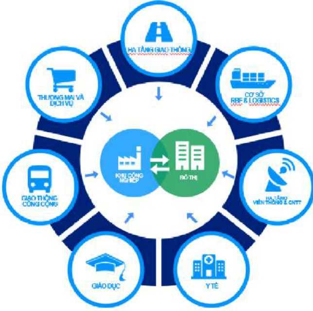
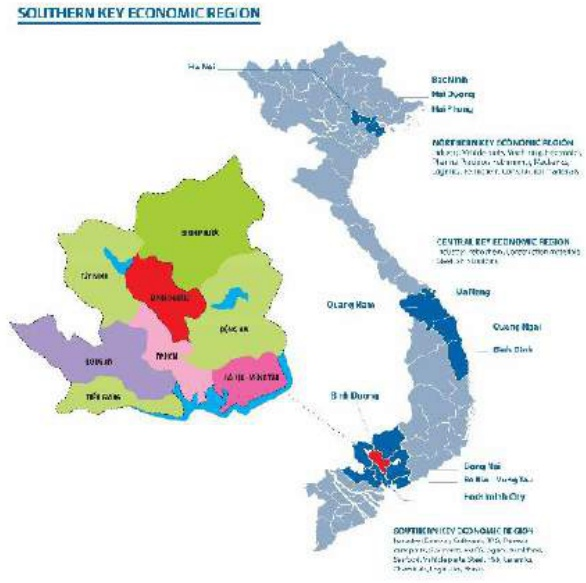

### 2. Ngành nghề và địa bàn kinh doanh:

#### - Ngành nghề kinh doanh:

Với 2 ngành chủ lực là phát triển bất động sản Khu công nghiệp và Khu Đô thị, trong những năm qua hai hoạt động này đã đưa vị thế của Tổng công ty là một trong những doanh nghiệp dẫn đầu về phát triển Khu công nghiệp, khu đô thị. Để phù hợp với xu hướng phát triển chung, Tổng công ty Becamex IDC cùng với các Công ty thành viên cùng phát triển các mảng kinh doanh hỗ trợ như giao thông công cộng, y tế, giáo dục, viễn thông thương mai dịch vụ, công nghệ thông tin... tạo thành một tập đoàn đa ngành nghề cùng xây dựng và phát triển.

##### Địa bàn kinh doanh

Những năm trước đây Becamex IDC chủ yếu tập trung khai thác lĩnh vực phát triển khu công nghiệp và khu dịch vụ đô thị trên địa bàn tỉnh Bình Dương. Tuy nhiên để đáp ứng cho xu thế phát triển bền vững Tổng công ty đã và đang cho triển khai các dự án ở các tỉnh thành khác như: Bình Định, Long An, Bình Phước, Bình Thuận. Ngoài ra, Becamex IDC cùng với VSIP đã phát triển thành công các Khu công nghiệp ở các tỉnh phía Bắc và miền Trung như: VSIP Bắc Ninh, VSIP Hải Phòng, VSIP Hải Dương, VSIP Nghệ An, VSIP Quảng Ngãi.

### 3. Thông tin về mô hình quản trị, tổ chức kinh doanh và bộ máy quản lý

Mô hình quản trị tại Tổng công ty bao gồm: Đại hội đồng cô động, Hội đồng quản trị, Ban Kiểm soát, Ban Tổng giám đốc và phòng ban chuyên môn, xí nghiệp trực thuộc.