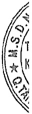

### 13. Chỉ phí xây dựng cơ bản đồ dang

Chỉ phí xây dựng cơ bản đồ dang phản ánh các chi phi liên quan trực tiếp (bao gồm cả chi phi lãi vay có liên quan phù hợp với chính sách kế toán của Tập đoàn) đến các tài sản đang trong quá trình xây dựng, máy móc thiết bị đang lắp đặt để phục vụ cho mục đích sản xuất, cho thuê và quản lý cũng như chi phí liên quan đến việc sửa chữa tài sản cố định đang thực hiện. Các tài sản này được ghi nhận theo giá gốc và không được tính khẩu hao.

### 14. Hợp nhất kinh doanh và lợi thế thương mại

Việc hợp nhất kinh doanh được kế toán theo phương pháp mua. Giá phí hợp nhất kinh doanh bao gồm: giá trị hợp lý tại ngày diễn ra trao đổi của các tài sản đem trao đổi, các khoản nợ phải trả đã phát sinh hoặc đã thừa nhận và các công cụ vốn do Tập đoàn phát hành để đổi lấy quyền kiểm soát bên bị mua và các chỉ phí liên quan trực tiếp đến việc hợp nhất kinh doanh. Tài sản đã mua, nợ phải trả có thể xác định được và những khoản nợ tiêm tàng phải gánh chịu trong hợp nhất kinh doanh được ghi nhận theo giá trị hợp lý tại ngày nắm giữ quyền kiểm soát.

Đối với giao dịch hợp nhất kinh doanh qua nhiều giai đoạn, giá phí hợp nhất kinh doanh được tính là tổng của giá phí khoản đầu tư tại ngày đạt được quyền kiểm soát công ty con cộng với giá phí khoản đầu tư của những lần trao đổi trước đã được đánh giá lại theo giá trị hợp lý tại ngày đạt được quyền kiểm soát công ty con. Chênh lệch giữa giá đánh giá lại và giá gốc khoản đầu tư được ghi nhận vào kết quả hoạt động kinh doanh nếu trước ngày đạt được quyền kiểm soát Tập đoàn không có ảnh hưởng đáng kể với công ty con và khoản đầu tư được trình bày theo phương pháp giá gốc. Nếu trước ngày đạt được quyền kiểm soát, Tập đoàn có ảnh hưởng đáng kể và khoản đầu tư được trình bày theo phương pháp vốn chủ sở hữu thì phần chênh lệch giữa giá đánh giá lại và giá trị khoản đầu tư theo phương pháp vốn chủ sở hữu được ghi nhận vào kết quả hoạt động kinh doanh và phần chênh lệch giữa giá trị khoản đầu tư theo phương pháp vốn chủ sở hữu và giá gốc khoản đầu tư được ghi nhận trực tiếp vào khoản mục “Lợi nhuận sau thuế chưa phân phối” trên Bảng cân đối kế toán hợp nhất.

Phần chênh lệch cao hơn của giá phí hợp nhất kinh doanh so với phần sở hữu của Tập đoàn trong giá trị hợp lý thuần của tài sản, nợ phải trả có thể xác định được và các khoản nợ tiềm tàng đã ghi nhận tại ngày đạt được quyền kiểm soát công ty con được ghi nhận là lợi thế thương mại. Nếu phần sở hữu của Tập đoàn trong giá trị hợp lý thuần của tài sản, nợ phải trả có thể xác định được và nợ tiềm tàng được ghi nhận tại ngày đạt được quyền kiểm soát công ty con vượt quá giá phí hợp nhất kinh doanh thì phần chênh lệch được ghi nhận vào kết quả hoạt động kinh doanh.

Lợi thế thương mại được phân bổ theo phương pháp đường thẳng trong 05 - 10 năm. Khi có bằng chứng cho thấy lợi thế thương mại bị tồn thất lớn hơn số phần bổ thì số phần bổ trong năm là số tổn thất phát sinh.

Lợi ích của cổ động không kiểm soát tại ngày hợp nhất kinh doanh ban đầu được xác định trên cơ sở tỷ lệ của các cổ động không kiểm soát trong giá trị hợp lý của tài sản, nợ phải trả và nợ tiêm tàng được ghi nhận.

### 15. Các khoản nợ phải trả và chi phí phải trả

Các khoản nợ phải trả và chi phí phải trả được ghi nhận cho số tiền phải trả trong tương lai liên quan đến hàng hóa và dịch vụ đã nhận được. Chi phí phải trả được ghi nhận dựa trên các ước tính hợp lý về số tiền phải trả.

Việc phân loại các khoản phải trả là phải trả người bán, chỉ phí phải trả và phải trả khác được thực hiện theo nguyên tắc sau:

Phải trả người bán phản ánh các khoản phải trả mang tính chất thương mại phát sinh từ giao dịch mua hàng hóa, dịch vụ, tài sản và người bán là đơn vị độc lập với Tập đoàn, bao gồm cả các khoản phải trả khi nhập khẩu thông qua người nhận ủy thác.

