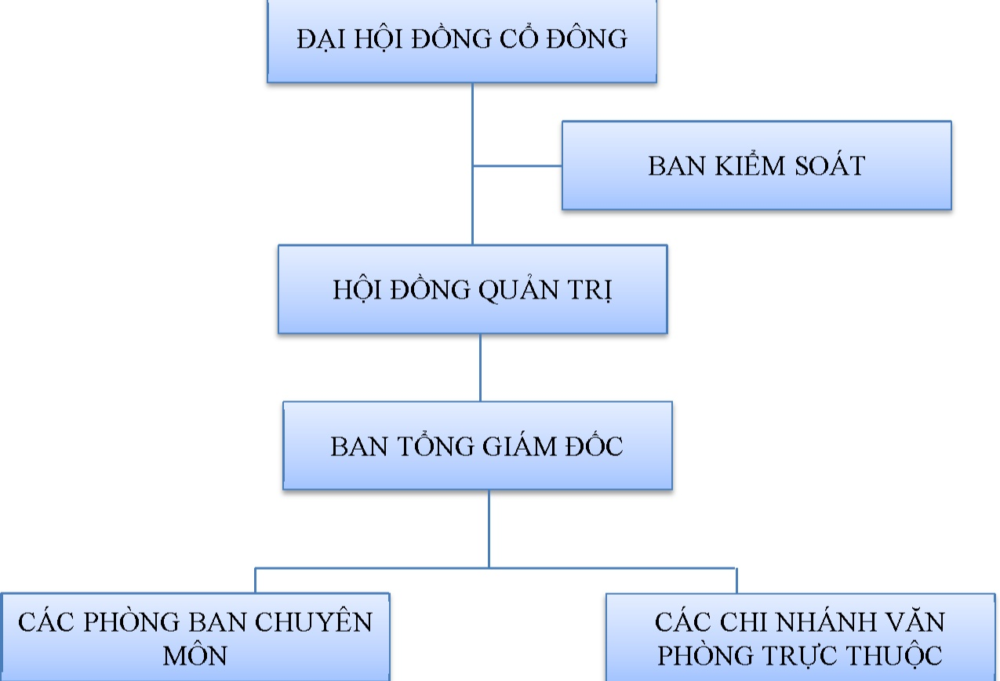

Đại hội đồng cổ đông, đại diện cho các cổ đông, là cơ quan quyết định cao nhất của Tổng Cộng ty.

Hội đồng quản trị là cơ quan quản lý Tổng công ty, có toàn quyền nhân danh Tổng công ty để quyết định, thực hiện các quyền và nghĩa vụ của Tổng công ty không thuộc thẩm quyền của Đại hội đồng cổ đông.

Ban Tổng giám đốc gồm Tổng giám đốc và các Phó Tổng giám đốc. Ban Tổng giám đốc điều hành công việc kinh doanh hàng ngày của Tổng công ty, chịu sự giám sát của Hội đồng quản trị, chịu trách nhiệm trước Hội đồng quản trị và trước pháp luật về việc thực hiện các quyền và nghĩa vụ được giao.

Các tổ và phòng ban chuyên môn chịu trách nhiệm triển khai các quyết định của Hội đồng quản trị và Ban Tổng giám đốc bao gồm các Phòng ban sau:

+ Tổ trợ lý.

+ Phòng Tổ Chức Hành Chính.

+ Phòng Quản lý Tài chính.

+ Trung tâm Phát triển Bim.

+ Phòng Kỹ Thuật.

+ Phòng Công nghệ Thông tin.

+ Phòng Sản xuất kinh doanh.

+ Phòng Tiếp thi

+ Phòng Đầu tư.