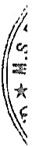

Giao dịch với các công ty liên doanh, liên kết

Các giao dịch trọng yếu giữa Tập đoàn với các công ty liên doanh, liên kết như sau:

<table border=1 style='margin: auto; word-wrap: break-word;'><tr><td style='text-align: center; word-wrap: break-word;'>Zông ty Liên doanh TNHH khu công nghiệp Việt Vam - Singapore</td><td style='text-align: center; word-wrap: break-word;'>vam nay</td><td style='text-align: center; word-wrap: break-word;'>Năm trước</td></tr><tr><td style='text-align: center; word-wrap: break-word;'>Thực hiện các công trình xây dựng</td><td style='text-align: center; word-wrap: break-word;'>77.762.665.891</td><td style='text-align: center; word-wrap: break-word;'>57.808.076.745</td></tr><tr><td style='text-align: center; word-wrap: break-word;'>Doanh thu cung cấp dịch vụ</td><td style='text-align: center; word-wrap: break-word;'>-</td><td style='text-align: center; word-wrap: break-word;'>468.150.000</td></tr><tr><td style='text-align: center; word-wrap: break-word;'>Nhận chuyển nhượng quyền sử dụng đất</td><td style='text-align: center; word-wrap: break-word;'>43.118.071.736</td><td style='text-align: center; word-wrap: break-word;'>242.501.737.477</td></tr><tr><td style='text-align: center; word-wrap: break-word;'>Cổ tức được chia</td><td style='text-align: center; word-wrap: break-word;'>460.600.000.000</td><td style='text-align: center; word-wrap: break-word;'>-</td></tr><tr><td style='text-align: center; word-wrap: break-word;'>Ứng tiền đầu tư dự án</td><td style='text-align: center; word-wrap: break-word;'>40.000.000.000</td><td style='text-align: center; word-wrap: break-word;'>-</td></tr><tr><td style='text-align: center; word-wrap: break-word;'>Công ty Cổ phần Bảo hiểm Hùng Vương Chỉ phí bảo hiểm</td><td style='text-align: center; word-wrap: break-word;'>220.678.182</td><td style='text-align: center; word-wrap: break-word;'>14.545.455</td></tr><tr><td style='text-align: center; word-wrap: break-word;'>Thanh lý khoản đầu tư</td><td style='text-align: center; word-wrap: break-word;'>61.204.008.789</td><td style='text-align: center; word-wrap: break-word;'>-</td></tr><tr><td style='text-align: center; word-wrap: break-word;'>Công ty Liên doanh TNHH Sinviet Mua hàng hóa, dịch vụ</td><td style='text-align: center; word-wrap: break-word;'>-</td><td style='text-align: center; word-wrap: break-word;'>228.440.000</td></tr><tr><td style='text-align: center; word-wrap: break-word;'>Công ty Cổ phần Công nghệ &amp; Truyền thông Việt Nam Nhân cung cấp dịch vụ cước</td><td style='text-align: center; word-wrap: break-word;'>7.640.829.764</td><td style='text-align: center; word-wrap: break-word;'>8.959.453.564</td></tr><tr><td style='text-align: center; word-wrap: break-word;'>Mua tài sản cổ định</td><td style='text-align: center; word-wrap: break-word;'>3.389.540.000</td><td style='text-align: center; word-wrap: break-word;'>3.634.893.829</td></tr><tr><td style='text-align: center; word-wrap: break-word;'>Nhận giảm giá hàng bán</td><td style='text-align: center; word-wrap: break-word;'>-</td><td style='text-align: center; word-wrap: break-word;'>760.168.373</td></tr><tr><td style='text-align: center; word-wrap: break-word;'>Nhận cung cấp dịch vụ thi công công trình Mua thiết bị cho các công trình</td><td style='text-align: center; word-wrap: break-word;'>24.323.776.233</td><td style='text-align: center; word-wrap: break-word;'>20.999.894.271</td></tr><tr><td style='text-align: center; word-wrap: break-word;'>Mua hàng hóa, thiết bị và dịch vụ</td><td style='text-align: center; word-wrap: break-word;'>39.158.710.779</td><td style='text-align: center; word-wrap: break-word;'>56.947.928.407</td></tr><tr><td style='text-align: center; word-wrap: break-word;'>Cung cấp dịch vụ thi công công trình Cung cấp hàng hóa, dịch vụ Bán tài sản cổ định</td><td style='text-align: center; word-wrap: break-word;'>12.031.752.717</td><td style='text-align: center; word-wrap: break-word;'>11.558.057.513</td></tr><tr><td style='text-align: center; word-wrap: break-word;'>Mua dịch vụ thi công công trình Tiên thuê đất và phí quản lý</td><td style='text-align: center; word-wrap: break-word;'>1.998.767.489</td><td style='text-align: center; word-wrap: break-word;'>6.811.044</td></tr><tr><td style='text-align: center; word-wrap: break-word;'>Sang nhượng quyền sử dụng đất</td><td style='text-align: center; word-wrap: break-word;'>-</td><td style='text-align: center; word-wrap: break-word;'>1.059.669.353</td></tr><tr><td style='text-align: center; word-wrap: break-word;'>Công ty TNHH Becamex Tokyu</td><td style='text-align: center; word-wrap: break-word;'>10.023.025.503</td><td style='text-align: center; word-wrap: break-word;'>1.066.597.125</td></tr><tr><td style='text-align: center; word-wrap: break-word;'>Xây dựng công trình</td><td style='text-align: center; word-wrap: break-word;'>28.414.211</td><td style='text-align: center; word-wrap: break-word;'>32.490.338</td></tr><tr><td style='text-align: center; word-wrap: break-word;'>Cung cấp dịch vụ</td><td style='text-align: center; word-wrap: break-word;'>109.699.193.650</td><td style='text-align: center; word-wrap: break-word;'>8.589.632.510</td></tr><tr><td style='text-align: center; word-wrap: break-word;'>Phí bảo lãnh thực hiện hợp đồng vay Mua dịch vụ</td><td style='text-align: center; word-wrap: break-word;'>4.202.563.982</td><td style='text-align: center; word-wrap: break-word;'>40.196.663.327</td></tr><tr><td style='text-align: center; word-wrap: break-word;'>Công ty Cổ phần Phát triển Giáo dục Miền Đông Cổ tức được chia</td><td style='text-align: center; word-wrap: break-word;'>779.117.818</td><td style='text-align: center; word-wrap: break-word;'>-</td></tr><tr><td style='text-align: center; word-wrap: break-word;'>Chuyển nhượng quyền sử dụng đất</td><td style='text-align: center; word-wrap: break-word;'>-</td><td style='text-align: center; word-wrap: break-word;'>65.493.400</td></tr><tr><td style='text-align: center; word-wrap: break-word;'>Thù lao Hội đồng quản trị và Ban kiếm soát chi hộ</td><td style='text-align: center; word-wrap: break-word;'>4.534.530.000</td><td style='text-align: center; word-wrap: break-word;'>45.331.155</td></tr><tr><td style='text-align: center; word-wrap: break-word;'>Công ty Cổ phần Setia – Becamex Cung cấp dịch vụ thi công công trình Chuyển nhượng quyền sử dụng đất Cung cấp dịch vụ Bán hàng hóa</td><td style='text-align: center; word-wrap: break-word;'>13.725.000.000</td><td style='text-align: center; word-wrap: break-word;'>4.575.000.000</td></tr><tr><td style='text-align: center; word-wrap: break-word;'>Công ty Cổ phần Nước - Môi trường Bình Dương Cổ tức được chia</td><td style='text-align: center; word-wrap: break-word;'>5.599.708.863</td><td style='text-align: center; word-wrap: break-word;'>12.218.266.085</td></tr><tr><td style='text-align: center; word-wrap: break-word;'>Thanh lý khoản đầu tư</td><td style='text-align: center; word-wrap: break-word;'>28.349.260.424</td><td style='text-align: center; word-wrap: break-word;'>-</td></tr><tr><td style='text-align: center; word-wrap: break-word;'>Mua nguyên vật liệu</td><td style='text-align: center; word-wrap: break-word;'>41.335.000</td><td style='text-align: center; word-wrap: break-word;'>120.625.755</td></tr><tr><td style='text-align: center; word-wrap: break-word;'>Thuê dịch vụ</td><td style='text-align: center; word-wrap: break-word;'>-</td><td style='text-align: center; word-wrap: break-word;'>17.460.617</td></tr><tr><td style='text-align: center; word-wrap: break-word;'>Mua nước</td><td style='text-align: center; word-wrap: break-word;'>43.050.000.000</td><td style='text-align: center; word-wrap: break-word;'>-</td></tr><tr><td style='text-align: center; word-wrap: break-word;'>Thi công công trình Bán hàng hóa, thành phẩm</td><td style='text-align: center; word-wrap: break-word;'>240.000.000.000</td><td style='text-align: center; word-wrap: break-word;'>244.722.375</td></tr><tr><td style='text-align: center; word-wrap: break-word;'>Bán hàng hóa, thành phẩm</td><td style='text-align: center; word-wrap: break-word;'>75.200.000</td><td style='text-align: center; word-wrap: break-word;'>127.268.000</td></tr><tr><td style='text-align: center; word-wrap: break-word;'></td><td style='text-align: center; word-wrap: break-word;'>710.723.895</td><td style='text-align: center; word-wrap: break-word;'>3.944.865.437</td></tr><tr><td style='text-align: center; word-wrap: break-word;'></td><td style='text-align: center; word-wrap: break-word;'>2.429.452.747</td><td style='text-align: center; word-wrap: break-word;'>174.767.200</td></tr><tr><td style='text-align: center; word-wrap: break-word;'></td><td style='text-align: center; word-wrap: break-word;'>-</td><td style='text-align: center; word-wrap: break-word;'>92.363.63</td></tr></table>

Bản thuật mình này là một bộ phận hợp thành và phải được cứng với Báo cáo tài chính hợp nhất

3:20040232