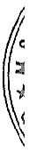

<table border=1 style='margin: auto; word-wrap: break-word;'><tr><td style='text-align: center; word-wrap: break-word;'></td><td style='text-align: center; word-wrap: break-word;'>Số cuối năm</td><td style='text-align: center; word-wrap: break-word;'>Số đầu năm</td></tr><tr><td style='text-align: center; word-wrap: break-word;'>Công ty TNHH Bào hiểm Nhân thọ AIA Việt Nam(xv)</td><td style='text-align: center; word-wrap: break-word;'></td><td style='text-align: center; word-wrap: break-word;'></td></tr><tr><td style='text-align: center; word-wrap: break-word;'>- Mệnh giá trái phiếu</td><td style='text-align: center; word-wrap: break-word;'>72.000.000.000</td><td style='text-align: center; word-wrap: break-word;'>108.000.000.000</td></tr><tr><td style='text-align: center; word-wrap: break-word;'>- Chỉ phi phát hành trái phiếu</td><td style='text-align: center; word-wrap: break-word;'>(1.030.553.425)</td><td style='text-align: center; word-wrap: break-word;'>(1.462.553.425)</td></tr><tr><td style='text-align: center; word-wrap: break-word;'>Ngân hàng TMCP Bản Việt(xv)</td><td style='text-align: center; word-wrap: break-word;'></td><td style='text-align: center; word-wrap: break-word;'></td></tr><tr><td style='text-align: center; word-wrap: break-word;'>- Mệnh giá trái phiếu</td><td style='text-align: center; word-wrap: break-word;'>40.000.000.000</td><td style='text-align: center; word-wrap: break-word;'>60.000.000.000</td></tr><tr><td style='text-align: center; word-wrap: break-word;'>- Chỉ phí phát hành trái phiếu</td><td style='text-align: center; word-wrap: break-word;'>(566.136.986)</td><td style='text-align: center; word-wrap: break-word;'>(806.136.986)</td></tr><tr><td style='text-align: center; word-wrap: break-word;'>Công ty TNHH MTV Quân lý quỹ Ngân hàng TMCP Công thương Việt Nam(xv)</td><td style='text-align: center; word-wrap: break-word;'></td><td style='text-align: center; word-wrap: break-word;'></td></tr><tr><td style='text-align: center; word-wrap: break-word;'>- Mệnh giá trái phiếu</td><td style='text-align: center; word-wrap: break-word;'>20.000.000.000</td><td style='text-align: center; word-wrap: break-word;'>30.000.000.000</td></tr><tr><td style='text-align: center; word-wrap: break-word;'>- Chỉ phí phát hành trái phiếu</td><td style='text-align: center; word-wrap: break-word;'>(283.068.493)</td><td style='text-align: center; word-wrap: break-word;'>(403.068.493)</td></tr><tr><td style='text-align: center; word-wrap: break-word;'>Vietnam Debt Fund SPC(xv)</td><td style='text-align: center; word-wrap: break-word;'></td><td style='text-align: center; word-wrap: break-word;'></td></tr><tr><td style='text-align: center; word-wrap: break-word;'>- Mệnh giá trái phiếu</td><td style='text-align: center; word-wrap: break-word;'>60.000.000.000</td><td style='text-align: center; word-wrap: break-word;'>90.000.000.000</td></tr><tr><td style='text-align: center; word-wrap: break-word;'>- Chỉ phí phát hành trái phiếu</td><td style='text-align: center; word-wrap: break-word;'>(849.205.479)</td><td style='text-align: center; word-wrap: break-word;'>(1.209.205.479)</td></tr><tr><td style='text-align: center; word-wrap: break-word;'>Công ty TNHH Bào hiểm Nhân thọ Sun Life Việt Nam(xv)</td><td style='text-align: center; word-wrap: break-word;'></td><td style='text-align: center; word-wrap: break-word;'></td></tr><tr><td style='text-align: center; word-wrap: break-word;'>- Mệnh giá trái phiếu</td><td style='text-align: center; word-wrap: break-word;'>24.000.000.000</td><td style='text-align: center; word-wrap: break-word;'>36.000.000.000</td></tr><tr><td style='text-align: center; word-wrap: break-word;'>- Chỉ phí phát hành trái phiếu</td><td style='text-align: center; word-wrap: break-word;'>(408.723.288)</td><td style='text-align: center; word-wrap: break-word;'>(552.723.288)</td></tr><tr><td style='text-align: center; word-wrap: break-word;'>Ngân hàng TMCP Quân đội - Chỉ nhánh Bình Dương(xv)</td><td style='text-align: center; word-wrap: break-word;'></td><td style='text-align: center; word-wrap: break-word;'></td></tr><tr><td style='text-align: center; word-wrap: break-word;'>- Mệnh giá trái phiếu</td><td style='text-align: center; word-wrap: break-word;'>80.000.000.000</td><td style='text-align: center; word-wrap: break-word;'>120.000.000.000</td></tr><tr><td style='text-align: center; word-wrap: break-word;'>- Chỉ phí phát hành trái phiếu</td><td style='text-align: center; word-wrap: break-word;'>(1.362.410.960)</td><td style='text-align: center; word-wrap: break-word;'>(1.842.410.960)</td></tr><tr><td style='text-align: center; word-wrap: break-word;'>Ngân hàng TMCP Tiên Phong(xv)</td><td style='text-align: center; word-wrap: break-word;'></td><td style='text-align: center; word-wrap: break-word;'></td></tr><tr><td style='text-align: center; word-wrap: break-word;'>- Mệnh giá trái phiếu</td><td style='text-align: center; word-wrap: break-word;'>120.000.000.000</td><td style='text-align: center; word-wrap: break-word;'>180.000.000.000</td></tr><tr><td style='text-align: center; word-wrap: break-word;'>- Chỉ phí phát hành trái phiếu</td><td style='text-align: center; word-wrap: break-word;'>(1.668.852.808)</td><td style='text-align: center; word-wrap: break-word;'>(2.373.865.858)</td></tr><tr><td style='text-align: center; word-wrap: break-word;'>Ngân hàng TMCP Quốc tế - Chỉ nhánh Hồ Chí Minh(xv)</td><td style='text-align: center; word-wrap: break-word;'></td><td style='text-align: center; word-wrap: break-word;'></td></tr><tr><td style='text-align: center; word-wrap: break-word;'>- Mệnh giá trái phiếu</td><td style='text-align: center; word-wrap: break-word;'>200.000.000.000</td><td style='text-align: center; word-wrap: break-word;'>300.000.000.000</td></tr><tr><td style='text-align: center; word-wrap: break-word;'>- Chỉ phí phát hành trái phiếu</td><td style='text-align: center; word-wrap: break-word;'>(2.781.421.348)</td><td style='text-align: center; word-wrap: break-word;'>(3.956.443.098)</td></tr><tr><td style='text-align: center; word-wrap: break-word;'>Ngân hàng TMCP Quân đội - Chỉ nhánh Bình Dương(xvii)</td><td style='text-align: center; word-wrap: break-word;'></td><td style='text-align: center; word-wrap: break-word;'></td></tr><tr><td style='text-align: center; word-wrap: break-word;'>- Mệnh giá trái phiếu</td><td style='text-align: center; word-wrap: break-word;'>1.200.000.000.000</td><td style='text-align: center; word-wrap: break-word;'>-</td></tr><tr><td style='text-align: center; word-wrap: break-word;'>- Chỉ phí phát hành trái phiếu</td><td style='text-align: center; word-wrap: break-word;'>(17.645.972.054)</td><td style='text-align: center; word-wrap: break-word;'>-</td></tr><tr><td style='text-align: center; word-wrap: break-word;'>Cộng</td><td style='text-align: center; word-wrap: break-word;'>5.288.972.368.870</td><td style='text-align: center; word-wrap: break-word;'>9.138.073.398.830</td></tr></table>

(1) Khoản vay Ngân hàng TMCP Đầu tư và Phát triển Việt Nam - Chi nhánh Bình Dương theo các hợp đồng tín dụng sau:

Hợp đồng tín dụng dài hạn số 01/83576/HĐDH ngày 29 tháng 11 năm 2013 với số tiền vay 500 tỷ VND, thời hạn 10 năm đề thực hiện dự án đầu tư "Bệnh viện đa khoa quốc tế Miền Đông - Giai đoạn 1" bao gồm thanh toán tiền mua, nhập khẩu máy móc thiết bị y tế và chi phí xây dựng cơ bản, lãi suất vay áp dụng cơ chế lãi suất thả nổi và được điều chỉnh theo quy định của Ngân hàng trong từng thời kỳ. Khoản vay này được đảm bảo bằng việc thế chấp:

Toàn bộ số dư tài khoản tiền gửi sản xuất kinh doanh bằng VND và ngoại tệ của Tổng Cộng

ty tại ngân hàng và tại các tổ chức tín dụng khác (xem thuyết minh số V.1);

- Các khoản thu theo các hợp đồng kinh tế được ký kết giữa Tổng Công ty và đối tác khác mà Tổng Công ty là người thụ hưởng. Toàn bộ các khoản phải thu, nguyên vật liệu - hàng hóa tồn kho, chi phí sản xuất sở dang bảo đảm nợ vay cho ngân hàng.

