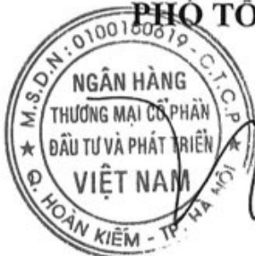

# CÔNG BỘ THÔNG TIN ĐỊNH KỸ

Kính gửi:

- Ủy ban Chứng khoán Nhà nước;

- Sở Giao dịch chứng khoán Việt Nam;

- Sở Giao dịch chứng khoán TP HCM;

- Sở Giao dịch chứng khoán Hà Nội.

1. Tên tổ chức: Ngân hàng Thương mại Cổ phần Đầu tư và Phát triển Việt Nam (BIDV)

- Mã chúng khoán: BID

Địa chỉ: Tháp BIDV, 194 Trần Quang Khải, Hoàn Kiểm, Hà Nội

Điện thoại liên hệ: (84-24) 2220 5544

- E-mail: nhadautu@bidv.com.vn

Fax: (84-24) 2220 0399

2. Nội dung thông tin công bố:

Ngân hàng TMCP Đầu tư và Phát triển Việt Nam công bố thông tin Báo cáo thường niên năm 2023 như đính kèm.

3. Thông tin này đã được công bố trên trang thông tin điện tử của ngân hàng vào ngày 4.1.0.4/2024 tại đường dẫn https://www.bidv.com.vn/vn/quan-he-nha-dau-tu/

Chúng tôi xin cam kết các thông tin công bố trên đây là đúng sự thật và hoàn toàn chịu trách nhiệm trước pháp luật về nội dung các thông tin đã công bố.

Nơi nhận: (03b)

- Như trên;

- Lưu TKHBQT&QHCB, VP.

NGƯỚI ĐƯỚC ỨY QUYỀN CÔNG BỎ THÔNG TIN

PHỐ TỔNG GIÁM ĐỐC

Trần Phương