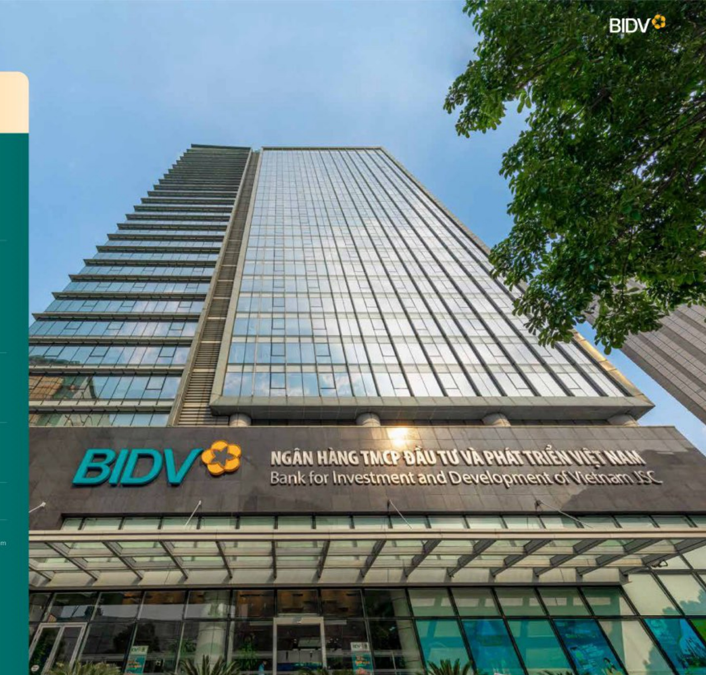

#### THÔNG TIN KHÁI QUẬT VỀ BIDV

TẾN DẠY DỤ

NGÀN HÀNG THƯỞNG MẠI CÓ PHẢN ĐẦU TƯ VÀ

PHÁT TRIỂN VIỆT NAM

TÊN GIAO DÍCH QUỐC TẾ

JOINT STOCK COMMERCIAL BANK FOR INVESTMENT AND DEVELOPMENT OF VIETNAM

TÊN VIỆT TẬT

BIDV

MÃ GIAO DÍCH SWIFT

MÃ SÓ DOANH NGHIỆP

BIDWNVX

Số 84/GP-NHNN do Ngân hàng Nhà nước Việt Nam cấp ngày 23/04/2012

GIẤY CHỮNG NHẬN DẪNG KỸ DOANH NGHIỆP

Do Số Kế hoạch và Đầu tư Thành phố Hà Nội cấp lần đầu ngày 03/04/1993. Đăng ký thay đổi lần thứ 28 ngày 03/01/2024

DIỆN THOẠI FAX WEBSITE

02422205544 02422200399 https://www.bidv.com.vn

Địa chỉ trụ sở chính

Tháp BIDV, 194 Trần Quang Khải, Phường Lý Thái Tố, Quận Hoàn Kiểm, Thành phố Hà Nội

MỆNH GIÁ CỔ PHẦN

10.000 đăng/cổ phần

VỐN ĐIỂU LỆ

57.004.359.000.0

CHỮ TÍCH HDỎT

Phan Đức Tù

Lê Ngọc Lâm

TỔ CHỨC XẾP HÀNG TÍN NHIỆM

CÔNG TY KIẾM TOẠN

Moody's

ĐINH HÀNG TIẾN GỮI DÀI HÀN

Ba2

BỊNH HÀNG NHÀ PHÁT HÀNH

ĐẠI HẠN

Ba2

