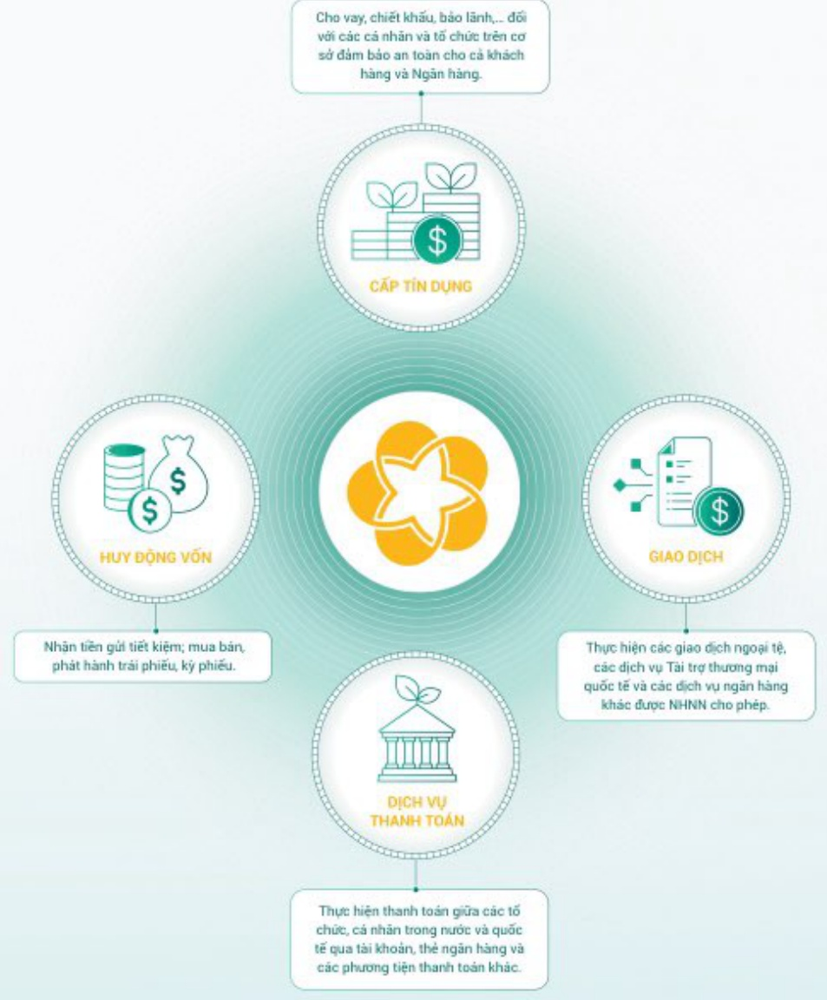

# NGÀNH NGHỀ VÀ ĐỊA BÀN KINH DOANH NGÀNH NGHỀ KINH DOANH

Cho vay, chiết khấu, bảo lãnh... dối với các cá nhân và tổ chức trên cơ sở đảm bảo an toàn cho cả khách hàng và Ngân hàng.

Nhận tiền gửi tiết kiệm; mua bán, phát hành trải phiếu, ký phiếu.

Thực hiện các giao dịch ngoại tệ, các dịch vụ Tài trợ thương mại quốc tế và các dịch vụ ngân hàng khác được NHHN cho phép.

Thực hiện thanh toán giữa các tổ chức, cá nhân trong nước và quốc tế qua tài khoản, thế ngân hàng và các phương tiện thanh toán khác.

Địa Bản KINH DOANH

MẠNG LƯỢI

Mạng lưới host động trong nước phân bố rộng khắp các tỉnh/thành phố gup ĐlDv tiếp cận một lương lên khách

TRONG NƯỚC

hàng trên toàn quốc và các khu vực lân cân, cung cấp dịch vụ đa dạng cho nhiều đối tượng khách hàng từ cả

nhân, hộ gia đình đến các lợi hình tố chức, doanh nghiệp.

Tổng số điểm mạng lưới đến 31/12/2023 gồm:

TRỤ SỐ CHÍNH

01

194 Trần Quang Khải, phương Lý Thái Tổ, quản Hoàn Kiểm, TP. Hà Nội

CHI NHÁNH

34 Chi nhánh tại Thành phố Hà Nội

14 Chi nhánh tại Bắc Trung Bộ

189

36 Chi nhánh tại Thành phố Hồ Chí Minh

15 Chi nhánh tại Nam Trung Bộ

tại tất cả 63 tinh/

thành phố trên

cá nước

24 Chỉ nhánh tại địa bàn Động lực phía Bắc

ngoài TP Hà Nội và Động bảng sông Hồng. - 15 Chỉ nhánh tại địa bản Động lực phía Nam ngoài TP.HCM

- 17 Chỉ nhánh tại Miền Núi phía Bắc

- 22 Chỉ nhánh tại Đông bảng Sống Cầu Long

PHÒNG GIAO DÍCH VĂN PHÒNG DẠI DIỆN

ĐƠN VI SỰ NGHIỆP TRỰC THƯỚC

895 02

03

- Viên Đảo tạo và Nghiên cứu

- Trung tâm Công nghệ Thống tin

- Trung tâm Dịch vụ khả quỹ phía Nam

CÔNG TY CON CÔNG TY LIÊN KẾT

CÔNG TY LIỄN DOẠNH

10 02

03

MẠNG LƯỢI CHI NHÁNH TÀI MYANMAR

VĂN PHÒNG DẠI DIỆN

04

tai Campuchia, Lào, Đài Loan (Trung Quốc),

Liên bang Nga.