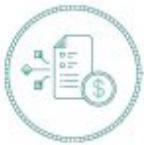
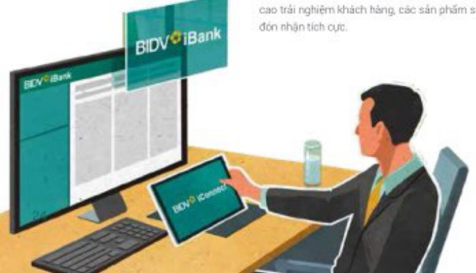
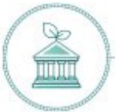
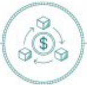
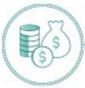
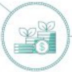

#### SẢN PHẦM CHÍNH VÀ NỘI BẠT

#### KHỐI NGÂN HÀNG BÁN BUÔN

Xác định Chuyển đổi số và chuyển đổi xanh là xu hướng chuyển dịch tất yếu của thế giới và của Việt Nam, hướng tới phát triển bền vững, năm 2023 hoạt động ngân hàng Bán buôn của BIDV tiếp tục đi đầu trong việc triển khai các sản phẩm dịch vụ ngân hàng số, sản phẩm tài chính Xanh nhằm giúp doanh nghiệp nâng cao hiệu quả kinh doanh, trải nghiệm liên mạch và từng bước chuyển đổi xanh trong hoạt động.

##### DỊCH VỤ THANH TOÁN PHÍ XẾT TUYỄN DẠI HỌC

### 63.500

##### TIỆN PHONG RA MẬT HỆ THỐNG

BIDV OPEN AI

hệ sinh thái mơ giúp tích hợp các dịch vụ ngân hàng vào các ứng dụng, phần mềm, nền tảng sổ của khách hàng, đối tác.

##### Sản phẩm Ngân hàng số dành cho khách hàng tổ chức

Với mục tiêu là ngân hàng có nền táng số tốt nhất Việt Nam, BIDV đã luôn nổ lực xây dựng một hệ sinh thái ngân hàng số toàn diện đành cho khách hàng tố chức thông qua 2 nền táng Omni BIDV iBank và BIDV iConnect. Trong năm 2023, BIDV không ngừng mở rộng và hoàn thiện hệ thống ngân hàng số, đặc biệt là ứng dụng BIDV iBank nhằm mang đến trải nghiệm liên mạch và tối ưu hóa các giải pháp tài chính cho khách hàng với nhiều tính năng bao gồm chuyến tiền quốc tế, mua bán ngoại tế và các sản phẩm tiền gửi có ký hạn trực tuyến... Sản phẩm BIDV iBank và BIDV iConnect đã trở thành những trụ cột chính trong hệ sinh thái số của ngân hàng, góp phần quan trọng trong việc kiến tạo giá trị biển vững cho khách hàng. Đồng thời, nhằm đáp ứng mục tiêu chiến lược của Chính phủ trong việc số hóa và tối ưu quy trình giải quyết thú lực hành chính, đem tối trái nghiệm thuần tiến cho người dân, BIDV đã tích cực triển khai dịch vụ thu phí, lệ phí bô số ban ngành trực tuyến trên cổng Dịch vụ công quốc gia. Tiêu biểu trong năm 2023, dịch vụ thanh toàn phí xét tuyến đại học được dấy mạnh với gần 63.500 giao dịch được thực hiện trong 3 tháng triển khai, đạt tổng giá trị 6.88 tỷ VND. Năm 2023, số lượng giao dịch dịch vụ công được triển khai qua BIDV đạt gần 800.000 giao dịch, tầng trường 445% so với năm 2022. Việc phát triển hệ sinh thái số (digital ecosystem) cũng trở thành một trong những lĩnh vực được BIDV quan tâm. Ngày 29/11/2023, BIDV đã tiên phong ra mất thị trường hệ thống BIDV Open API - hệ sinh thái mở giúp tích hợp các dịch vụ ngân hàng vào các ứng dụng, phần mềm, nền tầng số của khách hàng, đối tác. Với BIDV Open API, dịch vụ ngân hàng sẽ được tích hợp dễ dàng nhất vào các ứng dụng, phần mềm, nền tầng số trên thị trường, tạo ra những giải pháp tài chính mỗi, nâng cao trải nghiệm cho khách hàng cá nhân và tổ chức khi mua sắm, thanh toàn, kinh doanh và quản lý tài chính trên không gian số. Phát triển sản phẩm theo hướng chủ trọng năng cao trải nghiệm khách hàng, các sản phẩm số của BIDV đã được công đống doanh nghiệp đón nhận tích cực.

##### Sản phẩm Tài trợ thương mại

Bên cạnh các uẩn đôi về dịch vụ, BIDV luôn dành uẩn tiến cấp tín dụng cho đối tượng doanh nghiệp xuất nhập khẩu với các gối tín dụng ưu đãi và các điều kiện tín dụng linh hoạt. Đăng thời, BIDV triển khai nhiều hình thức sản phẩm tài trợ thuang mại với điều kiện tài sản bảo đảm linh hoạt như tín chấp, thế chấp khoản phải thu tử hợp đồng xuất khẩu, lô hàng nhập... nhằm đáp ứng kịp thời nhu cầu doanh nghiệp. Đặc biệt, các sản phẩm dịch vụ thanh toàn quốc tế, tài trợ thuong mại đã được số hóa, cho phép khách hàng doanh nghiệp gửi hỗ sở giao dịch và tiếp nhận, theo dõi kết quả xử lý tử ngàn hàng qua chương trình ngân hàng điện tử BIDV iBank.

Danh mục sản phẩm tài trợ thương mại (TTTM) của BIDV đầy đủ, da dạng, cơ chế sản phẩm tiêu chuẩn theo thông lệ quốc tế như: Thư tín dụng (L/C), nhờ thu, chiết khẩu hồi phiếu đời ngư, Forfaiting... Mang lưới ngăn hàng đại lý/thị trưởng thanh toán quốc tế rộng đem lại nhiều lợi thế cho BIDV trong triển khai, cung cấp dịch vụ TTTM cho khách hàng.

##### Sản phẩm Tài trợ chuỗi cung ứng

Với định vị dưa BIDV trở thành ngân hàng số 1 trong hoạt động tài trợ chuỗi, mục tiêu đến năm 2026 quy mô tài trợ chuỗi cung ứng đạt 1.6 tỷ USD, trong thời gian qua, BIDV đã dành nhiều nguồn lực đấu tư cho công tác phát triển sản phẩm, ứng dụng công nghệ thông tin và bản hàng. Bảng khả năng cung cấp giải pháp "may đo" cho nhiều doanh nghiệp lớn. BIDV đã phối hợp xây dựng các chuông trình tài trợ chuỗi cung ứng dành cho các tập đoàn hàng đầu trong các lĩnh vực kinh tế như bất động sản, hàng tiêu đúng nhanh (FMCG), phần phối ở tô, thiết bị điện... Năm 2023 cũng ghi nhận thành công của BIDV trong hành trình chính phục doanh nghiệp trung tâm là các công ty da quốc gia cũng như tập đoàn lớn trong nước thông qua các giải pháp về sản phẩm, ứng dụng công nghệ số hóa và chính sách thức đấy bên với nhiều nguồn lực uu dải cho khách hàng chuỗi cung ứng.

Với các giải pháp đồng bộ, năm 2023 số dư tín dụng tài trợ chuỗi cung ứng tăng gặp gần 3 lần so với năm 2022. Trong đó, số lượng doanh nghiệp SME tại Việt Nam được tiếp cận với dòng vốn tài trợ chuỗi từ BIDV đã tăng trưởng 195%, tốc độ giải ngắn thông qua giải pháp này cũng tăng 123% trong năm qua.

##### Sản phẩm Tín dụng ngành

BIDV thiết kế, cải tiến các gói sản phẩm tin dung theo ngành cũng như các giải pháp trọn gói, đóng gói sản phẩm dịch vụ (all-in-one) để đáp ứng tốt nhất nhu cầu của khách hàng trong từng ngành, lĩnh vực kinh tế. Trong đó, BIDV ưu tiên thúc dây tin dụng đối với các ngành nghề lĩnh vực tiêm năng, quan trọng đối với nên kinh tế như bất động sản khu công nghiệp, năng lượng tài cao, các lĩnh vực xuất nhập khẩu, được phẩm, thi công xảy lắp,... BIDV cũng là ngăn hàng di đầu trong việc thực hiện các giải pháp tin dụng để góp phần thực hiện chủ trương, chỉ đạo của Đáng và Chính phủ trong việc hồi phục và phát triển nên kinh tế, qua việc triển khai Chương trình tin dụng 120.000 tỷ đồng cho vay nhà ở xã hội, nhà ở công nhân, cải tạo, xây dựng lại chung cư cũ theo Nghị quyết 33/NQ-CP, gói tin dụng đối với lĩnh vực bất đồng sản nhà ở thương mai phú hợp với nhu cầu thực về nhà ở trên thị trường, chuồng trình tin dụng đối với lĩnh vực làm sản, thầy sản...

SỐ DỰ TÍN DỤNG TÀI TRỘ CHUỔI CUNG ỨNG TẤNG

GẢN GẬP 3 LẨN

TIÊN PHONG TRIỂN KHAI CHƯƠNG TRÌNH TÍN DỤNG

##### Sản phẩm Tín dụng xanh

BIDV là ngăn hàng thương mai cổ phần đâu tiên tai Việt Nam công bố "Khung Khoản vay bền vững" và hiện là ngăn hàng dẫn đâu thì trưởng về tài trợ các dự án xanh với hàng ngàn khác hàng và dưới. Luôn năm trong Top 5 ngăn hàng có dư nọ tin dụng xanh lớn nhất hệ thống. đến 31/12/2023, dưng tin dูก xanh tai BIDV đạt 74.177 tỷ đồng (chiếm tỷ trong 4,24% tổng dưnọ), trong đó, chủ yếu tập trung vào tính vực Năng lượng tài tao, năng lượng sạch với dư nọ 60.092 tỷ đồng (chiếm 81% tổng dư nọ tin dụng xanh). Hơn cả một ngân hàng, BIDV tiền phong phát triển các sản phẩm tài chính bền vững khi triển khai thành công sản phẩm Dết mày Xanh song hành với gói tin dụng Xanh 4.200 tỷ đồng nhăm tao tro lực quan trong hỗ trợ các doanh nghiệp dết mày chuyến dối hoạt động sản xuất kinh doanh theo hướng phát triển bền vững.

GỘI DỆT MAY XANH

4.200