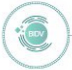
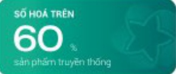
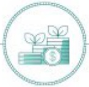
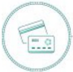
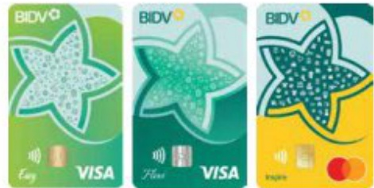
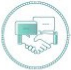
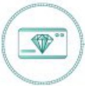
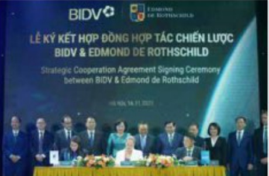

# SẢN PHẦM CHÍNH VÀ NỘI BẬT (tiếp theo) KHỐI NGÂN HÀNG BÁN LỄ

Năm 2023, hoạt động ngân hàng bán lẻ BIDV tiếp tục khẳng định vị thế số 1 thị trường với những dấu mốc ăn tượng, trở thành ngân hàng đầu tiên và duy nhất tại Việt Nam 9 lần nhận giải thưởng danh giá Ngân hàng Bản lẻ tốt nhất Việt Nam do tập chỉ The Asian Banker bình chọn. Để đạt được những thành tụ đó bên cạnh chính sách, chiến lược kinh doanh linh hoạt, nhạy bén, phải kế đến thành công của sự kiện chuyển đổi hệ thống ngân hàng lỗi và hàng loạt sản phẩm liên tục được số hóa, năng cấp có tính chất đột phá, khác biệt giúp thu hút và gia tăng trải nghiệm khách hàng một cách toàn diện.

##### BIDV SmartBanking - Hệ sinh thái tài chính số toàn diện

BIDV SmartBanking đang vận hành theo huống trò thành hệ sinh thái tài chính số đáp ứng toàn diện nhu cầu của khách hàng, không chỉ cung cấp các dịch vụ thiết yếu mà còn giải quyết các nhu cầu tài chính nâng cao. Với định hướng đó, BIDV đã số hóa trên 60% sản phẩm truyền thống (tiên gửi, tiến vay, thế, chuyển tiền quốc tế...), đồng thời phát triển các tính năng mới đột phá như Smart Kids, sản phẩm đấu tư, báo hiểm, chúng khoán đưa lên kênh SmartBanking. Đồng thời, liên tục hợp tác với các dối tác lám, mở rộng và hoàn thiện hệ sinh thái tiến ích tài chính và phi tài chính hấp dẫn, da dang cho khách hàng: Mua sầm hoàn tiễn, taxi, đặt hoa, giao hàng, đặt vẻ sự kiện...

Bên cạnh chú trọng phát triển hệ sinh thái sản phẩm số. BIDV cũng tập trung chiến lược trái nghiệm khách hàng vượt trội da kênh liên mạch với các tinh năng có hàm lượng công nghệ cao như: Chatbot; AI trả lời tự động các thác mắc của khách hàng; Dấu Ăn 2023 - Tổng kết giao dịch trong năm và gọi ý phong thủy, bán chèo dựa trên phần tích dưới liệu lớn; Ứng dụng công nghệ gamification xây dựng trò cho BIDV Smart City thúc dấy khách hàng giao dịch thông qua các hoạt động giải trí.

##### Tín dụng xanh - Đón đâu xu thế

Huống ủng Chiến lược quốc gia về tăng trưởng xanh giai đoạn 2021 - 2030, tầm nhìn đến năm 2050, bên cạnh các gói vay ưu đãi như vay tiêu dùng, vay sản xuất kinh doanh thống thường, BIDV đã ban hành gói Tín dụng xanh đánh cho khách hàng cá nhăn vay vốn phát triển năng lượng sạch (điện mất trời, diễn gió) hoặc các lĩnh vực trồng trot chăn nuôi theo các tiêu chuẩn VIETGAP, ISO...với chính sách lãi suất hấp dẫn và ưu đãi hơn với thống thuống.

Bèn cạnh đó, BIDV cùng tập trung đấy mạnh sổ hóa các quy trình, hồ sơ sản phẩm Tín dụng, hạn chế giấy tờ, hồ sơ giấy và trợ thành ngân hàng quốc doanh đầu tiên triển khai cấp tin dụng trên tất cả các nền tầng kênh sổ với quy trình thẩm định, phê duyệt tin dụng bán lẻ được thực hiện hoàn toàn trên hệ thống RLOS.

Uống dụng vay online BIDV Home tiếp tục được cái tiến, nâng cấp nhằm khép kín hành trình của khách hàng từ khâu tìm hiểu thông tin về sản phẩm, đăng ký vay nhận ưu đài lãi suất, gửi hỗ so trực tiếp qua ứng dụng, theo đổi tiến trình xử lý khoản vay online. Bên cạnh đó, ứng dụng cũng mang đến đa dạng lựa chọn cho khách hàng bằng việc kết nối với các đối tác uy tín, cung cấp các dự án nhà ở xanh, các dòng xe ở tô sử dụng động cơ điện thân thiện với môi trường.

### Thé BIDV - Diện mạo, cảm hứng mối, tận hưởng phong cách sống tinh hoa

Năm 2023, BIDV đã cho ra mắt bộ thế BIDV theo nhận diện thương hiệu hoàn toàn mới, với thông điệp "Inspire Your Life - Khoi nguồn

cảm hùng cuộc sống", bộ thể mới gồm các dòng thế ghi nợ, thế tin dụng, thế trả trước prepaid với hai màu sắc chủ đạo là xanh ngọc lục bảo và màu vàng kết hợp với hình bông hoa mai 5 cánh thế hiện sự trẻ trung, phong cách, cá tính, sành điệu, nhưng không kém phần sang trọng và đáng cấp.

* Thế tín dụng BIDV là một trong những đồng sản phẩm trong tấm BIDV tập trung phát triển dựa trên các phân tích, nghiên cứu chuyên sâu về số thích, thời quen chi tiêu, phong cách sống của khách hàng, gồm các đồng thế Cashback cho khách hàng thường xuyên giao dịch online, mua sầm siêu thị; đồng thế chuyên cho du lịch, ấm thực, với hệ sinh thái đối tác rộng lớn, đặc quyền da dạng, ưu đãi hợp dẫn.

- Đặc biệt, BIDV chú trọng phát triển động thế tin dụng quốc tế đánh cho phần khúc khách hàng cao cấp với thế BIDV Private Banking với hệ sinh thái hàng ngàn đôi tác liên kết rộng kháp thị trường tại các lĩnh vực hàng không, nghĩ đường, ẩm thực, golf, spa, chăm sóc sức khỏe. Ngoài ra, BIDV cũng hợp tác với JCB ra mắt thế tin dụng quốc tế BIDV JCB Ultimate - đồng thế JCB cao cấp bậc nhất đánh cho khách hàng cá nhân yêu thích trải nghiệm ẩm thực, văn hóa Nhật Bản.

Bên cạnh phát triển các động thê đa đang và mở rộng hệ sinh thái ưu đãi, BIDV cũng tập trung số hóa quy trình phát hành thê mang đến trải nghiệm nhanh chóng và để đàng, khách hàng có thể đàng kỳ phát hành thê online trên website hoặc qua ứng dụng BIDV SmartBanking, chủ động điện thông tin, đàng tài hồ sơ để ngàn hàng phê duyệt tư động và gửi thê tăn nhà khách hàng.

##### Đa dạng hóa danh mục tiễn gửi, thúc đẩy tăng trưởng CASA mạnh mẽ

Bên cạnh cải tiến quy trình và đa dạng các sản phẩm tiến gửi tại quày (bộ sung tiến gửi bằng bảng Anh, đó là Ức), BIDV đã triển khai nhiều sản phẩm tiến gửi mới trên kênh online với hình thức trả lời linh hoạt (đầu kỳ, định kỳ), mục dịch đa dạng nhằm đáp ứng tốt nhất như cầu khách hàng, tự động nhận diện và áp dụng chính sách lãi suất cạnh tranh cho khách hàng cao cấp khi gửi tiết kiệm online nhằm gia tăng trải nghiệm của khách hàng.

Bên cạnh gia tầng quy mô tiễn gửi có ký han, BIDV cũng triển khai manh mẻ các giải pháp thu hút khách hàng sử dụng tải khoản BIDV làm tài khoản chính, tư đó gia tầng nguôn tiễn gửi không ký han (CASA) của khách hàng như dịch vụ Tài khoản Như ý găm Tài khoản số đẹp thế hệ môi với tài khoản siêu ngân (chỉ 3 đến 10 chữ số), tài khoản nickname/shopname, tài khoản số điện thoại. Chiến lược tài chính toàn diện và các giải pháp thanh toán không dùng tiến một như kênh giao dịch tư động như nộp rút tiễn tại CRM; Mở rộng liên kết với các trung gian thanh toán dịch vụ thanh toán hóa đơn với các nhà cung cấp, phát triển các tính năng thanh toán QR xuyên biến giới tại thị trường Thái Lan, Campuchia...

##### Thiết lập chuẩn mực mới, vị thế mới cho dịch vụ khách hàng cá nhân cao cấp tại thị trường Việt Nam

Sau gần 2 năm triển khai, BIDV đã chúng tô được đáng cấp của dịch vụ khách hàng cao cấp với các giải pháp báo toàn và phát triển tài sản bền vững, hiệu quả, được thiết kế theo như cầu tùng khách hàng như: đa dạng hóa danh mục sản phẩm đâu tư với số lượng hiển tại lên tối 11 quý - làm nhất trong số các ngân hàng Việt Nam; giải pháp đâu tư chuyên biết Elevate by DC đánh cho khách hàng siêu giàu; bảo hiểm sức khỏe BIC Smart Care với phạm vi địa lý bảo hiểm mở rộng tại Châu Á và trên toàn cầu; giải pháp bất động sản cao cấp, toàn diện và dịch vụ tư vấn chuyên biết về các lĩnh vực giáo dục, định cư, di trù, nhập tịch, tư vấn thuê và lập kế hoạch tài sản.

Các khách hàng cũng được phục vụ bởi các giảm độc quản lý tài sản được đào tạo bài bản, cấp chúng chỉ quốc tế về tư vấn, quản lý tài sản. Bên cạnh đó, BIDV cũng đặc biệt chủ trọng đếm đến trái nghiệm vượt trội cho khách hàng thông qua hệ sinh thái đối tác uy tín, độc quyền đáng cấp và công đồng Private Club ưu tù với những trải nghiệm độc đào, xứng tăm thượng lưu về văn hóa, nghệ thuật và phong cách sống.

Tháng 4/2023, BIDV tiếp tục tiến tới bước ngoặt xa hơn khi "bắt tay" cùng ông lón Private Banking hàng đều thế giới - Edmond de Rothschild. Với kinh nghiệm và các giải pháp đã chứng minh hiệu quả trên toàn cầu, Edmond de Rothschild sẽ kết hợp với BIDV để đáp ứng nhiều câu của những khách hàng có thụ nhập rộng cao tại Việt Nam, bằng cách giúp họ tiếp cận với các cơ hội đều tư hiệu quả và sáng tạo. Edmond de Rothschild cũng cảm kết sở hỗ trợ BIDV chuẩn hòa và nâng cao năng lực đối ngũ giám đốc quản lý tài sản, từ đó mang lại dịch vụ Private Banking chuẩn mực, đăng cấp quốc tế.

