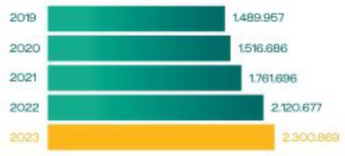
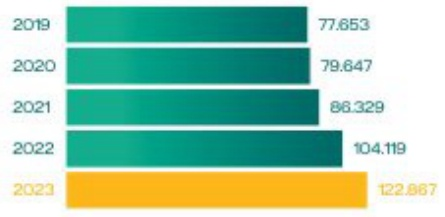
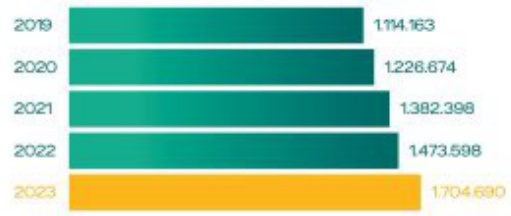
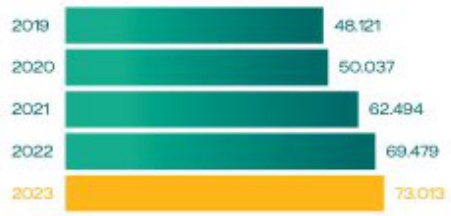
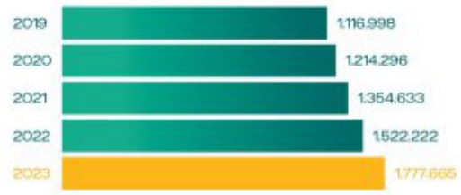
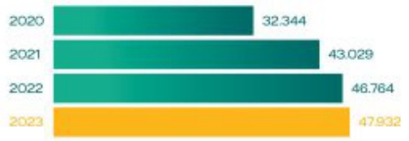

### CHỈ SỐ HOẠT ĐỘNG CỔ BẢN

#### TỔNG TÀI SẢN

BIDV tiếp tục khảng định vị thế hàng đầu với quy mô tổng tài sản lớn nhất trong các ngân hàng thương mại cổ phần tại Việt Nam; đạt 2.300.869 tỷ đồng, tăng trưởng 8.5% so với năm 2022.

#### 2.300.869

#### VỐN CHỦ SỞ HỪU

Vốn chủ sở hữu đến 31/12/2023 đạt 122.867 tỷ đồng, tăng trưởng 18% so với năm 2022.

### 122.867

Tiền gửi của khách hàng đến 31/12/2023 đặt

1.704.690 tỷ đồng. tăng trưởng 15,7% so với

năm 2022.

#### TIỆN GỬI KHÁCH HÀNG

#### TỔNG THU NHẬP HOẠT ĐỘNG

Tổng thu nhập hoạt động năm 2023 đạt 73.013 tỷ đồng. tăng trưởng 5,1% so với năm 2022.

73.013

#### CHO VAY KHÁCH HÀNG

Cho vay khách hàng đến 31/12/2023 đạt 1.777.665 tỷ đồng, tăng trưởng 16,8% so với năm 2022.

#### 1.777.665

#### CHÊNH LỆCH THU CHI

### 47.932

