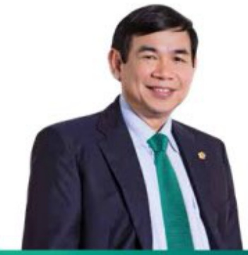
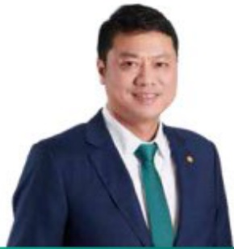
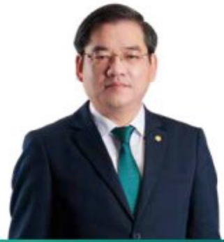

#### HỘI ĐỒNG QUẢN TRỊ

Hội đồng Quản trị (HDQT) là cơ quan quản trị BIDV, có toàn quyền nhân danh BIDV để quyết định, thực hiện các quyền, nghĩa vụ của BIDV không thuộc thẩm quyền của Đại hội đồng cổ đồng. HDQT còn có nhiệm vụ xác định và xây dựng các kế hoạch và chính sách như chính sách quản lý kinh doanh, chiến lược kinh doanh và các kế hoạch phát triển chung của BIDV.

##### Các thành viên HDQT tại BIDV bao gồm:

<table border=1 style='margin: auto; word-wrap: break-word;'><tr><td style='text-align: center; word-wrap: break-word;'>HỘ VÀ TÊN</td><td style='text-align: center; word-wrap: break-word;'>CHỨC VỤ</td><td style='text-align: center; word-wrap: break-word;'>SỐ LƯỢNG CỔ PHIỆU</td><td style='text-align: center; word-wrap: break-word;'>TỶ LỆ SỐ HỪU (%)</td></tr><tr><td style='text-align: center; word-wrap: break-word;'>Ông PHÁN ĐỨC TỪ</td><td style='text-align: center; word-wrap: break-word;'>Chú tích HDQT</td><td style='text-align: center; word-wrap: break-word;'>61.670</td><td style='text-align: center; word-wrap: break-word;'>0.0011</td></tr><tr><td style='text-align: center; word-wrap: break-word;'>Ông LÊ NGỌC LẤM</td><td style='text-align: center; word-wrap: break-word;'>Uý viên HDQT, Tống Giám đốc</td><td style='text-align: center; word-wrap: break-word;'>1.024</td><td style='text-align: center; word-wrap: break-word;'>0.00002</td></tr><tr><td style='text-align: center; word-wrap: break-word;'>Ông ĐẰNG VĂN TUYỀN</td><td style='text-align: center; word-wrap: break-word;'>Ủy viên HDQT</td><td style='text-align: center; word-wrap: break-word;'>0</td><td style='text-align: center; word-wrap: break-word;'>0</td></tr><tr><td style='text-align: center; word-wrap: break-word;'>Bà PHÁN THÍ CHINH</td><td style='text-align: center; word-wrap: break-word;'>Ủy viên HDQT</td><td style='text-align: center; word-wrap: break-word;'>41.365</td><td style='text-align: center; word-wrap: break-word;'>0.0007</td></tr><tr><td style='text-align: center; word-wrap: break-word;'>Ông NGỮ VĂN DỪNG</td><td style='text-align: center; word-wrap: break-word;'>Ủy viên HDQT</td><td style='text-align: center; word-wrap: break-word;'>1.105</td><td style='text-align: center; word-wrap: break-word;'>0.00002</td></tr><tr><td style='text-align: center; word-wrap: break-word;'>Ông PHÁM QUANG TỪNG</td><td style='text-align: center; word-wrap: break-word;'>Ủy viên HDQT</td><td style='text-align: center; word-wrap: break-word;'>1</td><td style='text-align: center; word-wrap: break-word;'>0.002</td></tr><tr><td style='text-align: center; word-wrap: break-word;'>Ông TRẦN XUẬN HOÀNG</td><td style='text-align: center; word-wrap: break-word;'>Ủy viên HDQT</td><td style='text-align: center; word-wrap: break-word;'>113</td><td style='text-align: center; word-wrap: break-word;'>0.002</td></tr><tr><td style='text-align: center; word-wrap: break-word;'>Ông LÊ KIM HÒA</td><td style='text-align: center; word-wrap: break-word;'>Ủy viên HDQT</td><td style='text-align: center; word-wrap: break-word;'>60.920</td><td style='text-align: center; word-wrap: break-word;'>0.0011</td></tr><tr><td style='text-align: center; word-wrap: break-word;'>Ông QUÁCH HÙNG HIỆP</td><td style='text-align: center; word-wrap: break-word;'>Ủy viên HDQT</td><td style='text-align: center; word-wrap: break-word;'>106</td><td style='text-align: center; word-wrap: break-word;'>0.002</td></tr><tr><td style='text-align: center; word-wrap: break-word;'>Ông YOO JE BONG</td><td style='text-align: center; word-wrap: break-word;'>Ủy viên HDQT</td><td style='text-align: center; word-wrap: break-word;'>0</td><td style='text-align: center; word-wrap: break-word;'>0</td></tr><tr><td style='text-align: center; word-wrap: break-word;'>Ông NGUYỄN VĂN THANH</td><td style='text-align: center; word-wrap: break-word;'>Ủy viên HDQT độc lập</td><td style='text-align: center; word-wrap: break-word;'>0</td><td style='text-align: center; word-wrap: break-word;'>0</td></tr></table>

##### Những thay đổi của HĐQT:

- Ông Đăng Văn Tuyên được bầu giữ chức vụ Ủy viên HDQT BIDV nhiệm kỳ 2022-2027 kế từ ngày 28/04/2023 và đại diện 30% vốn nhà nước tại BIDV.

Ông Quách Hùng Hiệp được bầu giữ chức vụ Ủy viên HDQT BIDV nhiệm kỳ 2022-2027 kế tư ngày 30/1/2024.

#### CHI TIẾT VỀ CÁC THÀNH VIÊN HỘI ĐỒNG QUẢN TRỊ

Ông Phan Đức Tú - Chủ tịch HDQT

• Sinh năm 1964.

- Cử nhân Tài chính ngàn hàng.

Bắt đầu làm việc tại BIDV từ năm 1987.

- Được bầu giữ chức vụ Chủ tịch HĐQT Ngân hàng TMCP Đầu tư và Phát triển Việt Nam tương đạt 15/11/2018 đến nay.

Tùng giữ các chức vụ. Úy viên HĐQT kiểm Tổng Giám đốc, Phó Tổng giám đốc BIDV, Giám đốc Ban Tổ chức cân bộ BIDV, Giám đốc Chi nhánh BIDV Quảng Ngãi.

• Sinh năm 1975.

- Thạc sự Kính tế

Bắt đầu làm việc tại BIDV từ năm 1997.

Được bầu giữ chức vụ Uỷ viên HĐQT Ngân hàng TMCP Đầu tư và Phát triển Việt Nam từ ngày 12/03/2021 đến nay.

Tùng giữ các chức vụ: Phó Tổng Giám đốc phụ trách Ban Điều hành BIDV, Phó Tổng giám đốc BIDV, Giám đốc Ban Quản lý rủi ro tin dụng BIDV, Giám đốc Ban Khách hàng doanh nghiệp BIDV.

Ông Lê Ngọc Lâm - Ứy viên HDQT, Tổng Giám đốc

Ông Đặng Văn Tuyên - Ủy viên HĐQT

##### • Sinh năm 1973

- Cử nhân Luật, Cử nhân Tài chính - Ngàn hàng

Được bầu giữ chức vụ Uý viên HĐQT Ngân hàng TMCP Đầu tư và Phát triển Việt Nam từ ngày 28/04/2023 đến nay.

Tùng giữ các chức vụ: Vụ trưởng Vụ Tổ chức cân bộ Ngân hàng Nhà nước Việt Nam, Phó Vụ trưởng Vụ Tổ chức cân bộ Ngân hàng Nhà nước Việt Nam.