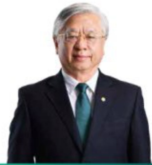
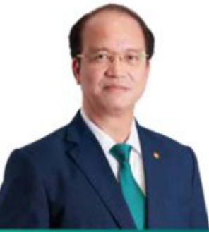
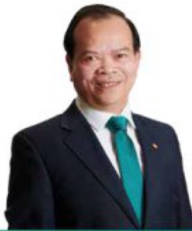
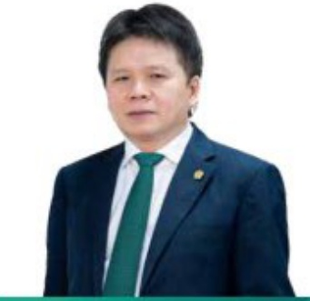

#### CHI TIẾT VỀ CÁC THÀNH VIÊN HỘI ĐỒNG QUẢN TRỊ (tiếp theo)

##### • Sinh năm 1968.

Thực sự Quản trị kinh doanh.

Bắt đầu làm việc tại BIDV từ năm 1991.

- Được bầu làm ủy viên HĐQT Ngàn hàng TMCP Đầu tư và Phát triển Việt Nam từ ngày 25/04/2014

Hiện kiếm chức vụ Ủy viên Hiệi đồng Quản tri Công ty cổ phân thành toàn quốc gia (Napas) và Chủ tịch HĐQT Công ty Liên doanh tháp BIDV.

Tùng giữ các chức vụ: Phó Tổng Giám đốc BIDV, Giám đốc Ban Tài Chính.

##### • Sinh năm 1965.

Cử nhân Kinh tế

- Được bầu làm Ủy viên HĐC T Nghản hàng TMCP Đầu tư và Phát triển Việt Nam từ ngày 07/03/2020.

Hiện kiểm chức vụ: Chủ tịch HĐQT Tổng Cộng ty bảo hiểm BIDV, Chủ tịch Cộng ty Cổ phản Bất động sản và xảy dụng nhà Mê Kông (MHBR).

##### Bà Phan Thị Chính - Ủy viên HDQT

Tùng giữ các chục vụ: Phó Tổng Giám đốc BIDV, Giám đốc Ban Tổ chức cản bộ.

##### Ông Trần Xuân Hoàng - Ủy viên HĐQT

• Sinh năm 1968.

Thác sự Tài chính ngàn hàng.

Bắt đầu làm việc tại BIDV từ năm 1998.

Được bầu làm Ủy viên HĐQT Ngân hàng TMCP Đầu tư và Phát triển Việt Nam từ ngày 01/06/2015.

Hiện kiếm chức vụ: Chủ tịch HĐQT Cộng ty cổ phần Chứng khoản BIDV (BSC), Chủ tịch Cộng ty TNHH MTV quản lý ngữ và khai thác tài sản (BAMC).

Tùng giữ các chức vụ: Giám đốc Ban Quản lý rủi ro BIDV, Giám đốc Chi nhánh BIDV Hà Nội.

##### Ông Ngô Văn Dũng - Ứy viên HDQT

##### • Sinh năm 1971.

Ông Phạm Quang Tùng - Ủy viên HDQT

- Kỹ sư kinh tế, Cử nhân Luật.

- Được bầu làm Ủy viên HDQT Ngân hàng TMCP Đầu tư và Phát triển Việt Nam tương 21/04/2018.

Tổng giữ các chủ vụ: Phó Chủ tịch HDTV Công ty cho thuê tài chính TNHH BIDV - SuMi TRUST (BSL), Chủ tịch HĐQT Ngân hàng Phát triển Việt Nam (VDB), Phó Tổng Giám đốc BIDV, Chủ tịch HĐQT kiểm Tổng Giám đốc Tổng Công ty Bảo hiểm BIDV.

##### Ông Lê Kím Hòa - Ủy viên HDQT

##### • Sinh năm 1965.

Thạc sự Quản trị kinh doanh.

Được bầu làm Ủy viên HĐQT Ngân hàng TMCP Đầu tư và Phát triển Việt Nam từ ngày 07/03/2020.

Hieп kiem chuc vu: Chù tich HbQT Ngán hàng Đầu tư và Phát triển Campuchia (BIDC).

Tùng giữ các chức vụ: Phó Tổng Giám độc BIDV, Giám độc Chi nhánh BIDV Thành phố Hồ Chí Minh, Giám độc Ban Quản lý rủi ro tin dụng BIDV.

##### • Sinh năm 1969

• Tiến sĩ kính tế

Bắt đầu làm việc tại BIDV từ năm 1991.

Được bầu làm ủy viên HDQT Ngàn hàng TMCP Đầu tư và Phát triển Việt Nam tương 30/1/2024.

- Tùng giữ các chức vụ: Phó Tổng Giám độc BIDV, Giám độc Sở giao dịch III BIDV, Chủ tịch HDQT Ngân hàng Liên đoạn Lào - Việt, Phó Tổng Giám độc Ngân hàng Liên đoạn Lào - Việt, Giám độc Ban Ngôn văn và kinh doanh tiền tệ BIDV.

Ông Quách Hùng Hiệp - Ủy viên HDQT