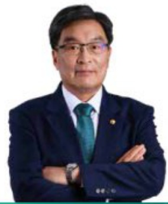
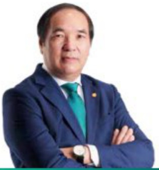

#### CHI TIẾT VỀ CÁC THÀNH VIÊN HỘI ĐỒNG QUẢN TRỊ (tiếp theo)

Sinh năm 1962

Cử nhân Kinh tế

Ông Yoo Je Bong - Ủy viên HDQT

Được bầu làm Ủy viên HDQT Ngân hàng TMCP Đầu tư và Phát triển Việt Nam từng 27/12/2019.

Tùng giữ các chức vụ: Phó Tổng Giám đốc Tập đoàn Tài chính Hana; Giám đốc Khôi Chiến lược Toàn cầu, Tập đoàn Tài chính Hana; Giám đốc điều hành phu trách Khôi Kinh doanh toàn cầu, Ngân hàng Hana.

##### - Sinh năm 1960.

- Tiến sự Kinh tế.

Được bầu làm Ủy viên HĐQT độc lập Ngân hàng TMCP Đầu tư và Phát triển Việt Nam tư ngày 29/04/2022

- Từng đám nhiệm vị trí: Vụ trưởng Vụ Tổ chức cân bộ - Ngàn hàng Nhà nước Việt Nam; Chủ tịch Hội đồng quản trị Bảo hiểm Tiến gửi Việt Nam; Phó Tổng giảm độc Ngân hàng Công Thương Việt Nam.

Ông Nguyên Văn Thạnh - Ủy viên HDQT độc lập

#### BAN ĐIỂU HÀNH

Ban Điều hành chịu trách nhiệm quản lý công việc hàng ngày của BIDV theo Điều lệ của BIDV. Ban Điều hành chịu sự giảm sát của HDQT. Ban Điều hành có các hội đồng là: Hội đồng Quản lý Tài sản Nợ - Tài sản Có, Hội đồng Rùi ro, Hội đồng quản lý vốn,...

Các thành viên Ban Điều hành chuyên trách làm việc tại BIDV bao gồm:

<table border=1 style='margin: auto; word-wrap: break-word;'><tr><td style='text-align: center; word-wrap: break-word;'>HỘ VÀ TÊN</td><td style='text-align: center; word-wrap: break-word;'>CHỨC VỤ</td><td style='text-align: center; word-wrap: break-word;'>SỐ LƯỢNG CỔ PHIỂU</td><td style='text-align: center; word-wrap: break-word;'>TỶ LỆ SỐ HỪU (%)</td></tr><tr><td style='text-align: center; word-wrap: break-word;'>Ông LÊ NGỌC LÂM</td><td style='text-align: center; word-wrap: break-word;'>Ủy viên HĐỘT, TỐNG Giám đốc</td><td style='text-align: center; word-wrap: break-word;'>1.024</td><td style='text-align: center; word-wrap: break-word;'>0,00002</td></tr><tr><td style='text-align: center; word-wrap: break-word;'>Ông TRẢN PHƯƠNG</td><td style='text-align: center; word-wrap: break-word;'>Phó Tổng Giám đốc</td><td style='text-align: center; word-wrap: break-word;'>29.971</td><td style='text-align: center; word-wrap: break-word;'>0,0005</td></tr><tr><td style='text-align: center; word-wrap: break-word;'>Ông LÊ TRỨNG THÀNH</td><td style='text-align: center; word-wrap: break-word;'>Phó Tổng Giám đốc</td><td style='text-align: center; word-wrap: break-word;'>3.191</td><td style='text-align: center; word-wrap: break-word;'>0,00056</td></tr><tr><td style='text-align: center; word-wrap: break-word;'>Ông NGUYỄN THIÊN HOÀNG</td><td style='text-align: center; word-wrap: break-word;'>Phó Tổng Giám đốc</td><td style='text-align: center; word-wrap: break-word;'>3</td><td style='text-align: center; word-wrap: break-word;'>0,00...1</td></tr><tr><td style='text-align: center; word-wrap: break-word;'>Ông PHÁN THÁNH HÀI</td><td style='text-align: center; word-wrap: break-word;'>Phó Tổng Giám đốc</td><td style='text-align: center; word-wrap: break-word;'>6</td><td style='text-align: center; word-wrap: break-word;'>0,00...1</td></tr><tr><td style='text-align: center; word-wrap: break-word;'>Ông HOÀNG VIỆT HÚNG</td><td style='text-align: center; word-wrap: break-word;'>Phó Tổng Giám đốc</td><td style='text-align: center; word-wrap: break-word;'>11</td><td style='text-align: center; word-wrap: break-word;'>0,00...2</td></tr><tr><td style='text-align: center; word-wrap: break-word;'>Ông TRẢN LONG</td><td style='text-align: center; word-wrap: break-word;'>Phó Tổng Giám đốc</td><td style='text-align: center; word-wrap: break-word;'>0</td><td style='text-align: center; word-wrap: break-word;'>0</td></tr><tr><td style='text-align: center; word-wrap: break-word;'>Bà NGUYỄN THÍ QUỲNH GIÁO</td><td style='text-align: center; word-wrap: break-word;'>Phó Tổng Giám đốc</td><td style='text-align: center; word-wrap: break-word;'>3</td><td style='text-align: center; word-wrap: break-word;'>0,00...1</td></tr><tr><td style='text-align: center; word-wrap: break-word;'>Ông ĐOÀN VIỆT NAM</td><td style='text-align: center; word-wrap: break-word;'>Phó Tổng Giám đốc</td><td style='text-align: center; word-wrap: break-word;'>0</td><td style='text-align: center; word-wrap: break-word;'>0</td></tr><tr><td style='text-align: center; word-wrap: break-word;'>Ông LÀI TIẾN QUẢN</td><td style='text-align: center; word-wrap: break-word;'>Phó Tổng Giám đốc</td><td style='text-align: center; word-wrap: break-word;'>11.327</td><td style='text-align: center; word-wrap: break-word;'>0,0002</td></tr><tr><td style='text-align: center; word-wrap: break-word;'>Ông HAM JIN SIK</td><td style='text-align: center; word-wrap: break-word;'>Thành viên Ban điều hành</td><td style='text-align: center; word-wrap: break-word;'>0</td><td style='text-align: center; word-wrap: break-word;'>0</td></tr><tr><td style='text-align: center; word-wrap: break-word;'>Ông TỪ QUỐC HỌC</td><td style='text-align: center; word-wrap: break-word;'>Trường khối Pháp chế và Kiểm soát tuần thù</td><td style='text-align: center; word-wrap: break-word;'>0</td><td style='text-align: center; word-wrap: break-word;'>0</td></tr><tr><td style='text-align: center; word-wrap: break-word;'>Bà BỰI THÍ HÒÀ</td><td style='text-align: center; word-wrap: break-word;'>Kế toàn trường</td><td style='text-align: center; word-wrap: break-word;'>0</td><td style='text-align: center; word-wrap: break-word;'>0</td></tr></table>

##### Những thay đổi của Ban Điều hành:

- Ông Đoàn Việt Nam được bộ nhiệm chức vụ Phó Tổng Giám đốc Ngân hàng TMCP Đầu tư và Phát triển Việt Nam từ ngày 30/01/2024.

- Ông Lai Tiến Quân được bộ nhiệm chức vụ Phó Tổng Giám đốc Ngân hàng TMCP Đầu tư và Phát triển Việt Nam từ ngày 30/01/2024.

- Ông Ham Jin Sik được bộ nhiệm chức vụ Thành viên Ban Điều hành Ngân hàng TMCP Đầu tư và Phát triển Việt Nam từ ngày 01/03/2024.

- Bà Bùi Thị Hòa được bộ nhiệm chức vụ Kế toàn trường Ngân hàng TMCP Đầu tư và Phát triển Việt Nam tương 30/01/2024.

- Ông Quách Hùng Hiệp thời giữ chức vụ Phó Tổng Giám đốc Ngân hàng TMCP Đầu tư và Phát triển Việt Nam tương 30/1/2024.

- Ông Sung Kỉ Jung thôi giữ chức vụ Thành viên Ban Điều hành Ngân hàng TMCP Đầu tư và Phát triển Việt Nam từ ngày 01/03/2024.

- Bà Tạ Thị Hạnh thôi giữ chức vụ Kế toàn trường Ngân hàng TMCP Đầu tư và Phát triển Việt Nam từ ngày 30/1/2024.