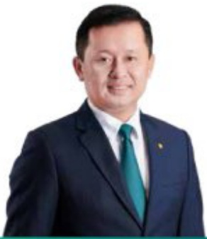
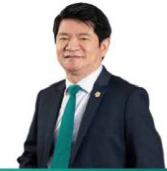
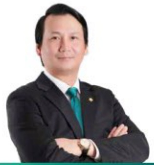

#### CHI TIẾT VỀ CÁC THÀNH VIỆN BAN ĐIỂU HÀNH (tiếp theo)

##### • Sinh năm 1975.

Thạc sự Kính tế

Bắt đầu làm việc tại BIOV từ năm 1997.

Được bổ nhiệm giữ chức vụ Tổng Giám đốc BIDV từ ngày 12/03/2021.

Hie nềm chúc vụ: Úy viên Ban chấp hành Liên đoàn thuông mại và công nghiệp Việt Nam.

Tùng giữ các chữ vụ: Phó Tổng Giám độc phụ trách Ban Điều hành BIDV, Phó Tổng Giám độc BIDV; Giám độc Ban Quản lý rủi ro tin dụng; Giám độc Ban Khách hàng doanh nghiệp BIDV.

##### Ông Lê Ngọc Lâm - Ứy viên HDQT, Tổng Giám đốc

Thực sự Quân tri kính doanh.

Bắt đầu làm việc tại BIDV từ năm 1994.

##### • Sinh năm 1973.

- Được bổ nhiệm chức vụ Phó Tổng Giám đốc Ngân hàng TMCP

Đầu tư và Phát triển Việt Nam từ ngày 01/06/2016.

Tùng giữ các chức vụ: Giám đốc Ban Tổ chức cân bộ BIDV, Giám đốc Chi nhánh BIDV Quảng Bình.

##### • Sinh năm 1973.

Thực sự Tài chính ngân hàng.

Bắt đầu làm việc tại BIDV từ năm 1997.

##### Ông Nguyên Thiên Hoàng - Phó Tổng Giám đốc

- Được bổ nhiệm là Phó Tổng Giám đốc Ngàn hàng TMCP Đầu tư và Phát triển Việt Nam từ ngày 01/05/2012.

Tùng giữ chức vụ: Giám đốc Ban Kế hoạch phát triển BIDV. Giám đốc Ban Quản lý Dự án Cổ phần hóa BIDV.

##### Ông Trần Phương - Phó Tổng Giám đốc

Thạc sự Kinh tế

##### • Sinh năm 1964.

tư và Phát triển Việt Nam từ ngày 16/07/2014

Tùng giữ các chức vụ: Giám đốc Chi nhánh BIDV Nam Kỳ Khôi

Bắt đầu làm việc tại BIDV từ năm 1992.

Được bố nhiệm chúc vụ Phá Tổng Giám đốc Ngân hàng TMCP Đầu

Thạc sự Quán trị kinh doanh

##### • Sinh năm 1972.

Nghĩa, Phó Giám đốc Chi nhánh BIDV An Giang.

Bắt đầu làm việc tại BIDV từ năm 1996.

- Được bổ nhiệm chức vụ Phó Tổng Giám đốc Ngân hàng TMCP Đầu tư và Phát triển Việt Nam từ ngày 12/03/2020.

##### Ông Hoàng Việt Hùng - Phó Tổng Giám đốc

Tùng giữ các chục vụ: Giảm độc Ban Tổ chức cản bộ BIDV, Giảm độc Chi nhánh BIDV Nghệ An.

• Tiến sĩ Kính tế.

Bắt đầu làm việc tại BIDV từ năm 1999.

##### • Sinh năm 1976.

Được bố nhiệm chúc vụ Phó Tổng Giám đốc Ngàn hàng TMCP Đầu tư và Phát triển Việt Nam từ ngày 12/03/2020

Tùng giữ các chúc vụ: Giám đốc Chi nhánh BIOV Hà Thành, Giám đốc Ban Kế hoạch chiến lược, Tổng Giám đốc Công ty cổ phần cho thuế máy bay (VALC).

