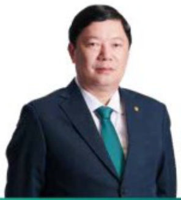

#### CHI TIẾT VỀ CÁC THÀNH VIÊN BAN ĐIỂU HÀNH (tiếp theo)

##### • Sinh năm 1978.

Thác sự Quán trị kinh doanh.

Bắt đầu làm việc tại BIDV từ năm 2000.

Được bổ nhiệm chức vụ Phó Tổng Giám đốc Ngân hàng TMCP Đầu tư và Phật triển Việt Nam từ ngày 12/03/2020.

Hien kiểm chức vụ: Chủ tịch HDTV Công ty TNHH bảo hiểm nhân tho BIDV MetLife.

Tùng giữ các chục vu: Giám đốc Chi nhánh BIDV Hà Nội, Giám đốc Ban Phát triển Ngân hàng bản lệ.

##### • Sinh năm 1977.

Thực sự Tài chính ngân hàng.

Bắt đầu làm việc tại BIDV từ năm 2001.

- Được bổ nhiệm chức vụ Phó Tổng Giám đốc Ngân hàng TMCP Đầu tư và Phát triển Việt Nam từ ngày 12/03/2020.

Tùng giữ các chủ vũ: Trường khởi Ngàn hàng bán buôn kiểm Giám độc Ban Khách hàng doanh nghiệp lớn, Giám độc Ban Kế hoạch chiến lược, Giám độc Chi nhánh BIDV Vĩnh Long

##### Bà Nguyễn Thị Quỳnh Giao – Phó Tổng Giám đốc

##### Ông Phan Thanh Hái - Phó Tổng Giám đốc

##### • Sinh năm 1974.

Thực sĩ Quán trị kinh doanh.

Bắt đầu làm việc tại BIDV từ năm 1997.

Được bổ nhiệm chức vụ Phó Tổng Giám đốc Ngân hàng TMCP

Đầu tư và Phát triển Việt Nam từ ngày 30/01/2024.

Tùng giữ các chức vụ Giám đốc Chi nhánh BIDV Thanh Xuân, Giám đốc Chi nhánh Thanh Xuân kiểm phụ trách Chi nhánh Nam Sài Gòn, Phố Giám đốc Chi nhánh Thanh Xuân.

##### Ông Lại Tiến Quân - Phó Tổng Giám đốc

Bắt đầu làm việc tại BIOV từ năm 1998.

Được bổ nhiệm chức vụ Phó Tổng Giám đốc Ngân hàng TMCP Đầu tư và Phát triển Việt Nam từ ngày 30/01/2024.

Thạc sĩ Quản trị kinh doanh.

Thạc sĩ Quán trị kinh doanh.

##### • Sinh năm 1976

Từng giữ các chức vụ: Giám đốc Chi nhánh BIDV Số giao dịch 1, Ủy viên HDQT, Tổng Giám đốc Ngân hàng Liên doanh Lào Việt, Trường Viễn phòng đại diện BIDV tại Lào, Phó Tổng Giám đốc Ngân hàng Liên doanh Lào Việt Bank, Giám đốc Chi nhánh Yên Bái.

##### • Sinh năm 1969.

##### Ông Đoàn Việt Nam - Phó Tổng Giám đốc

Bắt đầu làm việc tại BIDV từ năm 2024.

Tùng giữ các chức vụ: Giám đốc Ban tại Ngân hàng KEB Hana (Khối kinh doanh Gangnam Seocho), Giám đốc chi nhánh Ngân hàng KEB Hana (chi nhánh Nam Seoul, chi nhánh Hà Nội).

Được bổ nhiệm chức vụ Thành viên Ban Điều hành Ngân hàng TMCP Đầu

tư và Phát triển Việt Nam từ ngày 01/03/2024

##### • Sinh năm 1963.

Cửn hàn Tài chính ngăn hàng.

Bắt đầu làm việc tại BIDV từ năm 1987.

- Được bổ nhiệm chức vụ Trường Khôi Pháp chế và Kiểm soát tuần thù

Ngân hàng TMCP Đầu tư và Phát triển Việt Nam từ ngày 01/05/2019.

Tùng giữ các chức vụ: Giám đốc Ban Kiểm tra và Giám sát tuần thù BIDV; Giám đốc Chi nhánh BIDV Hòa Bình.

