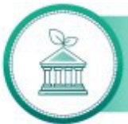
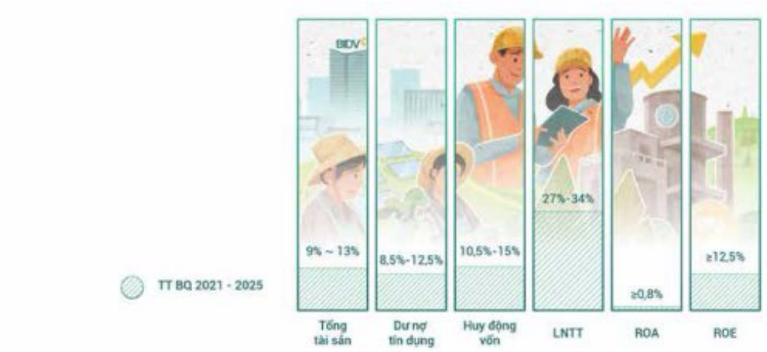
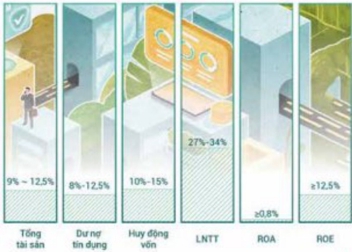

#### ĐỊNH HƯỚNG PHÁT TRIỂN CÁC MỤC TIỀU CHIẾN LƯỢC

Hướng tới sự phát triển bền vững, BIDV xác định các mục tiêu chiến lược giai đoạn 2021 - 2025, cụ thể như sau:

Năng lực tài chính lành mạnh đáp ứng các yêu cầu an toàn hoạt động theo quy định và thông lệ tốt, làm nền tảng trưởng quy mô hoạt động, gia tăng thi phần và duy trì vị thế đùng đâu trên thị trường ngân hàng.

Hiệu quả hoạt động bền vững trên cơ sở nâng cao chất lượng tài sản, cơ cấu lại nguồn thu, nâng dân tụ trọng thu nhập phi tín dụng và cung cấp các sản phẩm dịch vụ ngân hàng - tài chính - bảo hiểm tốt nhất cho khách hàng.

Cơ cấu nền khách hàng chuyển dịch tích cực, phát triển khách hàng FDI, duy trì vi thế ngàn hàng đùng đâu Việt Nam về thị phần trong phần khúc khách hàng bán lẻ và SME.

Quán trị điều hành minh bạch, hiệu quả theo thông lệ, phần đấu niệm yết trên thị trường chứng khoản nước ngoài

Đi đầu về công nghệ thông tin và ứng dụng ngân hàng số tại Việt Nam trong hoạt động kinh doanh và quản trị điều hành, thích ứng được với sự thay đổi của thời đại.

Đội ngũ nhân sự chất lượng cao đảm bảo yêu cầu phát triển của ngành ngân hàng trong xu thế hội nhập và CMCN 4.0; Phát triển văn hóa doanh nghiệp, xây dựng và duy trì mỗi trường làm việc chuyên nghiệp, hiện đại, học hồi, sáng tạo, trách nhiệm xã hội.

CHỈ TIÊU KINH DOANH ĐỊNH HƯƠNG ĐẾN NĂM 2025

Đối với kế hoạch kinh doanh khối NHTM

Đối với kế hoạch kinh doanh hợp nhất

