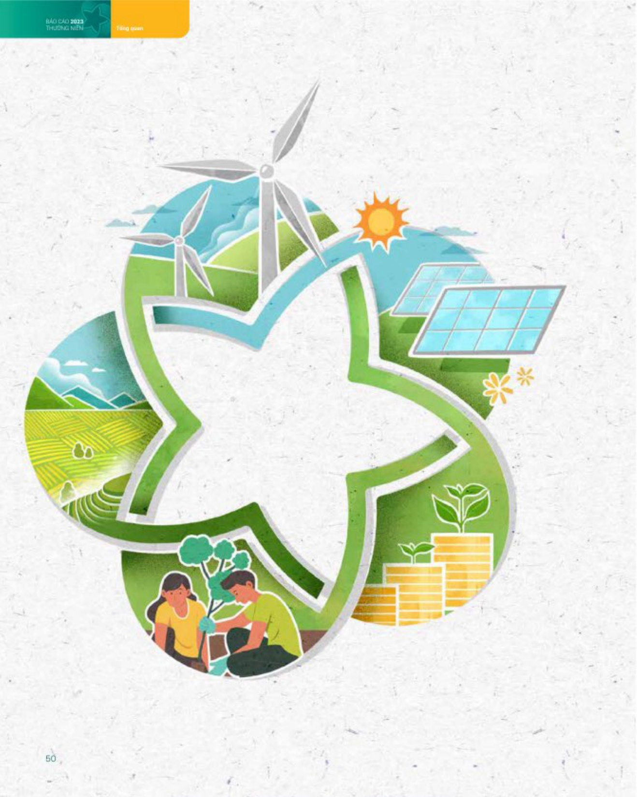
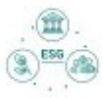

# ĐỊNH HƯỚNG PHÁT TRIỂN (tiếp theo)

### CÁC MỤC TIẾU PHÁT TRIỂN BỂN VŨNG (MÔI TRƯỜNG, XÃ HỘI VÀ QUẢN TRỊ - ESG)

Là định chế tài chính hàng đầu Việt Nam, BIDV luôn tiến phong đi đầu, thực thi có hiệu quả các chủ trương định hướng của Chính phủ, NHNN nhằm góp phần thực đấy tăng trưởng phát triển kinh tế xã hội, ấn định kinh tế vĩ mô. Bên cạnh nhiệm vụ chính là thực thi chính sách tiến tệ, thực hiện kinh doanh hiệu quả, an toàn, BIDV luôn uẩn tiến thực hiện trách nhiệm với xã hội, cộng đồng và môi trường, coi đây một trong những nhiệm vụ quan trọng trong hoạt động.

Ngay từ khi xảy dụng chiến lược kinh doanh giai đoạn 2021 - 2025 tăm nhìn đến 2030, BIDV đã xác lập mục tiêu "hướng tới sự phát triển bên vững" là mục tiêu xuyên suốt trong hoạt động ngân hàng. Trong đó, chủ trọng đóng góp vào sự phát triển toàn diện và bên vững của cộng đồng xã hội hướng đến sự thịnh vượng thông qua:

Tập trung nguồn lực xảy dụng Chiến lược phát triển bên vững và thực hành ESG tổng thể tại BIDV nhằm đưa BIDV trở thành ngân hàng đứng đầu thị trường Việt Nam trong phát triển xanh, bên vững và thực hành ESG. Tích cực triển khai các hoạt động có liên quan trên tất cả các phương diện về kiện toàn cơ cấu tổ chức, phát triển sản phẩm, công nghệ - số hóa, quản lý rủi ro, hợp tác quốc tế... bám sát mục tiêu phát triển bên vững đã được xác định tại Chiến lược kinh doanh dài han.

Triển khai thực hiện kế hoạch hành động thực hiện Chiến lược tài chính toàn diện quốc gia đến năm 2025, định hướng đến năm 2030 của NHHN, trong đó đấy mạnh các hoạt động, giải pháp nhằm cung ứng sản phẩm dịch vụ đến mọi đối tượng trên toàn quốc, bao gồm cả vùng nông thần, vùng sâu, vùng xa, người nghèo, người về hầu, học sinh, sinh viên...

Triển khai các gọi "tín dụng xanh", đành tỷ trọng nhất định để tài trợ cho các khách hàng trong lĩnh vực năng lượng tài tạo, năng lượng sạch, các ngành sản xuất và tiêu dùng phát thái các-bon thập, thích ứng với biện đối khí hậu, qua đó góp phần chuyển đối nền kinh tế theo hướng tăng trưởng xanh, bảo về mỗi trưởng, ngân chặn biến đổi khí hậu, nâng cao hiệu quả sử dụng tài nguyên, nâng lương, thế hiện trách nhiệm với cộng đồng và môi trường. Ngoài ra, bổ trí nguồn văn cần thiết để phát triển các sản phẩm cho vay phục vụ đối sổng tạo điều kiện thuần kị đáp ứng nhu cầu chính đáng của người dân, góp phần han chế tín dụng đen.

Tăng cường phát triển sản phẩm tài chính bền vững, xảy dụng kế hoạch, lộ trình sổ hóa các sản phẩm, dịch vụ để giảm thiếu tác động đến mỗi trường, đảm bảo an toàn an ninh thống tin khi triển khai ESG.

Tập trung chuyên nghiệp hóa càng tác quán lý rủi rõ mỗi trường và xã hội trong quy trình cấp tin dụng.

Tăng cường hợp tác với các tổ chức, định chế tài chính quốc tế, tham gia tích cực, chủ động và có trách nhiệm với các định chế phát triển, các định chế song phương, đa phương trong lĩnh vực phát triển bền vững để hỗ trợ triển khai nguồn văn xanh và bền vững tại BIDV, góp phần thực đầy mạnh mẽ tài chính xanh, tiết kiệm năng lượng và chuyển đổi năng lượng.

Tich cục tham dự các hội thảo, hội nghị trong và ngoài nước, không ngừng học hồi kinh nghiệm trong lĩnh vực phát triển bền vững, động thời đưa ra các giải pháp thực đấy sự phát triển bền vững của công dạng.

Thực hiện các hoạt động an sinh xã hội; tham gia các hoạt động tài trợ mang tính động lực chung của xã hội và tương lai, qua đó tác động ngược trở lại tiếp tục góp phần tích cực cho chính hoạt động và sự phát triển bền vững của BIDV.