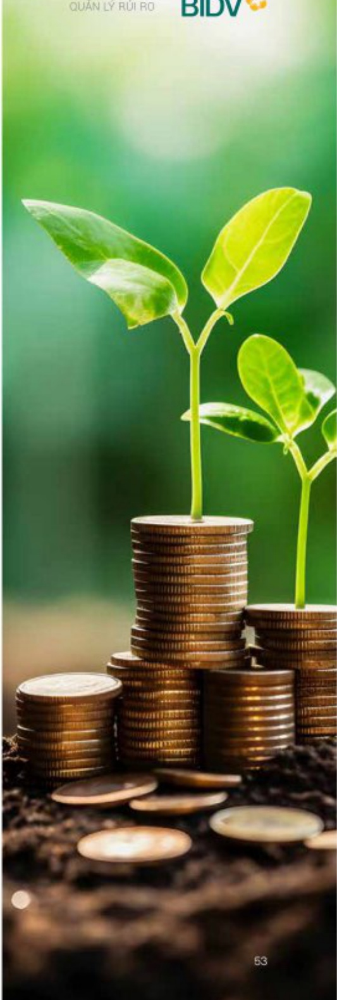

# QUẬN LÝ RỪI RO

# BIDV xin lưu ý các nhân tố rủi ro có thể ảnh hưởng tới kết quả kinh doanh của BIDV. 1. RỪI RO VỀ KINH TẾ

Năm 2023, mỗi trường kinh tế quốc tế tiếp tục phục hồi chạm, thiếu vững chắc và không động đều bại.

Xung đột địa chính trị gia tăng, khó lương

- Chính phú và NHTW các nước tiếp tục thực hiện chính sách tiền tế thất chất, tăng và giữ lại suất ở mức cao, nhằm đối phó với lạm phát làm suy giảm sức cầu thế giới, kéo theo sự định trẻ của khu vực sản xuất tại nhiều nền kinh tế lớn như Đức và Nhật Bản, khiến các nước này đối mặt với rủi ro suy thoái hoặc rơi vào suy thoái kỳ thuật trong ngân hạn

- Rùi ro tài chính - tiên tê, rùi ro an ninh lương thực, an ninh nàng lương và chuỗi cung ứng gia tăng.

Kinh tế trong nước năm 2023 có nhiều điểm sáng như các cân đối với mô được đảm bảo, làm phát được kiểm soát tối ở mức 3,25%, tỷ giá tăng song văn trong tầm kiểm soát, mặt bằng lãi suất tiếp tục giảm, tốc độ tăng trường của nền kinh tế ở mức khá 5,05% (mặc dù thấp hơn so với mục tiêu 6-6,5% song văn là mức đáng khích lệ, đùng thử ba trong khu vực ASEAN, chỉ sau Campuchia (5,4%) và Philippines (5,6%).

Tuy vậy, nên kinh tế phải đối mặt với những khó khăn, thách thức lớn như:

- Rùi ro, thách thúc tư bên ngoài văn hiện hữu

- Các động lực tăng trưởng truyền thống (xuất khẩu, tiêu dùng cuối cùng, sản xuất công nghiệp, đấu tư tư nhân) phục hồi chậm, chất lượng tăng trưởng chưa cải thiện

Họat động doanh nghiệp tiếp tục đối mặt với nhiều khó khăn (cá về đầu ra, khả năng hấp thụ và tiếp cận vốn)

Tin dụng tăng trưởng chậm, nợ xấu tăng

Tài cơ cấu nền kinh tế và các doanh nghiệp yếu kém còn chậm, thế chế cho các động lực tăng trưởng mới còn chậm ban hành

Thi trường TPDN, BDS và vàng còn nhiều rũi.

Trong năm 2023, trong bối cảnh khó khăn, thách thức của mỗi trường quốc tế và trong nước, BIDV luôn chủ động phân tích, đánh giá kịp thời và xây dựng kịch bản ứng phó linh hoạt trước những biến động nhanh, bất thường của thị trường, trên cơ sở tuần thủ các chính sách điều hành của Chính phủ, NHNN và các cơ quan chức năng, tư đô, giúp cho hoạt động của BIDV luôn được an toàn, thống suốt và hiệu quả.

Năm 2024, những rủi ro, thách thức tư bối cảnh quốc tế được dự bảo bao gồm:

Xung đột địa chính trị văn dai dẳng, khó lường, tiếp tục tác động đến chuỗi sản xuất, cung ứng toàn cầu

- Dù làm phát đang trên dà hạ nhiệt, NHTW các nước dự báo sẽ không tiếp tục tăng lãi suất song mặt bảng lãi suất tại Mỹ và Châu Âu vẫn duy trì ở mức cao cho đến khi làm phát được kiểm chế và hạ dân về mức mục tiêu

- Nhiều đầu tàu kinh tế thế giới suy yếu (dự bảo kinh tế EU rơi vào suy thoái kỹ thuật) hoặc phục hồi chậm hơn dự kiến (dự bảo kinh tế Mỹ tăng trưởng 2,1% (theo IMF, giảm so với 2,5% năm 2023), đã phục hồi của kinh tế Trung Quốc chưa tạo được sự lan tóa cho các nền kinh tế khác...) khiến kinh tế toàn cầu tiếp tục tăng trưởng chăm (khoảng 2,4% năm 2024 (theo WB tháng 1/2024) hoặc 3,1% (theo IMF tháng 1/2024))

Tăm lý tiết kiệm, phòng thù tăng lên khiến niềm câu hàng hóa, dịch vụ giảm, ảnh hưởng đến lĩnh vực xuất khẩu, sản xuất và du lịch tại nhiều nước

Biến đổi khí hậu với thời tiết khác nghiệt, cực đoan (thiên tai, lũ lụt, hạn hán...) cân trở đã phục hồi kinh tế tại nhiều nước, khu vực.

Một số rùi ro, thách thức của nội tại nền kinh tế Việt Nam trong năm 2024 như:

- Kinh tế quốc tế phục hồi chạm, một số khu vực, quốc gia, đặc biệt là các đối tác thương mại lớn của Việt Nam, tăng trưởng chạm lại hoặc có thể rõ vào suy thoái kỹ thuật, làm giảm lực câu xuất khẩu, đâu tư tiêu đúng và du lịch quốc tế

- Những điểm nghền chưa thể giải quyết như mô hình tăng trưởng kinh tế, cơ cấu nên kinh tế còn chưa hợp lý, chất lượng tăng trưởng chưa cao, khá nàng chống chịu với các cụ sốc bên ngoài còn yếu, thế chế kinh tế thị trường định hướng XHCN còn đang trong quá trình hoàn thiện

Thách thức tử việc thực thi các FTA mới, nhất là sức ép canh tranh, thu hút FDI trong bối cảnh thuế tối thiếu toàn cầu được triển khai từ năm 2024

Việt Nam văn di sau trong xu thế phát triển công nghệ và mô hình kinh doanh mới

- Vấn đề giả hóa dân số, sự nổi lên của tầng lớp trung lưu và sự phát triển của KHCN đời hồi thế chế chính trị phải mình bach hơn, trách nhiệm và giải trình cao hơn

- Việt Nam chịu nhiều tác động tiêu cực của biến đổi khí hậu và ở nhiệm mỗi trường.

Theo đó, kinh tế Việt Nam được dự báo tăng trưởng khoảng 6-6,5% (theo kịch bản cơ sở) và làm phát tiếp tục được kiểm soát, ở mức khoảng 3,5-4% trong năm 2024.

Với triển vọng kinh tế quốc tế và trong nước được dự bảo có nhiều cơ hội đồng thời tiêm ăn rủi ro dan xen, khó khăn, thách thức sẽ nhiều hơn, làm hơn, BIDV quyết tâm hoàn thành kế hoạch kinh doanh của mình với phương châm "Tinh giản quy trình - Chuyến đối hoạt động", nghiêm túc thực hiện theo định hướng điều hành của Chính phủ và NHNN, đảm bảo hệ thống BIDV hoạt động thông suốt, an toàn, đồng góp cho sự phát triển của hệ thống ngân hàng và kinh tế cả nước.

