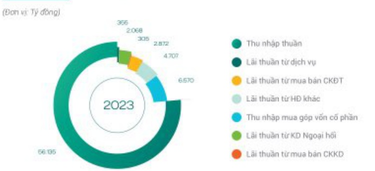

### TÌNH HÌNH HOẠT ĐỘNG KINH DOANH (tiếp theo)

<table border=1 style='margin: auto; word-wrap: break-word;'><tr><td style='text-align: center; word-wrap: break-word;'>TIẾN GỬI KHÁCH HÀNG</td><td style='text-align: center; word-wrap: break-word;'>CHỈNH LỆCH THU CHI HỘP NHẤT</td></tr><tr><td style='text-align: center; word-wrap: break-word;'>1.704.690</td><td style='text-align: center; word-wrap: break-word;'>47.932</td></tr><tr><td style='text-align: center; word-wrap: break-word;'>CHO VAY KHÁCH HÀNG</td><td style='text-align: center; word-wrap: break-word;'>LỘI NHUẬN TRƯỚC THUẾ HỘP NHẤT</td></tr><tr><td style='text-align: center; word-wrap: break-word;'>1.777.665</td><td style='text-align: center; word-wrap: break-word;'>27.589</td></tr></table>

CẤU PHẦN THU NHẬP THUẬN NĂM 2023

