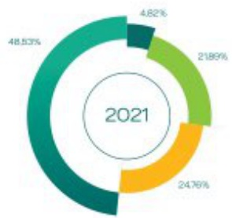
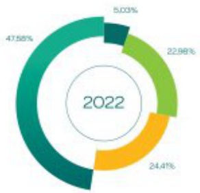
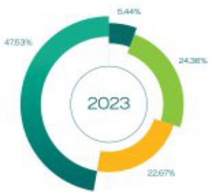
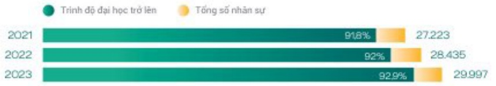
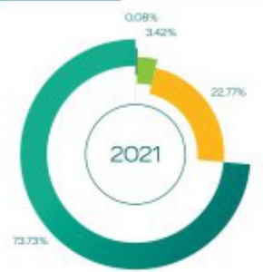
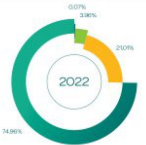
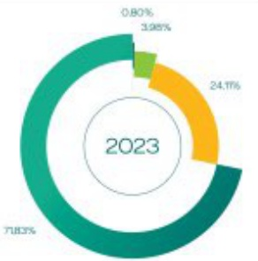

#### TỔ CHỨC VÀ NHÂN SỰ

BIDV nhận thức được rằng nguồn nhân lực là nhân tố quan trọng hàng đầu cho sự phát triển và thành công của tổ chức.

Tại thái điểm 31/12/2023, BIDV có tổng số 29.997 nhân viên (tăng hơn 1.500 lao động so với cuối năm 2022). BIDV nhận thức được rằng nguồn nhân lực là nhân tố quan trọng hàng đầu cho sự phát triển và thành công của tố chức. Vì vậy, một trong những mục tiêu quan trọng nhất của BIDV là phải xây dựng và phát triển đội ngũ nhân viên đảm bảo dữ về số lượng và chất lượng để thực hiện thắng lợi các mục tiêu, chiến lược kinh doanh của hệ thống.

Về cơ cấu giới tính: Nam chiếm tỷ lệ 40,54%, Nữ chiếm tỷ lệ 59,46% cơ cấu này tương đồng với hầu hết các dân vị trong lĩnh vực ngân hàng tài chính. Về chất lượng nhân sự tỷ lệ cản bộ có trình độ đại học trả lên tại BIDV chiếm hơn 92,9%, độ tuổi bình quân khoáng 36,5 tuổi (trong đó, tỷ lệ người lao động thuộc thế hệ từ BX trả đi chiếm khoáng 84,7%) - nhìn chung, mặt bằng đội ngũ nhân sự có chất lượng tốt so với thị trường, nhân sự trẻ chiếm tỷ trọng khá lân trong cơ cấu lao động và đều đạt độ chin về kinh nghiệm công tác.

29.997

Tăng hơn 1.500 lão động

TỸ LỆ

92,9%

có trình độ đại học trợ lên

DỠ TUỐI BÌNH QUẢN

36,5

๕๑๑ ๗๐๐๐

Từ 41 tuổi đến 50 tuổi

SỐ LIỆU TẤNG TRƯỞNG NHÂN LỰC QUA 3 NĂM:

