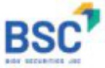

#### CÁC CÔNG TY CON, CÔNG TY LIÊN KẾT

##### CÔNG TY CỔ PHẦN CHỮNG KHOÁN BIDV

<table border=1 style='margin: auto; word-wrap: break-word;'><tr><td style='text-align: center; word-wrap: break-word;'>Tên viết tắt</td><td style='text-align: center; word-wrap: break-word;'>BSC</td></tr><tr><td style='text-align: center; word-wrap: break-word;'>Giấy phép hoạt động</td><td style='text-align: center; word-wrap: break-word;'>Số 111/GP - UBCK do Ủy ban Chùng khoản Nhà nước cấp ngày 31/12/2010. Giấy phép điều chỉnh số 70/GPDC-UBCK ngày 13/09/2023</td></tr><tr><td style='text-align: center; word-wrap: break-word;'>Lĩnh vực hoạt động</td><td style='text-align: center; word-wrap: break-word;'>Chùng khoản và các hoạt động liên quan</td></tr><tr><td style='text-align: center; word-wrap: break-word;'>Vốn điều lệ (31/12/2023)</td><td style='text-align: center; word-wrap: break-word;'>2.028 tỷ đồng</td></tr><tr><td style='text-align: center; word-wrap: break-word;'>Tỷ lệ số hữu của BIDV</td><td style='text-align: center; word-wrap: break-word;'>51,96%</td></tr><tr><td style='text-align: center; word-wrap: break-word;'>Trụ số chính</td><td style='text-align: center; word-wrap: break-word;'>Tăng 8, 9 Tòa nhà Thai Holdings, 210 Trần Quang Khải, Hà Nội</td></tr><tr><td style='text-align: center; word-wrap: break-word;'>Diện thoại</td><td style='text-align: center; word-wrap: break-word;'>024.39352722</td></tr><tr><td style='text-align: center; word-wrap: break-word;'>Fax</td><td style='text-align: center; word-wrap: break-word;'>024.22200669</td></tr></table>

BSC thành lập ngày 18/11/1999, là một trong hai công ty chung khoản đầu biên được cấp phép hoạt động tại thi trường Việt Nam. BSC thực hiện đầy đủ các chức năng của một công ty chung khoản, bao gồm: mối giới chung khoản, tự doanh chung khoản, bảo lãnh phát hành chung khoản và tư vấn đầu tư chung khoản.

Năm 2010, BSC cổ phần hóa thành công, chính thức chuyển sang hoạt động theo mô hình công ty cổ phần tư ngày 01/01/2011. Trong năm 2022, BSC hoàn thành việc phát hành riêng lẻ cổ phần cho nhà đầu tư chiến lược nước ngoài Hana Securities Company của Hàn Quốc.

#### BICO TỔNG CỘNG TY BÀO HẾM ĐỐV

Năm 2023, trong bối cảnh thị trường chung và các yếu tố vĩ mô được duy trì ổn định, bắt đầu cải thiên song chua thực sự tích cực, với nó lực của BSC và lượng vốn mới được bố sung sau đặt phát hành riêng lẻ cho Hana Securities Company, hoạt động kinh doanh của BSC đặt kết quả vượt trội so với năm 2022: lợi nhuận trước thuế đạt 509 tỷ đồng, tương đương 102% kế hoạch năm 2023, cao gấp 3,4 lần năm trước. Thu dịch vụ ròng đặt 115 tỷ đồng. Các chỉ tiêu an toàn hoạt động theo quy định pháp luật được đảm bảo, chất lượng cho vay khách hàng được kiểm soát tốt, không phát sinh ngữ xấu.

##### TỔNG CÔNG TY CỔ PHẦN BẢO HIỂM BIDV

BSC tự hào nhận giải thưởng quốc tế danh giá do các tập chỉ tài chính lớn, uy tín trên thế giới trao tặng như: Giải thưởng "Nhà mới giới chúng khoản tốt nhất Việt Nam 2023" do Tạp chí Global Banking and Finance Review trao tặng; cùng nhiều giải thưởng, thành tích khác được trao cho tập thể, cái nhân tại Công ty.

BIC chính thức đi vào hoạt động từ thắng 01/2006, sau khi BIDV mua lại vốn góp của QBE tại Công ty Liên doanh Bảo hiểm Việt Uc, hoạt động chủ yếu trong lĩnh vực bảo hiểm phi nhân thọ. BIC thực hiện IPO thành công, chính thức chuyển sang mô hình công ty cố phân tử ngày 01/10/2010, niêm yết cố phếu trên Sản Giao dịch chứng khoản TP. Hồ Chí Minh năm 2011 và bản chiến lược cho Fairfax Asia Limited - Công ty con của Fairfax Financial Holdings - Tập đoàn Tài chính bảo hiểm hàng đầu thế giới năm 2015. Vốn điều lệ BIC tại thời điểm 31/12/2023 là 1.172,7 tỷ đồng.

<table border=1 style='margin: auto; word-wrap: break-word;'><tr><td style='text-align: center; word-wrap: break-word;'>Tên viết tắt</td><td style='text-align: center; word-wrap: break-word;'>BIC</td></tr><tr><td style='text-align: center; word-wrap: break-word;'>Giấy phép hoạt động</td><td style='text-align: center; word-wrap: break-word;'>Số 11/GPDC16/KDBH do Bộ Tài chính cấp ngày 06/04/2016</td></tr><tr><td style='text-align: center; word-wrap: break-word;'>Lĩnh vực hoạt động</td><td style='text-align: center; word-wrap: break-word;'>Bảo hiểm phi nhân tho</td></tr><tr><td style='text-align: center; word-wrap: break-word;'>Vốn điều lệ (31/12/2023)</td><td style='text-align: center; word-wrap: break-word;'>1.172,7 tỷ đồng</td></tr><tr><td style='text-align: center; word-wrap: break-word;'>Tỷ lệ số hữu của BIDV</td><td style='text-align: center; word-wrap: break-word;'>51%</td></tr><tr><td style='text-align: center; word-wrap: break-word;'>Trụ số chính</td><td style='text-align: center; word-wrap: break-word;'>Tăng 11, Tòa nhà 263 Cầu Giấy, Phương Dịch Vọng, Quản Cầu Giấy, Hà Nội</td></tr><tr><td style='text-align: center; word-wrap: break-word;'>Diện thoại</td><td style='text-align: center; word-wrap: break-word;'>024.33885522</td></tr><tr><td style='text-align: center; word-wrap: break-word;'>Fax</td><td style='text-align: center; word-wrap: break-word;'>024.32222180</td></tr></table>

Năm 2023, BIC ghi nhận kết quả hoạt động kinh doanh tăng trưởng mạnh về quy mô và hiểu quả hoạt động, chất lượng hoạt động được kiểm soát tốt. Doanh thu phí bảo hiểm gốc đạt 4.731 tỷ đồng, tăng 25,3% so với năm 2022; thị phần bảo hiểm gốc chiếm khoảng 6,4%, dùng thứ 6 trên thị trường bảo hiểm phí nhân thọ Việt Nam; lợi nihuận sau thuế hợp nhất đạt 574 tỷ đồng, là một trong các công ty bảo hiểm có lợi nhuận cao nhất trên thị trường bảo hiểm phí nhân thọ Việt Nam năm 2023.

Năm 2023, BiC duy trí mục định hang năng lực tài chính B++, xếp hang trong nước AAA.VN - mục định hàng cao nhất tại Việt Nam theo mục xếp hàng tín nhiệm trong phạm vi quốc gia, mục định hàng tín nhiệm cao nhất trên trị trưởng theo tố chức: A.M.BEST. Công ty được vinh danh với nhiều danh hiệu, giải thuếng uy tín như Top 10 Công ty bảo hiểm phi nhân thọ uy tín nhất Việt Nam (Vietnam Report), Top 50 công ty tăng trưởng xuất sắc nhất Việt Nam, Top 50D doanh nghiệp lớn nhất Việt Nam,...

#### BIDV SuMi TRUST LEASING

##### CÔNG TY CHO THUỆ TÀI CHÍNH TNHH BIDV - SUMI TRUST

<table border=1 style='margin: auto; word-wrap: break-word;'><tr><td style='text-align: center; word-wrap: break-word;'>Tên viết tắt</td><td style='text-align: center; word-wrap: break-word;'>BSL</td></tr><tr><td style='text-align: center; word-wrap: break-word;'>Giấy CNDKDN</td><td style='text-align: center; word-wrap: break-word;'>Số 0100777569 do Số Kế hoạch và Đầu tư Thành phố Hồ Chí Minh cấp, đăng ký thay đổi lần thứ 15 ngày 07/04/2023.</td></tr><tr><td style='text-align: center; word-wrap: break-word;'>Lĩnh vực hoạt động</td><td style='text-align: center; word-wrap: break-word;'>Cho thuê tài chính</td></tr><tr><td style='text-align: center; word-wrap: break-word;'>Vốn điều lệ (31/12/2023)</td><td style='text-align: center; word-wrap: break-word;'>895,6 tỷ đồng</td></tr><tr><td style='text-align: center; word-wrap: break-word;'>Tỷ lệ số hữu của BIDV</td><td style='text-align: center; word-wrap: break-word;'>50%</td></tr><tr><td style='text-align: center; word-wrap: break-word;'>Trụ sở chính</td><td style='text-align: center; word-wrap: break-word;'>Tăng 23, Tòa nhà TNR, 54A Nguyễn Chí Thanh, Đông Đa, Hà Nội.</td></tr><tr><td style='text-align: center; word-wrap: break-word;'>Điện thoại</td><td style='text-align: center; word-wrap: break-word;'>024.39284666</td></tr><tr><td style='text-align: center; word-wrap: break-word;'>Fax</td><td style='text-align: center; word-wrap: break-word;'>024.39743939</td></tr></table>

BSL được chuyển đổi hình thức pháp lý từ Công ty Cho thue tài chính TNHH MTV BIDV, trên cơ sở hợp tác liên doanh giữa BIDV, Ngân hàng Sumitomo Mitsui Trust Bank (SMTB) và Công ty Cổ phần Tập đoàn Mặt trời. BSL chính thức đi vào hoạt động tư thưởng 5/2017 với mức vốn điều lệ 896 tỷ đồng, có trụ sở chính tại Hà Nội và 03 chỉ thành tại Hà Nội, TP. Hồ Chí Minh, Đà Nẵng, là các địa bàn kinh tế trọng điểm của cả nước.

Năm 2023, trong bối cảnh tính hình kinh tế xã hội trong và ngoài nước còn nhiều khó khăn thách thức đặc biệt là diễn biến lãi suất tăng cao những tháng đầu năm, song hoạt động kinh doanh năm 2023 của BSL đã ghi nhận kết quả kinh doanh khá quan, tiếp tục tăng trưởng mạnh về quy mô và hiệu quả hoạt động, chất lượng nợ kiểm soát tốt. Cụ thể: (i) Tổng dư nợ đạt 4.613 tỷ đồng, tăng 26,6% so với năm 2022, đạt 98,4% kế hoạch năm. (ii) LNTT đạt 85,6 tỷ đồng, tăng 44,35% so với năm 2022 và đạt 100% kế hoạch năm; (iii) Chất lượng dư nợ được quản trị tốt theo dùng mục tiêu đề ra: nợ nhóm 1 chiếm tỷ trong chủ yếu (98,5%), tỷ lẽ nợ xấu có xu hướng tăng, tuy nhiên vẫn ở mức kiểm soát là 1,38%. Năm 2023, Công ty được vinh danh là "Doanh nghiệp tăng trưởng nhanh" tại Lê trao giải APEA 2023.

### LAOVIET Bank

##### NGÂN HÀNG LIÊN DOANH LÀO - VIỆT

<table border=1 style='margin: auto; word-wrap: break-word;'><tr><td style='text-align: center; word-wrap: break-word;'>Tên viết tắt</td><td style='text-align: center; word-wrap: break-word;'>LaoVietBank/LVB</td></tr><tr><td style='text-align: center; word-wrap: break-word;'>Giấy phép đấu tư nước ngoài</td><td style='text-align: center; word-wrap: break-word;'>Số 985-326, ngày 10/6/1999 và bản sửa đối gần nhất số 004-15/KH-DT.4 ngày 24/08/2015 do Bộ Kế hoạch Đầu tư CHDCND Lảo cấp</td></tr><tr><td style='text-align: center; word-wrap: break-word;'>Lĩnh vực hoạt động</td><td style='text-align: center; word-wrap: break-word;'>Ngăn hàng</td></tr><tr><td style='text-align: center; word-wrap: break-word;'>Vốn điều lệ (31/12/2023)</td><td style='text-align: center; word-wrap: break-word;'>791.357,56 triệu KIP Lảo</td></tr><tr><td style='text-align: center; word-wrap: break-word;'>Tỷ lệ số hữu của BIDV</td><td style='text-align: center; word-wrap: break-word;'>65%</td></tr><tr><td style='text-align: center; word-wrap: break-word;'>Trụ sở chính</td><td style='text-align: center; word-wrap: break-word;'>LVB Tower, Số 44 Lane Xang Blvd, Viêng Chân, CHDCND Lảo</td></tr><tr><td style='text-align: center; word-wrap: break-word;'>Điện thoại</td><td style='text-align: center; word-wrap: break-word;'>+85621.251418</td></tr><tr><td style='text-align: center; word-wrap: break-word;'>Fax</td><td style='text-align: center; word-wrap: break-word;'>+85621.212197</td></tr></table>

LVB là ngăn hàng được thành lập tại Lào năm 1999, trên cơ sở liên doanh giữa Ngân hàng TMCP Đầu tư và Phát triển Việt Nam (BIDV) và Ngân hàng Ngoại thường Lào Đại chúng (BCEL), nhằm triển khai Hiệp định Hợp tác văn hóa - khoa học - kỹ thuật giữa Việt Nam - Lào và thực đấy, hỗ trợ các hoạt động giao thưởng kinh tế giữa hai nước.

Sau gần 25 năm xảy dụng và phát triển, LVB đã trở thành một trong những ngăn hàng thương mại hoạt động hiệu quả hàng đầu tại Lào, đồng vai trò tích cực trong thực hiện nhiệm vụ "câu nói thanh toán chủ đạo, góp phần thức đấy quan hệ thương mại và đầu tư giữa hai nước Việt Nam - Lào".

Năm 2023, mỗi trường kinh doanh tại Lào văn gặp nhiều khô khăn và chịu tác động tức các biến động kinh tế chính trị trên thế giới, hoạt động sản xuất kinh doanh của doanh nghiệp và dân cư tiếp tục bị ảnh hưởng do lạm phát cao, động nội tệ tiếp tục mất giá. Trong bối cảnh đó, LVB đã nổ lực duy tri hoạt động ổn định, kinh doanh có lãi, là một trong những ngân hàng thương mại có quy mô hàng đầu tại Lào. Tổng tài sản đạt 18.600 tỷ LAK. Lợi nhuận trước thuế đạt gần 43,5 tỷ LAK.

Tổng số cản bộ nhân viên toàn hệ thống đặt 436 người. LVB hiện có 01 Trụ sở chính, 07 chi nhánh và 16 phòng/điểm giao dịch, có mặt tại 09/18 tính thành và khu kinh tế trọng điểm của Lào.