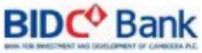
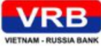
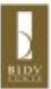

#### CÁC CÔNG TY CON, CÔNG TY LIÊN KẾT (tiếp theo)

##### NGÂN HÀNG ĐẦU TƯ VÀ PHÁT TRIỂN CAMPUCHIA

<table border=1 style='margin: auto; word-wrap: break-word;'><tr><td style='text-align: center; word-wrap: break-word;'>Tên viết tắt</td><td style='text-align: center; word-wrap: break-word;'>BIDC</td></tr><tr><td style='text-align: center; word-wrap: break-word;'>Giấy phép hoạt động</td><td style='text-align: center; word-wrap: break-word;'>Số 19 ngày 28/08/2009 do Ngân hàng Quốc gia Campuchia cấp và Đăng ký kinh doanh số Co.6101 E/2009 ngày 2/9/2009 do Bộ Thương mại Campuchia cấp</td></tr><tr><td style='text-align: center; word-wrap: break-word;'>Lĩnh vực hoạt động</td><td style='text-align: center; word-wrap: break-word;'>Ngân hàng</td></tr><tr><td style='text-align: center; word-wrap: break-word;'>Vốn điều lệ (31/12/2023)</td><td style='text-align: center; word-wrap: break-word;'>100.000.000 USD</td></tr><tr><td style='text-align: center; word-wrap: break-word;'>Tỷ lệ số hữu của BIDV</td><td style='text-align: center; word-wrap: break-word;'>98,5%</td></tr><tr><td style='text-align: center; word-wrap: break-word;'>Trụ số chính</td><td style='text-align: center; word-wrap: break-word;'>Số 235, Preah Norodom Blvd, Sangkat Tonle Bassac, Khan Chamkamorn, Phnom Penh, Campuchia</td></tr><tr><td style='text-align: center; word-wrap: break-word;'>Điện thoại</td><td style='text-align: center; word-wrap: break-word;'>+855 23 210 044</td></tr></table>

BIDC được thành lập và chính thức đi vào hoạt động từ tháng 09/2009 tại Campuchia, trên cơ sở BIDV mua lại Ngân hàng Thịnh vượng, tái cấu trúc thành Ngân hàng Đầu tư và Phát triển Campuchia.

Sau hơn 14 năm thành lập, BIDC đã tạo lập được vị thế, thuong hiệu, uy tin trong các lĩnh vực hoạt động, trở thành định chế tài chính hàng đầu tại thị trường Campuchia.

Trong năm 2023, mặc dù mỗi trường kinh doanh tai Campuchia và Việt Nam tiếp tục gặp nhiều khô khăn, có nhiều diễn biến phúc tạp do ảnh hưởng từ thế giới, hoạt động kinh doanh của toàn hệ thống BIDC vẫn duy trì ấn định, an toàn và đạt kết quả kinh doanh tích cực. Tổng tài sản đạt -898 triệu USD quy đổi. Nguồn văn huy động đạt gần 769 triệu USD quy đổi, trong đó, huy động văn dân cư và tố chức kinh tế đạt 411 triệu USD quy đổi. Tổng dư nọ đạt 645 triệu USD quy đổi. Lợi nhuân trước thuế đạt 2,75 triệu USD quy đổi.

Tổng số cần bộ nhân viên toàn hệ thống đặt 429 người. BIDC hiện có 01 Trụ số chính, 09 chi nhánh tại các địa bản kinh tế trọng điểm của Campuchia và Việt Nam (Phnom Penh, Siêm Riệp, Hà Nội, Tp. Hồ Chí Minh), tạo thành hệ thống thanh toán phục vụ quan hệ đầu tư thương mại hai nước.

##### CÔNG TY TNHH QUẢN LÝ NỘ VÀ KHAI THÁC TÀI SẢN BIDV

<table border=1 style='margin: auto; word-wrap: break-word;'><tr><td style='text-align: center; word-wrap: break-word;'>Tên viết tắt</td><td style='text-align: center; word-wrap: break-word;'>BAMC</td></tr><tr><td style='text-align: center; word-wrap: break-word;'>Giấy phép hoạt động</td><td style='text-align: center; word-wrap: break-word;'>Số 0101196750 do Sở Kế hoạch và Đầu tư Hà Nội cấp ngày 14/05/2018</td></tr><tr><td style='text-align: center; word-wrap: break-word;'>Lĩnh vực hoạt động</td><td style='text-align: center; word-wrap: break-word;'>Quản lý ngữ và khai thác tài sản</td></tr><tr><td style='text-align: center; word-wrap: break-word;'>Vốn điều lệ (31/12/2023)</td><td style='text-align: center; word-wrap: break-word;'>100 tỷ đồng</td></tr><tr><td style='text-align: center; word-wrap: break-word;'>Tỷ lệ số hữu của BIDV</td><td style='text-align: center; word-wrap: break-word;'>100%</td></tr><tr><td style='text-align: center; word-wrap: break-word;'>Trụ số chính</td><td style='text-align: center; word-wrap: break-word;'>Số 263 Cầu Giấy, Phương Dịch Vọng. Quận Cầu Giấy, Hà Nội</td></tr></table>

BAMC được thành lập năm 2001, hoạt động chính tập trung vào việc nhận và xử lý các khoản ngũ của BIDV phát sinh trước thời điểm 31/12/2000. Chỉ sau 7 năm hoạt động, BAMC cơ bản hoàn thành công tác xử lý ngữ xấu theo Quyết định số 149/2001/QB-TTg của Thủ tưởng Chính phủ, góp phần lãnh mạnh hóa cơ cấu nợ, tăng năng lực tài chính cho BIDV. Năm 2009, BAMC hoàn tất quá trình cơ cấu lại hoạt động theo hướng duy trì pháp nhân, thu gọn tối da hoạt động kinh doanh và nhân sự.

Dược sự phê duyệt của NHNN tại Công văn số 40/NHNN-TTGSNH ngày 03/01/2018 về việc tài cơ cấu BAMC, HDQT BIDV đã có Quyết định số 189/NQ-BIDV ngày 12/04/2018 về việc tăng vốn điều lệ cho BAMC lên 100 tỷ đồng, nhằm hỗ trợ Công ty bước đầu triển khai để án tái cơ cấu hoạt động. Tổng tài sản BAMC tại thời điểm 31/12/2023 đạt 110,8 tỷ đồng, doanh thu từ hoạt động ủy thác thu hồi no đạt 14 tỷ đồng, hoạt động kinh doanh có lãi.

VIETNAM - RUSSIA BANK

##### NGÂN HÀNG LIÊN DOANH VIỆT - NGA

<table border=1 style='margin: auto; word-wrap: break-word;'><tr><td style='text-align: center; word-wrap: break-word;'>Tên viết tắt</td><td style='text-align: center; word-wrap: break-word;'>VRB</td></tr><tr><td style='text-align: center; word-wrap: break-word;'>Giấy phép ngăn hàng</td><td style='text-align: center; word-wrap: break-word;'>0102028839 do Số Kế hoạch và Đầu tư Thành phố Hà Nội cấp ngày 09/11/2006, được sửa đổi lần thứ 14 ngày 18/07/2022</td></tr><tr><td style='text-align: center; word-wrap: break-word;'>Lĩnh vực hoạt động</td><td style='text-align: center; word-wrap: break-word;'>Ngăn hàng</td></tr><tr><td style='text-align: center; word-wrap: break-word;'>Vốn điều lệ (31/12/2023)</td><td style='text-align: center; word-wrap: break-word;'>3.008 tỷ đồng.</td></tr><tr><td style='text-align: center; word-wrap: break-word;'>Tỷ lệ số hữu của BIDV</td><td style='text-align: center; word-wrap: break-word;'>50%</td></tr><tr><td style='text-align: center; word-wrap: break-word;'>Trụ số chính</td><td style='text-align: center; word-wrap: break-word;'>75 Trần Hung Đạo, Hoàn Kiểm, Hà Nội</td></tr><tr><td style='text-align: center; word-wrap: break-word;'>Diện thoại</td><td style='text-align: center; word-wrap: break-word;'>024.39426668</td></tr><tr><td style='text-align: center; word-wrap: break-word;'>Fax</td><td style='text-align: center; word-wrap: break-word;'>024.39426669</td></tr></table>

##### CÔNG TY LIÊN DOANH THÁP BIDV

Năm 2023, hoạt động của VRB vẫn đối mặt với khó khăn, thach thức tư bản cánh kinh tế trong nước và thể giới. Tuy nhiên, VRB chủ động trên khai các giải pháp xử lý các khá khăn hiệu quả, thay đổi định hướng hoạt động và tìm kiếm cơ hội kinh doanh mới để gia tăng thu nhập nên đạt được kết quả kinh doanh khá ăn tượng, cụ thể: Huy động vốn từ TCKT, dân cư đạt 17.469 tỷ đăng tăng 20% so với năm 2022, dư nơi dụng đạt 13.630 tỷ đồng, tỷ lệ no xấu giám xuống còn 2,12%, lợi nhuận trước thuế đạt gần 304 tỷ đồng tăng 40% so với năm 2022. VRB luôn dăm báo tuần thù các tỷ lệ an toàn theo quy định, công tác quản trị rủi ro tiếp tục được kiện toàn phủ hợp với chuẩn mực Base II và thông lệ.

Qua 17 năm hoạt động, VRB không ngừng mở rộng quy mô, năng cao chất lượng dịch vụ và phát triển mạng lưới tại các tỉnh, thành phố trọng điểm trên cả nước. Hiện nay, VRB có 20 chỉ nhánh và phòng giao dịch tại Hà Nội, Thành phố Hồ Chí Minh, Hải Phòng, Đà Nẵng, Khánh Hòa, Vũng Tàu.

Ngân hàng Liên doanh Việt - Nga (VRB) là liên doanh giữa BIDV và Ngân hàng Ngoại thương Nga (VTB), được thành lập năm 2006 với vai trò kết nối hệ thống ngân hàng và góp phần thúc dây quan hệ hợp tác kinh tế, thương mại giữa hai nước Việt Nam - Liên bảng Nga. Công ty Liên doanh Tháp BIDV là liên doanh được thành lập cuối năm 2005 giữa BIDV và Công ty Bloomhills Holdings Pte Ltd. của Singapore. Từ năm 2006 đến hết năm 2009, hoạt động chính của Công ty là điều tư xây dựng công trình Tòa tháp BIDV tại 194 Trần Quang Khải, Quận Hoàn Kiểm, Hà Nội. Đến đầu năm 2010, công tác xây dựng hoàn thành và dự án tháp BIDV đi vào khai thác.

<table border=1 style='margin: auto; word-wrap: break-word;'><tr><td style='text-align: center; word-wrap: break-word;'>Tên viết tắt</td><td style='text-align: center; word-wrap: break-word;'>BIDV Tower</td></tr><tr><td style='text-align: center; word-wrap: break-word;'>Giấy phép đấu tư nước ngoài</td><td style='text-align: center; word-wrap: break-word;'>Số 2523/GP do Bộ Kế hoạch và Đầu tư cấp ngày 02/11/2005</td></tr><tr><td style='text-align: center; word-wrap: break-word;'>Lĩnh vực hoạt động</td><td style='text-align: center; word-wrap: break-word;'>Quản lý, văn hành Tòa tháp BIDV, 194 Trần Quang Khải, Hà Nội</td></tr><tr><td style='text-align: center; word-wrap: break-word;'>Vốn điều lệ (31/12/2023)</td><td style='text-align: center; word-wrap: break-word;'>209 tỷ đồng</td></tr><tr><td style='text-align: center; word-wrap: break-word;'>Tỷ lệ sở hữu của BIDV</td><td style='text-align: center; word-wrap: break-word;'>55%</td></tr><tr><td style='text-align: center; word-wrap: break-word;'>Trụ sở chính</td><td style='text-align: center; word-wrap: break-word;'>Tăng 13, Tháp BIDV, 194 Trần Quang Khải, Hoàn Kiểm, Hà Nội</td></tr><tr><td style='text-align: center; word-wrap: break-word;'>Diện thoại</td><td style='text-align: center; word-wrap: break-word;'>024.22205539</td></tr><tr><td style='text-align: center; word-wrap: break-word;'>Fax</td><td style='text-align: center; word-wrap: break-word;'>024.22205535</td></tr></table>

Năm 2023, thị trường văn phòng cho thuê Hà Nội đang đản phục hồi sau hai năm ảnh hưởng bởi dịch Covid-19. Trước tính hình đó, Công ty tiếp tục hoạt động ăn định, đạt kết quả kinh doanh tích cực: tỷ lệ lập đầy đạt 99%, cao hơn tỷ lệ lập đầy chung và giữ được mức giá thuê cao so với trung bình toàn thị trường.

Năm 2023, Công ty hoàn thành vượt chỉ tiêu kế hoạch kinh doanh được giao: doanh thu cho thuế văn phòng đặt 228 tỷ đồng đặt kế hoạch để ra, lợi nhuận trước thuế đặt 148,5 tỷ đồng (tăng 5% so với kế hoạch để ra).