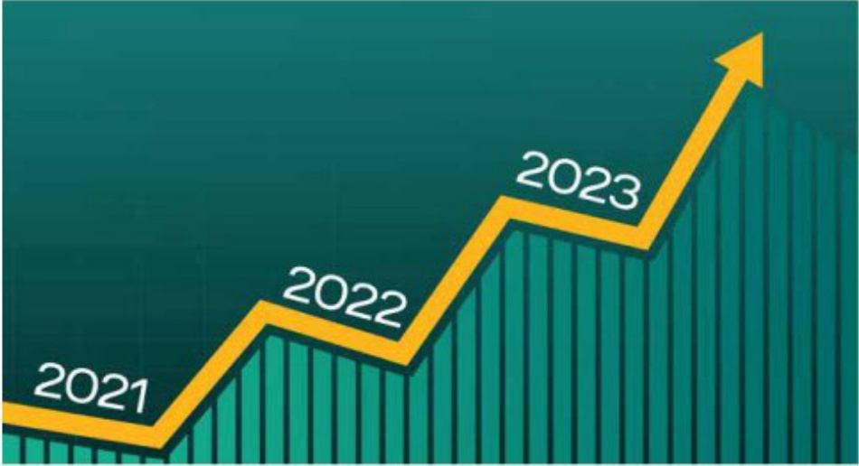

### CÁC CÔNG TY CON, CÔNG TY LIÊN KẾT (tiếp theo)

##### BIDV·MetLife

##### CÔNG TY TNHH BÀO HIỂM NHẨN THỊ BIDV METLIFE

<table border=1 style='margin: auto; word-wrap: break-word;'><tr><td style='text-align: center; word-wrap: break-word;'>Tên viết tắt</td><td style='text-align: center; word-wrap: break-word;'>BIDV METLIFE</td></tr><tr><td style='text-align: center; word-wrap: break-word;'>Giấy phép</td><td style='text-align: center; word-wrap: break-word;'>Số 72/GPDC4-KDBH ngày 16/01/2021</td></tr><tr><td style='text-align: center; word-wrap: break-word;'>Linh vực hoạt động</td><td style='text-align: center; word-wrap: break-word;'>Báo hiểm nhân thọ</td></tr><tr><td style='text-align: center; word-wrap: break-word;'>Vốn điều lệ (31/12/2023)</td><td style='text-align: center; word-wrap: break-word;'>1.145 tỷ đồng</td></tr><tr><td style='text-align: center; word-wrap: break-word;'>Tỷ lệ sở hữu của BIDV</td><td style='text-align: center; word-wrap: break-word;'>37,25%</td></tr><tr><td style='text-align: center; word-wrap: break-word;'>Trụ sở chính</td><td style='text-align: center; word-wrap: break-word;'>Tăng 3, Tòa nhà VCCI, số 9 Đào Duy Anh, Phương Mai, Đồng Đa, Hà Nội</td></tr><tr><td style='text-align: center; word-wrap: break-word;'>Diện thoại</td><td style='text-align: center; word-wrap: break-word;'>024.62820808</td></tr><tr><td style='text-align: center; word-wrap: break-word;'>Fax</td><td style='text-align: center; word-wrap: break-word;'>024.62990808</td></tr></table>

BIDV MetLife là liên doanh giữa Tập đoàn MetLife Inc. với BIDV và Tổng Cộng ty Cổ phần Bảo hiểm BIDV. Cộng ty chính thức di vào hoạt động tư thưởng 11/2014. Vốn điều lệ của BIDV MetLife tại thời điểm 31/12/2023 là 1.145 tỷ đồng.

Năm 2023, mặc dù gặp rất nhiều khó khăn do ảnh hưởng từ các sự vụ trên thị trường bảo hiểm nhân thọ, Công ty duy tri kết quả tăng trưởng khá quan về hiệu quả hoạt động: Tổng doanh thu phí bảo hiểm gốc năm 2023 đạt 1.629 tỷ đồng; kĩ nhuận trước thuế đạt 117 tỉ đồng, tăng hơn 38% so với năm 2022.

##### CÔNG TY CỔ PHẦN CHO THUỆ MÁY BAY VIỆT NAM

<table border=1 style='margin: auto; word-wrap: break-word;'><tr><td style='text-align: center; word-wrap: break-word;'>Tên viết tắt</td><td style='text-align: center; word-wrap: break-word;'>VALC</td></tr><tr><td style='text-align: center; word-wrap: break-word;'>Giấy phép hoạt động</td><td style='text-align: center; word-wrap: break-word;'>Số 010238410B, đăng kỳ lân dầu ngày 08/10/2007 tại Sở Kẻ hoạch và Đầu tư Thành phố Hà Nội và được sửa đổi lân thứ 16 ngày 02/11/2023</td></tr><tr><td style='text-align: center; word-wrap: break-word;'>Lĩnh vực hoạt động</td><td style='text-align: center; word-wrap: break-word;'>Mua và cho thuê máy bay</td></tr><tr><td style='text-align: center; word-wrap: break-word;'>Vốn điều lệ (31/12/2023)</td><td style='text-align: center; word-wrap: break-word;'>1.319 tỷ đồng</td></tr><tr><td style='text-align: center; word-wrap: break-word;'>Tỷ lệ số hầu của BIDV</td><td style='text-align: center; word-wrap: break-word;'>18.52%</td></tr><tr><td style='text-align: center; word-wrap: break-word;'>Trụ số chính</td><td style='text-align: center; word-wrap: break-word;'>Tăng 06, số 18 Lý Thuống Kiệt, Phường Phan Chu Trinh, Quận Hoàn Kiểm, Hà Nội</td></tr><tr><td style='text-align: center; word-wrap: break-word;'>Điện thoại</td><td style='text-align: center; word-wrap: break-word;'>024.35772225</td></tr><tr><td style='text-align: center; word-wrap: break-word;'>Fax</td><td style='text-align: center; word-wrap: break-word;'>024.35772270</td></tr></table>

Nhằm góp phần phát triển ngành hàng không quốc gia, trên cơ sở phê duyệt của Thủ tướng Chính phủ, Công ty CP Chỉ thuê Máy bay Việt Nam (VALC) chính thức đi vào hoạt động tử cuối năm 2007.

Sau 16 năm hoạt động, VALC dân kháng định vị thế trên thị trường cho thuê máy bay trong nước và quốc tế, với việc triển khai thành công 02 dự án mua và cho thuê máy bay lớn (dự án 05 máy bay ATR 72-500 và 10 máy bay Airbus A321-200). Bên cạnh đó, nhằm phát triển đội bay thương mại và đa dạng hóa hoạt động kinh doanh, VALC đã và đang nghiên cứu, phát triển một số dự án hợp tác kinh doanh đâu tư cho thuê động cơ, trang thiết bị hàng không khác.

#### TÌNH HÌNH ĐẦU TƯ, TÌNH HÌNH THỰC HIỆN CÁC DỰ ÁN

Năm 2023, hoạt động cho thuê máy bay đã dân khôi phục so với trước dịch. Tổng doanh thu của Công ty đặt 79,5 triệu USD, hoàn thành 104% kế hoạch, lợi nhuận trước thuê đặt 21,5 triệu USD, hoàn thành 130% kế hoạch năm.

Hoạt động đầu tư góp vốn vào công ty con, công ty liên doanh liên kết duy tri ấn định qua các năm. Trong năm 2023, BIDV không thực hiện mới các khoản đầu tư góp vốn, mua cổ phần.

#### TÌNH HÌNH TÀI CHÍNH

<table border=1 style='margin: auto; word-wrap: break-word;'><tr><td style='text-align: center; word-wrap: break-word;'>STT</td><td style='text-align: center; word-wrap: break-word;'>CHI TIÊU</td><td style='text-align: center; word-wrap: break-word;'>DVT</td><td style='text-align: center; word-wrap: break-word;'>2021</td><td style='text-align: center; word-wrap: break-word;'>2022</td><td style='text-align: center; word-wrap: break-word;'>2023</td><td style='text-align: center; word-wrap: break-word;'>Tăng/Giám so với 2022</td></tr><tr><td style='text-align: center; word-wrap: break-word;'></td><td style='text-align: center; word-wrap: break-word;'>QUY MÔ VĂN</td><td style='text-align: center; word-wrap: break-word;'></td><td style='text-align: center; word-wrap: break-word;'></td><td style='text-align: center; word-wrap: break-word;'></td><td style='text-align: center; word-wrap: break-word;'></td><td style='text-align: center; word-wrap: break-word;'></td></tr><tr><td style='text-align: center; word-wrap: break-word;'>1</td><td style='text-align: center; word-wrap: break-word;'>Tổng tài sản</td><td style='text-align: center; word-wrap: break-word;'>Tỷ đồng</td><td style='text-align: center; word-wrap: break-word;'>1.761.696</td><td style='text-align: center; word-wrap: break-word;'>2.120.677</td><td style='text-align: center; word-wrap: break-word;'>2.300.869</td><td style='text-align: center; word-wrap: break-word;'>8,5%</td></tr><tr><td style='text-align: center; word-wrap: break-word;'>2</td><td style='text-align: center; word-wrap: break-word;'>Văn chủ sở hữu</td><td style='text-align: center; word-wrap: break-word;'>Tỷ đồng</td><td style='text-align: center; word-wrap: break-word;'>86.329</td><td style='text-align: center; word-wrap: break-word;'>104.118</td><td style='text-align: center; word-wrap: break-word;'>122.867</td><td style='text-align: center; word-wrap: break-word;'>20,7%</td></tr><tr><td style='text-align: center; word-wrap: break-word;'>3</td><td style='text-align: center; word-wrap: break-word;'>Văn điều lệ</td><td style='text-align: center; word-wrap: break-word;'>Tỷ đồng</td><td style='text-align: center; word-wrap: break-word;'>50.585</td><td style='text-align: center; word-wrap: break-word;'>50.585</td><td style='text-align: center; word-wrap: break-word;'>57.004</td><td style='text-align: center; word-wrap: break-word;'>-</td></tr><tr><td style='text-align: center; word-wrap: break-word;'>4</td><td style='text-align: center; word-wrap: break-word;'>Tỷ lệ an toàn văn (CAR)</td><td style='text-align: center; word-wrap: break-word;'>%</td><td style='text-align: center; word-wrap: break-word;'>Đảm bảo quy định</td><td style='text-align: center; word-wrap: break-word;'>Đảm bảo quy định</td><td style='text-align: center; word-wrap: break-word;'>Đảm bảo quy định</td><td style='text-align: center; word-wrap: break-word;'></td></tr><tr><td style='text-align: center; word-wrap: break-word;'></td><td style='text-align: center; word-wrap: break-word;'>MỘT SỐ CHÍ TIÊU KẾT QUẢ KINH DOANH CHÍNH</td><td style='text-align: center; word-wrap: break-word;'></td><td style='text-align: center; word-wrap: break-word;'></td><td style='text-align: center; word-wrap: break-word;'></td><td style='text-align: center; word-wrap: break-word;'></td><td style='text-align: center; word-wrap: break-word;'></td></tr><tr><td style='text-align: center; word-wrap: break-word;'>1</td><td style='text-align: center; word-wrap: break-word;'>Dương cuối kỳ (không gồm TPON)</td><td style='text-align: center; word-wrap: break-word;'>Tỷ đồng</td><td style='text-align: center; word-wrap: break-word;'>1.354.633</td><td style='text-align: center; word-wrap: break-word;'>1.522.222</td><td style='text-align: center; word-wrap: break-word;'>1.777.665</td><td style='text-align: center; word-wrap: break-word;'>5,87%</td></tr><tr><td style='text-align: center; word-wrap: break-word;'>2</td><td style='text-align: center; word-wrap: break-word;'>Tổng thu nhập hoạt động</td><td style='text-align: center; word-wrap: break-word;'>Tỷ đồng</td><td style='text-align: center; word-wrap: break-word;'>62.494</td><td style='text-align: center; word-wrap: break-word;'>69.479</td><td style='text-align: center; word-wrap: break-word;'>73.013</td><td style='text-align: center; word-wrap: break-word;'>4,39%</td></tr><tr><td style='text-align: center; word-wrap: break-word;'>3</td><td style='text-align: center; word-wrap: break-word;'>Lợi nhuận trước thuế</td><td style='text-align: center; word-wrap: break-word;'>Tỷ đồng</td><td style='text-align: center; word-wrap: break-word;'>13.548</td><td style='text-align: center; word-wrap: break-word;'>22.922</td><td style='text-align: center; word-wrap: break-word;'>27.589</td><td style='text-align: center; word-wrap: break-word;'>16,78%</td></tr><tr><td style='text-align: center; word-wrap: break-word;'>4</td><td style='text-align: center; word-wrap: break-word;'>Lợi nhuận sau thuế</td><td style='text-align: center; word-wrap: break-word;'>Tỷ đồng</td><td style='text-align: center; word-wrap: break-word;'>10.841</td><td style='text-align: center; word-wrap: break-word;'>18.349</td><td style='text-align: center; word-wrap: break-word;'>21.977</td><td style='text-align: center; word-wrap: break-word;'>20%</td></tr><tr><td style='text-align: center; word-wrap: break-word;'>5</td><td style='text-align: center; word-wrap: break-word;'>ROA</td><td style='text-align: center; word-wrap: break-word;'>Tỷ đồng</td><td style='text-align: center; word-wrap: break-word;'>0.66%</td><td style='text-align: center; word-wrap: break-word;'>0,95%</td><td style='text-align: center; word-wrap: break-word;'>0,99%</td><td style='text-align: center; word-wrap: break-word;'>20,4%</td></tr><tr><td style='text-align: center; word-wrap: break-word;'>6</td><td style='text-align: center; word-wrap: break-word;'>ROE</td><td style='text-align: center; word-wrap: break-word;'>Tỷ đồng</td><td style='text-align: center; word-wrap: break-word;'>13.10%</td><td style='text-align: center; word-wrap: break-word;'>19,27%</td><td style='text-align: center; word-wrap: break-word;'>19,36%</td><td style='text-align: center; word-wrap: break-word;'>-</td></tr><tr><td style='text-align: center; word-wrap: break-word;'>7</td><td style='text-align: center; word-wrap: break-word;'>Tỷ lệ nợ xấu theo Thống tư 11/2021/TT-NHINN(*)</td><td style='text-align: center; word-wrap: break-word;'>%</td><td style='text-align: center; word-wrap: break-word;'>0,81%</td><td style='text-align: center; word-wrap: break-word;'>0,96%</td><td style='text-align: center; word-wrap: break-word;'>1,12%</td><td style='text-align: center; word-wrap: break-word;'></td></tr></table>

Ghi chú

- Số liệu theo các BCTC hợp nhất hàng năm đã được kiểm toán trong đó năm 2022 điều chỉnh theo khuyến nghị của Kiểm toán nhà nước.

- (+) Tỷ lệ ngữ xấu theo thống tư 11/2021/TT-NHNN (là số liệu riêng ngàn hàng.

