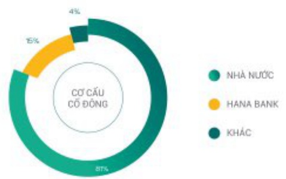
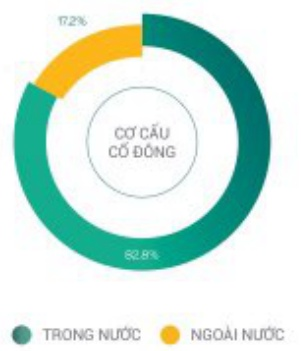
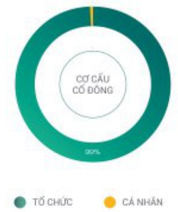

### Cơ CẤU CỔ ĐÔNG, THAY ĐỔI VỐN ĐẦU TỬ CỦA CHỦ SỞ HỮU TẠI THỜI ĐIỂM 31/12/2023

CỘ CẤU CỔ PHẦN

<table border=1 style='margin: auto; word-wrap: break-word;'><tr><td style='text-align: center; word-wrap: break-word;'>Tổng số cơ phản</td><td style='text-align: center; word-wrap: break-word;'>Loại cơ phản</td><td style='text-align: center; word-wrap: break-word;'>Số lượng cơ phản chuyển nhưng tự do</td><td style='text-align: center; word-wrap: break-word;'>Số lượng cơ phản hạn chế chuyển nhưng</td></tr><tr><td style='text-align: center; word-wrap: break-word;'>5.700.435.900</td><td style='text-align: center; word-wrap: break-word;'>Cổ phản phổ thông</td><td style='text-align: center; word-wrap: break-word;'>228.544.081</td><td style='text-align: center; word-wrap: break-word;'>5.471.891.819</td></tr></table>

#### TÊN CỔ ĐỒNG

<table border=1 style='margin: auto; word-wrap: break-word;'><tr><td style='text-align: center; word-wrap: break-word;'>Tên cổ đông</td><td style='text-align: center; word-wrap: break-word;'>Tống số cổ phản sở hữu</td><td style='text-align: center; word-wrap: break-word;'>Số cổ phản bị han chế chuyên nhượng</td><td style='text-align: center; word-wrap: break-word;'>Thời gian bị han chế chuyển nhượng</td></tr><tr><td style='text-align: center; word-wrap: break-word;'>Ngân hàng Nìh nước Việt Nam (Đại diện sở hữu văn Nìh nước)</td><td style='text-align: center; word-wrap: break-word;'>4.616.656.267</td><td style='text-align: center; word-wrap: break-word;'>4.616.656.267</td><td style='text-align: center; word-wrap: break-word;'>Theo Quy định của Nhà nước</td></tr><tr><td style='text-align: center; word-wrap: break-word;'>Hana Bank</td><td style='text-align: center; word-wrap: break-word;'>855.065.385</td><td style='text-align: center; word-wrap: break-word;'>855.065.385</td><td style='text-align: center; word-wrap: break-word;'>Theo cam kết của hai bên và theo quy định</td></tr><tr><td style='text-align: center; word-wrap: break-word;'>Cổ đông nội bộ</td><td style='text-align: center; word-wrap: break-word;'>203.352</td><td style='text-align: center; word-wrap: break-word;'>170.167</td><td style='text-align: center; word-wrap: break-word;'></td></tr><tr><td style='text-align: center; word-wrap: break-word;'>Hội đồng quản trị</td><td style='text-align: center; word-wrap: break-word;'>165.093</td><td style='text-align: center; word-wrap: break-word;'>165.093</td><td style='text-align: center; word-wrap: break-word;'>Trong thời gian đảm nhiệm chức vụ</td></tr><tr><td style='text-align: center; word-wrap: break-word;'>Ban Điều hành</td><td style='text-align: center; word-wrap: break-word;'>33.185</td><td style='text-align: center; word-wrap: break-word;'></td><td style='text-align: center; word-wrap: break-word;'></td></tr><tr><td style='text-align: center; word-wrap: break-word;'>Ban Kiểm soát</td><td style='text-align: center; word-wrap: break-word;'>5.074</td><td style='text-align: center; word-wrap: break-word;'>5.074</td><td style='text-align: center; word-wrap: break-word;'>Trong thời gian đảm nhiệm chức vụ</td></tr></table>

CỘ CẤU CỔ ĐÔNG

<table border=1 style='margin: auto; word-wrap: break-word;'><tr><td style='text-align: center; word-wrap: break-word;'>Tên cổ đông</td><td style='text-align: center; word-wrap: break-word;'>Tống sổ cổ phản sổ hữu</td><td style='text-align: center; word-wrap: break-word;'>Tỷ lệ sổ hữu</td><td style='text-align: center; word-wrap: break-word;'>Sổ lượng cổ đông</td></tr><tr><td style='text-align: center; word-wrap: break-word;'>Ngăn hàng Nhà nước Việt Nam (Đại diện sổ hữu vốn Nhà nước)</td><td style='text-align: center; word-wrap: break-word;'>4.616.656.267</td><td style='text-align: center; word-wrap: break-word;'>80.99%</td><td style='text-align: center; word-wrap: break-word;'>1</td></tr><tr><td style='text-align: center; word-wrap: break-word;'>Hana Bank</td><td style='text-align: center; word-wrap: break-word;'>855.065.385</td><td style='text-align: center; word-wrap: break-word;'>15.00%</td><td style='text-align: center; word-wrap: break-word;'>1</td></tr><tr><td style='text-align: center; word-wrap: break-word;'>Công đoàn Công ty</td><td style='text-align: center; word-wrap: break-word;'>13.319.383</td><td style='text-align: center; word-wrap: break-word;'>0.23%</td><td style='text-align: center; word-wrap: break-word;'>1</td></tr><tr><td style='text-align: center; word-wrap: break-word;'>Cổ đông khác</td><td style='text-align: center; word-wrap: break-word;'>215.394.865</td><td style='text-align: center; word-wrap: break-word;'>3.78%</td><td style='text-align: center; word-wrap: break-word;'>27.600</td></tr><tr><td style='text-align: center; word-wrap: break-word;'>Trong nước, trong đó:</td><td style='text-align: center; word-wrap: break-word;'>87.523.962</td><td style='text-align: center; word-wrap: break-word;'>1.54%</td><td style='text-align: center; word-wrap: break-word;'>26.487</td></tr><tr><td style='text-align: center; word-wrap: break-word;'>Tổ chức</td><td style='text-align: center; word-wrap: break-word;'>55.579.138</td><td style='text-align: center; word-wrap: break-word;'>0.97%</td><td style='text-align: center; word-wrap: break-word;'>186</td></tr><tr><td style='text-align: center; word-wrap: break-word;'>Cả nhân</td><td style='text-align: center; word-wrap: break-word;'>31.944.824</td><td style='text-align: center; word-wrap: break-word;'>0.56%</td><td style='text-align: center; word-wrap: break-word;'>26.301</td></tr><tr><td style='text-align: center; word-wrap: break-word;'>Ngoài nước, trong đó:</td><td style='text-align: center; word-wrap: break-word;'>127.870.903</td><td style='text-align: center; word-wrap: break-word;'>2.24%</td><td style='text-align: center; word-wrap: break-word;'>1.113</td></tr><tr><td style='text-align: center; word-wrap: break-word;'>Tổ chức</td><td style='text-align: center; word-wrap: break-word;'>125.714.612</td><td style='text-align: center; word-wrap: break-word;'>2.21%</td><td style='text-align: center; word-wrap: break-word;'>102</td></tr><tr><td style='text-align: center; word-wrap: break-word;'>Cả nhân</td><td style='text-align: center; word-wrap: break-word;'>2.156.291</td><td style='text-align: center; word-wrap: break-word;'>0.04%</td><td style='text-align: center; word-wrap: break-word;'>1.011</td></tr></table>

#### CỔ ĐÔNG LƠN

CỘ CẤU CỔ ĐÔNG TRONG

VÀ NGOÀI NƯỚC

CỔ ĐÔNG TỔ CHỨC

VÀ CÁ NHÂN

#### TÌNH HÌNH THAY ĐỔI VỐN ĐẦU TỪ CỦA CHỦ SỞ HỮU

Tại thời điểm 31/12/2023: 122.866.889.000.000 đồng

• Giao dịch cổ phiếu quý: Không có

Chúng khoản giao dịch tại nước ngoài: Không có

Các chứng khoản có phần khác: Không có