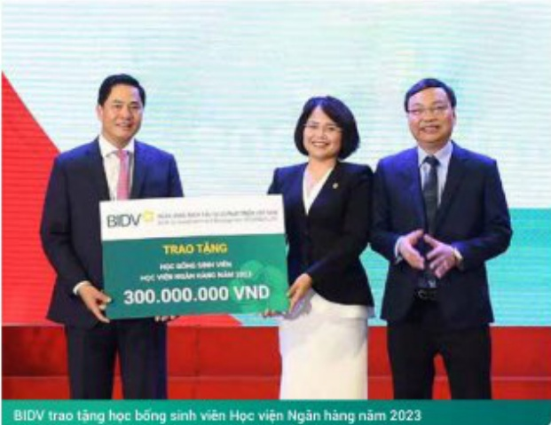
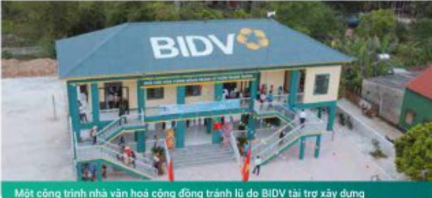

# BÁO CÁO TÁC ĐỘNG LIÊN QUAN ĐẾN MÔI TRƯỜNG VÀ XÃ HỘI (tiếp theo)

BÁO CÁO LIÊN QUAN ĐẾN TRÁCH NHIỆM ĐỐI VỚI CỘNG ĐỒNG ĐỊA PHƯƠNG

##### HOẠT ĐỘNG AN SINH XÃ HỘI NĂM 2023

158 CHUONG TRINH

TỔNG CHI PHÍ CÁC CHƯƠNG TRÌNH

ASXH NĂM 2023

## 330 TỶ ĐỒNG

Năm 2023, bên cạnh việc hoàn thành nhiệm vụ là công cụ hữu hiệu của Đảng, Nhà nước, Chính phủ trong thực thi các nhiệm vụ phát triển kinh tế - xã hội của đất nước, BIDV cũng đánh nhiều nguồn lực, tầm sức để thực hiện trách nhiệm xã hội vì công đồng.

Tiếp nối những hoạt động an sinh xà hỏi (ASXH) nhiều năm qua, công tác ASXH của BIDV năm 2023 tập trung vào các lĩnh vực chính theo định hướng của Chính phủ hướng tải phát triển bên vững bao gồm: giáo dục, y tế, xây nhà cho người nghèo, khác phục hậu quả thiên tai, quả Tiết cho người nghèo... Trong năm, BIDV đã triển khai 158 chuộng trình an sinh xã hội, tổng giá trị thực hiện là gần 330 tỷ đồng. Hoạt động tài trợ ASXH của BIDV được triển khai đùng mục dịch, đúng đối tượng và đem lại hiệu quả thiết thực cho đối tượng/đơn vị thụ hưởng, đồng góp chung vào kết quả công tác xóa đôi giảm nghèo, phát triển giáo dục, nâng cao tri thức cho người dân, cải thiện điều kiện y tế chăm sóc sức khỏe cho nhân dân, góp phần bình ổn cuộc sống người nghèo, an cư lạc nghiệp, giảm bất khổ khản, khác phục thiết hại cơ sở vật chất do thiên tai bảo lũ, hạn mặn, dịch bệnh...

##### Lĩnh vực Giáo dục

BIDV đã triển khai thực hiện tài trợ lĩnh vực giáo dục với tổng chí phí là gần 109,5 tỷ đồng, tài trợ xây dựng cơ sở vật chất, phòng học cho 07 cơ sở trưởng học, tập hạng ngàn suất học bống cho học sinh nghèo cả nước; Tài trợ các công trình phòng tin học máy tính, góp phần gia tây hàm lượng công nghệ trong hoạt động giáng dạy/đào tạo tại các trưởng học trong thời kỳ hội nhập 4.0.,, trong đó BIDV tham gia tài trợ xây dựng các hạng mục công trình trưởng học tiêu biểu như trưởng học tại huyện Thanh Hà (tính Hải Dương), trưởng học tại huyện Phú Mỹ (Bình Định), Nghệ An, Hà Tĩnh... Nâng cao chất lượng giáo dục là một trong những điều kiện cần bán để nâng cao dân trí, hướng tới sự phát triển bền vững.

BIDV trao tăng học băng sinh viên Học viên Ngân hàng năm 2023

<table border=1 style='margin: auto; word-wrap: break-word;'><tr><td style='text-align: center; word-wrap: break-word;'>Lĩnh vực Y tế</td><td style='text-align: center; word-wrap: break-word;'>BIDV tài trợ lĩnh vực y tế với tổng chi phí khoảng 93 tỷ đồng như tài trợ xây dựng bệnh viện, trang thiết bị y tế, cơ sở vật chất cho các cơ sở y tế, các dự án đào tạo năng cao năng lực, khám chữa bệnh cho đội ngũ y bác sự tại các khu vực khó khăn như miền núi, biên giới, hài đảo, góp phần nàng cao chất lượng khám chữa bệnh châm sức sức khỏe cho nhân dân, bảo vệ chủ quyền biến đảo Tổ quốc.</td></tr><tr><td style='text-align: center; word-wrap: break-word;'>Tài trợ xây dựng nhà ở cho người nghèo</td><td style='text-align: center; word-wrap: break-word;'>BIDV tài trợ xây dựng gần 1.500 cản nhà ở cho người nghèo với tổng giá trị tài trợ gần 75 tỷ đồng, góp phần cùng địa phương chăm lo cho người nghèo có mải ẩm ổn định, an cư lạc nghiệp, yên tâm sản xuất, phát triển kinh tế.</td></tr><tr><td style='text-align: center; word-wrap: break-word;'>Tặng quà Tết cho người nghèo</td><td style='text-align: center; word-wrap: break-word;'>BIDV tiếp tục triển khai chuộng trình ASXH có ý nghĩa nhân văn, có dấu ấn riêng đã được BIDV thực hiện liên tục trong suốt 15 năm qua đó là tặng 40.000 suất quà Tết cho đồng bào nghèo. Bây là chuộng trình được các cơ quan quản lý như Ủy ban Trung ương Mặt trận Tổ quốc Việt Nam ghi nhận, đánh giá cao, quan tâm tới đối tượng người nghèo trong những dị lễ tết có tính văn hóa cổ truyền của dân tộc.</td></tr></table>

## Các chương trình ASXH theo định hướng phát triển bền vững

CHƯƠNG TRÌNH

Trồng 1 triệu cây xanh

CHƯƠNG TRÌNH

Xây nhà văn hoá cộng đồng

tránh lũ

Với định hướng thực hiện trách nhiệm vì cộng đồng, BIDV cũng ưu tiên nguồn lực triển khai

tài trợ các chương trình ASXH theo hướng Ngân hàng Xanh cho phát triển bền vững. Năm

2023, BIDV tiếp tục thực hiện các chương trình ASXH trọng điểm, bao gồm: Trường 330 ngàn

cây xanh trong dự án trọng 1 triệu cây xanh, các chương trình trọng cây xanh của BIDV đóng

góp trực tiếp, hiệu quả vào hoạt động bảo vệ, phát triển rùng phòng hộ để giảm thiếu hầu

quá thiên tai, phú xanh các khu đô thị để bảo vệ môi trường xanh; tài trợ xây dựng, khánh

thành bản giao chuối nhà văn hóa cộng đồng tránh lỗ tại các tính khu vực miền Trung gồm

Nghệ An, Hà Tĩnh, Quảng Bình, Quảng Trị, Thừa Thiên Huế. Công trình được xây dựng với

những công năng chính: trong điều kiện bình thường, dây là nơi hội họp, giao lưu văn hóa, thế

dục, thế theo cho người dân, khi vào mùa bảo lũ đáng cao, công trình là nơi tránh trú bảo vệ

an toàn, tài sản tính mạng cho người dân vùng lũ. Tài trợ gần 600 bản chứa nước ngợi cho

người dân để vượt qua khô khăn do thiên tại hạn măn tại khu vực Đông bằng Sống Cấu Long.

CHƯƠNG TRÌNH

Nước ngọt cho cuộc sống xanh

Một công trình nhà văn hoá công dụng tránh lũ do BIDV tài trợ xây dựng