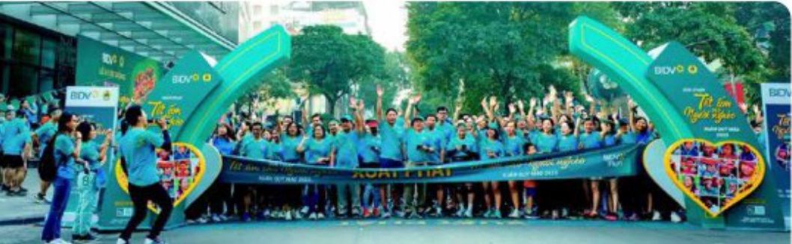
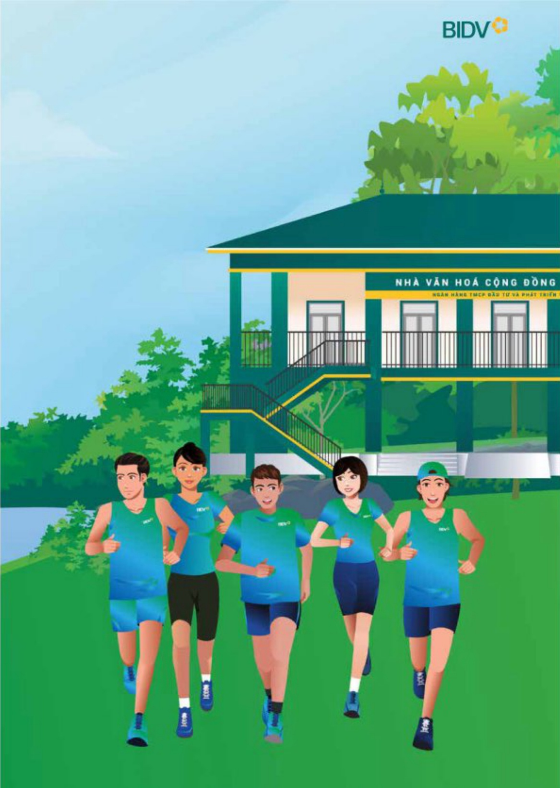

# BÁO CÁO TÁC ĐỘNG LIÊN QUAN ĐẾN MÔI TRƯỜNG VÀ XÃ HỘI (tiếp theo)

BÁO CÁO LIÊN QUAN ĐẾN TRÁCH NHIỆM ĐỐI VỚI CỘNG ĐỒNG ĐỊA PHƯƠNG

Tài trợ, tổ chức các sự kiện Xanh

5 NAM

tổ chức Giải chạy "BIDV Run - Tết ẩm cho người nghèo"

Bên cạnh việc trực tiếp hồ trợ chỉ phí thực hiện các chuộng trình an sinh xã hội hồ trợ giảm nghèo, BIDV đã sáng tạo trong việc văn đống khách hàng, công chúng chung tay thực hiện hoạt động an sinh xã hội hồ trợ cho các đối tượng yêu thế, kết hợp tuyến truyền, xây dựng thái quên rèn luyện năng cao sức khỏe trong cộng đồng, đặc biệt là chuộng trình "BIDV Run - Tết ẩm cho người nghèo", "BIDV Run - Cho cuộc sống Xanh".

Năm 2023, BIDV đánh dấu mốc 5 năm tố chức Giải chạy "BIDV Run - Tết âm cho người nghèo", sự kiện đã ghi dấu ăn với cộng đồng, được đồng đảo công chúng tham gia hướng ứng, thu hút gần 55.000 vận động viên tham gia. Giải chạy vận động công chúng, khách hàng cùng thăm gia đóng góp cho các chương trình ASXH, tặng quà Tết cho người nghèo và các hoạt động xanh báo về môi trường như trồng cây xanh, xây nhà văn hóa cộng đồng tránh lũ theo tiêu thức BIDV quy đổi thành tích chạy của vận động viên và trích chi phí từ 1.000-3.000 đồng/km tặng quà Tết cho người nghèo.

Từ những chuong trình trên, BIDV đã góp phần tạo ra những phong trào ùng họ ASXH trong xã hội, lan tòa tinh thần tuong thân, tuong ài, chia sẻ với người nghèo, cùng công đồng xây dựng nên những giá trị tốt đẹp, giàu tính nhân văn. Những hoạt động tích cực trên của BIDV đã góp phần vào thành quả chung của cả nước về giảm nghèo. Thông qua các hoạt động ASXH, BIDV tiếp tục kháng định không chỉ là định chế tài chính hàng đầu trong hoạt động kinh doanh mà còn luôn tiến phong hướng đến sự phát triển biên vững trong công đồng xã hội. Chương trình an sinh xã hội đã góp phần xây dựng và bồi đập uy tín, thuong hiệu BIDV vì cộng đồng, được nhân dân ghi nhận. Hiệu quả từ các chuong trình an sinh xã hội của BIDV qua túng năm nhận được sự đánh giá cao và ghi nhận tích cực từ các cơ quan quản lý, các địa phương, các tổ chức xã hội và người thụ hưởng. Các chuong trình ASXH của BIDV cũng nhận được sự ùng hộ, tham gia của đối tác, khách hàng, công chúng, lan tòa sâu rộng đến cộng đồng xã hội.

Thông qua các hoạt động ASXH, BIDV tiếp tục kháng đỉnh không chỉ là đỉnh chế tài chính hàng đầu trong hoạt động kinh doanh mà còn luôn tiền phong hướng đến sự phát triển bên vững trong đồng đồng xã hội. Chương trình an sinh xã hội đã góp phần xây dựng và bởi đập Uy tin, Thương hiệu BIDV vì cộng đồng, được nhân dân ghi nhận. Hiệu quá tử các chuong trình an sinh xã hội của BIDV qua tủng năm nhận được sự đánh giá cao và ghi nhận tích cực tử các cơ quan quân lý, các địa phương, các tổ chức xã hội và người thụ hưởng. Các chuong trình ASXH của BIDV cũng nhận được sự ứng hộ, tham gia của đối tác, khách hàng, công chúng, lan tóa sâu rộng đến cộng đồng xã hội.

