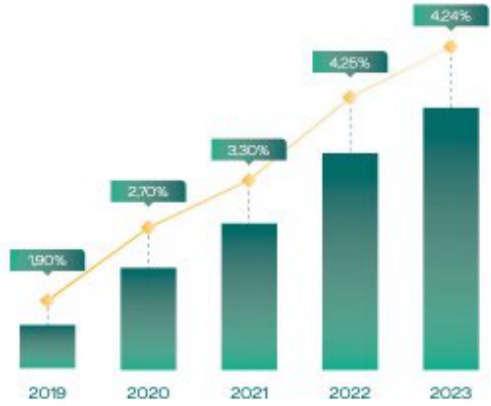

# BÁO CÁO TÁC ĐỘNG LIÊN QUAN ĐỀN MÔI TRƯỜNG VÀ XÃ HỘI (tiếp theo)

BÁO CÁO LIÊN QUAN ĐẾN HOẠT ĐỘNG THỊ TRƯỞNG VỐN XANH

##### Tín dụng xanh

Dựng cuối kỳ tin dụng xanh (tỷ đồng)

Tỷ trọng tin dụng xanh/Tống dư nợ (%)

Tai nghi quyết Hội đồng quản trị về chiến lược phát triển kinh doanh của BIDV đến năm 2025, tâm nhìn đến năm 2030 nếu rõ: BIDV sẽ nghiên cứu mô hình Chi nhánh, Phòng giao dịch "Ngân hàng xanh" gần với yêu cầu thúc dấy tăng trưởng tín dụng xanh và quản lý rủi ro môi trưởng - xã hội trong hoạt động cấp tín dụng. Động thời, BIDV cảm kết triển khai các gói "Tin dụng xanh", dành tỷ trọng tương xứng để tài trợ cho các khách hàng trong lĩnh vực nâng lượng tài tạo, năng lượng sạch, các ngành sản xuất và tiêu dùng phát thải carbon thấp, thích ứng với biến đổi khí hậu, qua đó góp phần chuyển đổi nền kinh tế theo hướng tăng trưởng xanh, bảo vệ môi trưởng, ngân chân biển đối khí hậu, nâng cao hiệu quả sử dụng tài nguyên, năng lượng, thể hiện trách nhiệm với công đồng và môi trưởng.

Trên cơ sở tầm nhìn chiến lược rõ ràng về phát triển tin dụng xanh, ngân hàng xanh của Ban Lãnh đạo BIDV, trong thôi gian qua BIDV, đã triển khai một cách nghiêm túc và có lộ trình phù hợp các công việc, giải pháp liên quan tới tin dụng xanh, ngân hàng xanh, cụ thể như sau:

Thứ nhất, BIDV luôn ưu tiên tập trung vốn tin dụng tài trợ các dự án tin dụng xanh và đã đạt được những kết quả rất tích cực. BIDV hiện đang năm trong 5 ngăn hàng có dưỡng tin dụng xanh lớn nhất toàn hệ thống. Đến 31/12/2023, dưỡng tin dụng tính vực xanh tại BIDV đạt 74.177 tỷ đồng (chiếm tỷ trong 4,24% tổng dưỡng), trong đó, chủ yếu tập trung vào lĩnh vực Năng lượng tài tạo, năng lượng sạch với dưỡng 60.092 tỷ đồng (chiếm 81% tổng dưỡng tin dụng xanh).

- Thứ hai, BIDV tăng cường hợp tác với các tổ chức quốc tế trong lĩnh vực phát triển bền vững, để hỗ trợ triển khai nguồn vốn về Việt Nam, qua đó góp phần thức đấy tài chính bền vững, tiết kiệm năng lượng và thực đấy chuyển đổi năng lượng sạch.

- Thí ba, BIDV là định chế tài chính trong nước đâu tiền hợp tác với Bộ TN&MT, xây dựng các giải pháp và hành động cụ thể nhằm hướng đến thực hiện các mục tiêu chiến lược về bảo vệ môi trường, ứng phó với biến đổi khi hậu, thực đấy phát triển tài chính xanh bền vững tại Việt Nam.

Thủ tư, BIDV không ngừng nặng cao nặng lực thế chế, hoàn thiện các quy trình nội bộ liên quan tới tin dung xanh.

Thứ năm, BIDV luôn nổ lực để góp phần cái thiện mỗi trưởng nhằm xây dựng ngàn hàng

##### Trái phiếu xanh

Năm 2022, Ngân hàng TMCP Đầu tư và Phát triển Việt Nam (BIDV) đã được Ngân hàng Nhà nước Việt Nam (SBV) lựa chọn để hỗ trợ nghiên cứu xây dựng Khung Trái phiếu xanh - tài liệu sử dụng trong hoạt động phát hành trái phiếu xanh của tổ chức phát hành theo chương trình hỗ trợ kỹ thuật giữa SBV và Tổ chức hợp tác quốc tế Đức (GIZ). Năm 2023, với sự tư vấn kỹ thuật của Ngân hàng Thế giới (WB), BIDV đã hoàn tất xảy dụng Khung Trái phiếu xanh được Tổng Giám đốc kỹ ban hành, trong đó bao gồm 04 try cốt:

- Sử dụng nguồn vốn thu được từ phát hành trái phiếu: Xác định các danh mục dự án xanh đủ điều kiện sử dụng nguồn vốn huy động từ trái phiếu xanh, bao gồm các dự án thuộc các lĩnh vực như hiệu quả năng lượng, năng lượng tại tạo, hệ thống quản lý nước thái, ở nhiễm không khí...

- Quy trình đánh giá và lựa chọn dự án: Mở tả quy trình nội bộ của tổ chức phát hành cho việc lựa chọn dự án đủ điều kiện để được tài trợ vốn bởi trải phiếu xanh;

- Quân lý nguồn vốn thu được từ phát hành trải phiếu: Xác định cách thức quản lý nguồn vốn thu được sau khi phát hành của tổ chức phát hành;

Chế độ báo cáo sau phát hành: Thiết lập quy trình các báo cáo căn tụan thú ở giai đoạn sau phát hành.

Khung TPX của BIDV đã được Tố chức Xếp hàng Quốc tế Moody's đánh giá tuần thù Nguyễn tắc trải phiếu xanh của Hiệp hội thị trường vốn quốc tế (ICMA) và chăm điểm ở mục SQS2 (rất tốt), qua đó xác nhận sự tuần thù, minh bạch ở cấp độ cao trong việc lựa chọn dự án, thẩm định, cho vay, các chế độ về quản trị, bảo cáo của BIDV khi phát hành trải phiếu xanh.

Trên cơ sở Khung trái phiếu xanh, ngày 25/10/2023 BIDV đã triển khai thành công giao dịch phát hành 2.500 tỷ đồng trái phiếu với kỹ hạn 05 năm, qua đó trở thành ngàn hàng đầu tiên phát hành trái phiếu xanh theo tiêu chuẩn quốc tế tại thi trường trong nước.

##### Khung Khoản vay bền vững

BIDV chính thức ban hành "Khung Khoán vay bền vùng" được xây dựng với sự tư vấn của tổ chức Carbon Trust. BIDV là ngân hàng thương mại Việt Nam đầu tiên công bố "Khung Khoán vay bền vùng", là tiền đề để BIDV phát triển các sản phẩm tài chính bền vùng theo chuẩn mực quốc tế.

Khung Khoản vay bền vững của BIDV được xây dựng đưa trên các nguyên tắc do Hiệp hội Thị trưởng vay (Loan Market Association - LMA), Hiệp hội Kinh doanh vốn và Cho vay hợp với (Loan Syndications and Trading Association - LSTA) và Hiệp hội Thị trưởng vay châu Á Thái Bình Dương (Asia Pacific Loan Market Association - APLMA) đăng ban hành, bao gồm Nguyễn tắc Khoản vay xanh (Green Loan Principles - GLP); Nguyễn tắc Khoản vay xã hội (Social Loan Principles - SLP) và Nguyễn tắc Khoản vay Liên kết bền vững (Sustainability-Linked Loan Principles - SLLP), cũng như phú hợp với quy định pháp luật hiện hành và tính hình kinh doanh tại Việt Nam.

Khung Khoản vay bền vững của BIDV được thiết kế nhằm cung cấp các sản phẩm cho vay bền vững phổ biến nhất trên thị trường toàn cầu hiện nay, bao gồm Khoản vay theo chủ đề và Khoản vay liên kết bền vững. Khoản vay theo chủ đề bao gồm Khoản vay Xanh, Khoản vay Xã hội và Khoản vay Bền vững, được thiết kế đánh riêng cho các dư án có mục đích sử dụng vốn vì lợi kịch mới trường (Khoản vay Xanh), hoặc phục lợi xã hội (Khoản vay Xã hội), hoặc động thời vị lợi ích mỗi trường-xã hội (Khoản vay Bền vững).

Khoản vay liên kết bền vững bao gồm những khoản vay được xây dựng nhằm khuyến khích bên vay đạt được các Chỉ tiêu Hiệu quá bền vững được thiết lập trước và do lường thông qua các chỉ số đánh giá hiệu quả công việc đã được xác định.

Khung Khoán vay bền vũng của BiDV cũng đưa ra khuôn khổ rõ ràng về Khoán vay theo chủ đề và Khoán vay liên kết biển vũng. Theo đó, các Khoán vay theo chủ đề được xác định dựa trên bốn thành phần cốt lối gồm: (i) Mục đích sử dụng vốn vay; (ii) Quy trình đánh giá và lựa chọn dự án; (iii) Quản lý sử dụng vốn vay và (iv) Bảo cáo. Trong khi đó, Khoán vay liên kết bền vũng đưa trên năm trụ cốt gồm: (i) Lựa chọn các Chỉ số đo lường hiểu quả (KPI); (ii) Xác định các Chỉ tiêu Hiệu quả bền vững; (iii) Đặc điểm khoản vay; (iv) Bảo cáo và (v) Xác minh từ bền thử ba. Khung Khoản vay bền vũng được xây dựng hướng đến các chuẩn mực quốc tế, do đó, sẽ giúp rút ngắn khoảng cách giữa chuẩn mực quốc tế với thực tiễn áp dung tai Việt Nam, động thời, cùng cổ vị thế của BIDV là một ngân hàng uy tín trên thị trường quốc tế, có vai trò chủ động và tích cực trong việc triển khai Chiến lược phát triển bền vững của Chính phủ Việt Nam.