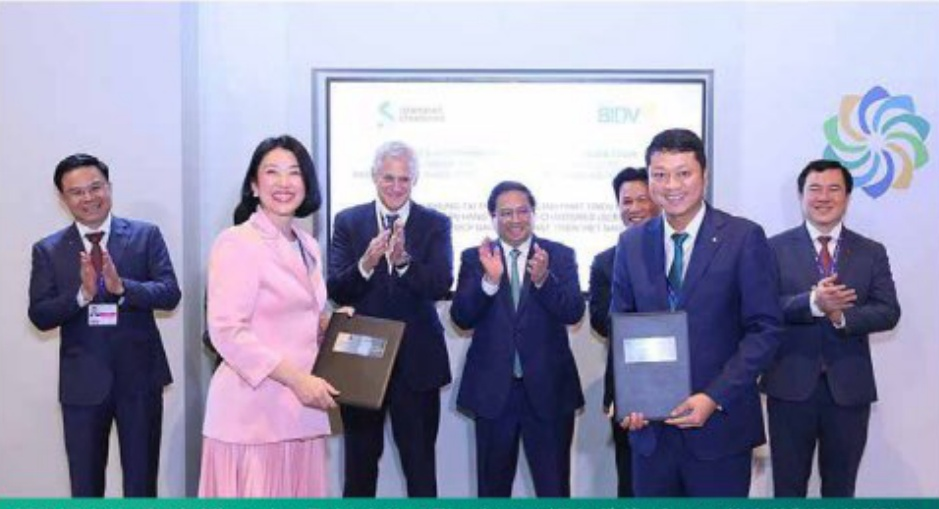

# KẾT QUẢ CÔNG TÁC ĐIỀU HÀNH TRONG NĂM 2023 (tiếp theo)

# CÔNG TÁC QUẢN TRỊ ĐIỂU HÀNH

Thực thi tốt chính sách tiền

tệ quốc gia, đảm bảo vai trò

nòng cốt, dẫn đất thị trường

Cung ứng lượng vốn làm cho nền kinh tế, tiếp tục kháng định vị thế số 1, thi trường về quy mô;

tích cực cho vay các dự án lớn, trọng điểm và là nền tăng của nền kinh tế, góp phần phát triển

cơ sở hạ tầng, đảm bảo an ninh năng lượng quốc gia.

Chủ động căn dõi nguồn ngoại tế để đáp ứng nhu cầu mua, bản ngoại tế của khách hàng với doanh số mua bán ngoại tế tăng gần 8% so với năm 2022; duy trí chính sách tỷ giá niềm yết canh tranh so với các NIHTMCP lớn, góp phần hỗ trợ các doanh nghiệp hoạt động trong lĩnh vực xuất nhập khẩu và góp phần bình ổn tỷ giá thị trưởng; Đa dạng nguồn tiền nhận gửi để hỗ trợ thanh khoản thi trưởng trong những giai đoạn thanh khoản eo hẹp.

Tham gia hồ trợ hoạt động của Ngàn hàng TMCP Sài Gòn (SCB) theo chỉ đạo của NHNN.

Phát huy tốt vai trò định chế

tài chính chủ lực, chủ đạo

của nền kinh tế, đồng hành

chia sẻ khó khăn với doanh

nghiệp, người dân

Dành nguồn lực tài chính để hạ lãi suất cho vay hỗ trợ các khách hàng gặp khó khăn. Thực hiện chỉ đạo của NHNN về giám mật bảng lãi suất, năm 2023, BIDV đã thực hiện 16 lần điều chỉnh giám lãi suất huy động vốn (HDV) với tổng mục giám tư 2.5-4.5%/năm tại tất cả các ký hạn, đối tượng khách hàng, áp trân lãi suất tới da từ giữa tháng 02/2023, tạo tiền đề giám lãi suất cho vay hỗ trợ doanh nghiệp, người dân. Đến hết năm 2023, tổng dưỡng được hạ lãi suất tại BIDV đạt hơn 900 nghìn tỷ đồng, mục giám lãi suất tử 0.5-2.5%, tổng thu nhập BIDV đã giám đế hỗ trợ cho hơn 260 nghìn khách hàng là 5.917 tỷ đồng.

Tiếp tục cơ cấu lại thời han trả ngờ và giữ nguyên nhóm ngờ hỗ trợ khách hàng khó khăn theo các Thông tư, hướng dẫn của NHNN.

Đồng hành với Chính phủ trong nỗ lực hiện thực hóa các cam kết giảm phát thái, bảo vệ môi trường, hướng tới chiến lược toàn diện về phát triển bền vững, thực hành ESG

Thành lập Ban Chỉ dạo và Ban Quân lý dự án Xây dựng và triển khai Chiến lược phát triển bền vững và thực hành ESG tổng thể tại BIDV; Đây nhanh công tác lựa chọn nhà thầu uy tín nhằm hỗ trợ xây dựng Chiến lược phát triển bền vững tổng thể; Ký kết thỏa thuận Khung tài trợ bền vững trợ giá 100 triệu USD với Ngân hàng Standard Chartered (SCB), đồng thời kỳ kết Bản Ghi nhớ hợp tác về thúc đẩy tín dụng xanh và làm việc cấp cao với Ngân hàng phát triển Châu Á (ADB) trong khuôn khổ Hội nghị CCP28 diễn ra tại Dubai, UAE vào tháng 12/2023;

BIDV là ngân hàng TMCP đâu tiền tại Việt Nam ban hành "Khung khoản vay bền vững", "Khung trái phiếu xanh" theo các chuẩn mực quốc tế và được tổ chức xếp hàng Moody's đánh giá cao; Phát hành thành công 2.500 tỷ đồng trái phiếu theo nguyên tắc Trái phiếu Xanh của Hiệp hội Thị trường Văn quốc tế, Đồng hành cùng nhiều diễn đàn, hội thảo chia sẻ kinh nghiệm và lan tỏa thông điệp phát triển bền vững tối khách hàng, dối tác. Đến 31/12/2023, BIDV đản đấu thị trường về tín dụng xanh với dự nợ đạt khoảng 74,2 nghìn tỷ đồng, chiếm tỷ trọng 5% tổng dư nợ, tăng 16,4% so với thời điểm 31/12/2022.

BIDV và Ngân hàng Standard Chartered trao Thỏa thuận khung Tài trợ thương mại Phát triển bên vững trong khuôn khổ Hội nghị COP 28

Điều hành hoạt động tín

dụng, huy động vốn linh

hoạt, bám sát tín hiệu thị

trường

Triển khai các giải pháp thúc đẩy tăng trưởng tín dụng, trong đó ban hành các gọi tín dụng

lải suất cạnh tranh, điều chỉnh, tháo gỡ điều kiện cho vay kịp thời, Định hướng tín dụng vào các lĩnh vực sản xuất kinh doanh, các ngành nghề có tiêm năng phát triển, thuộc đối tượng được Chính phủ, NHẦN ưu biên, khuyến khích. Tập trung năng cao chất lượng, hiệu quả hoạt động tín dụng, quyết liệt thu hồi ngụ xấu, ngư tiêm ăn rủi ro.

Ban hành kịp thời văn bản chỉ đạo hoạt động tín dụng năm 2023 từ đầu năm và các văn bản độc thù theo chỉ đạo của Chính phủ, NHNN; ban hành Chỉ thời về việc tăng cường kiểm soát chất lượng tín dụng và thu hồi ngữ xấu với những giải pháp, cơ chế, chế tài cụ thể nhằm kiểm soát rủi ro, nâng cao chất lượng tín dụng. Triển khai nghiên cứu và hoàn thiện công tác Quản lý danh mục theo phương pháp năng cao.

## Tích cực triển khai các giải pháp thúc đẩy hoạt động kinh doanh

KHÁCH HÀNG CÁ NHẬN

## 19 TRIỆU tăng 32% so với năm 2022

##### KHÁCH HÀNG DOÀNH NGHIỆP

### 430.200

Tổ chức thành công Chương trình làm việc của Ban Lãnh đạo với các chi nhánh trên toàn hệ thống để đánh giá kết quả thực hiện kế hoạch kinh doanh (KHKD), chất lượng tín dụng, thảo gỡ những khô khăn, vương mắc của các chi nhánh và xác định các giải pháp, biện pháp để đạt kết quả KHKD cao nhất năm 2023.

tăng 6,5% so với năm 2022

Lần đầu tiên Hội nghị Phòng giao dịch (PGD) BIDV được tổ chức trên phạm vi toàn hệ thống nhằm rõ soát, đánh giá toàn diện, thực chất kết quả kinh doanh của Khôi PGD giai đoạn 2019-2022, đồng thời ban hành các định hướng, cơ chế, chính sách nhằm thực đấy Khôi PGD phát triển toàn diện, tiếp tục định hướng là kênh phân phối mũi nhom, đưa sản phẩm dịch vụ của BIDV ngày càng đến gần hơn tới khách hàng.

Tổ chức triển khai nhiều cơ chế, chiến dịch, hội nghị thúc đẩy hoạt động kinh doanh, phát triển môi năng cấp nhiều sản phẩm dịch vụ với nhiều tính năng và hàm lượng số hóa đi đâu thị trường. Trong năm 2023, BIDV phát triển môi 3,3 triệu khách hàng cá nhân, tăng 32% so với năm 2022, năng tổng số khách hàng cá nhân (KHCN) lên gần 19 triệu khách hàng, đồng thời, phát triển môi 24.342 khách hàng doanh nghiệp (KHDN), tăng 6,5% so với năm 2022, năng tổng số KHDN lên 430.200 khách hàng.