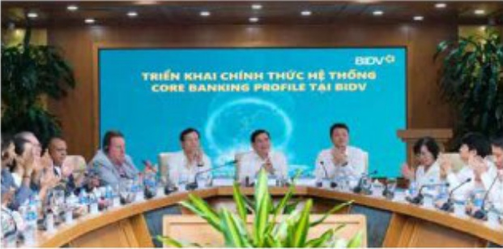

# KẾT QUẢ CÔNG TÁC ĐIỀU HÀNH TRONG NĂM 2023 (tiếp theo)

Triển khai thành công,

đúng tiến độ hệ thống Core

Banking mới; Tự chủ trong

phát triển ứng dụng công

nghệ thông tin (CNTT) và

đảm bảo khả năng vận

hành hệ thống một cách ổn

định, thông suốt, an toàn

Tập trung tối đa nguồn lực của hệ thống, làm việc trách nhiệm, hiệu quả với quyết tâm cao nhất, hệ thống Core Banking Profile của BIDV đã chính thức go-live vào 15 giờ 10 phút ngày 03/09/2023. Trước và sau khi chuyển đổi, hệ thống Core Banking vận hành ổn định, an toàn, đáp ứng yêu cầu hoạt động kinh doanh và khối lượng giao dịch lớn của hệ thống với khoảng 2.3 tỷ giao dịch tài chính trong năm 2023.

Tự phát triển thành công dự án Payment Hub (là ngăn hàng đầu tiên tại Việt Nam đặt chuẩn tín điện ISO 20022 trong cả 3 vai trò: ngăn hàng gửi diễn, nhận diện và trung gian), tiếp tục nghiên cứu triển khai dự án Hệ thống chuyển đổi số quản trị nội bộ toàn hàng (B.One) và Hệ thống ngăn hàng điện tử cho khách hàng tố chức (iBank 2).

Tăng cường nghiên cứu ứng dụng các xu hướng công nghệ mới trong hoạt động CNTT (Open API, điện toàn đảm mày...); Triển khai thành công dự án trang bị giải pháp quản lý quy trình BPM trong hoạt động kế toàn nội bộ đến 100% chi nhánh trong hệ thống, góp phần tiết giám khoảng 160 giờ lao động/ngày.

Hoàn thiện cơ cấu, mô hình

tổ chức; kiện toàn nhân sự

các cấp

Thành lập mới, thành lập lại, cơ cấu lại và điều chỉnh chức năng nhiệm vụ một số đơn vị tại

Trụ sở chính: Thành lập Khối Đáng - Đoàn thể; Thành lập lợi Khối Ngân hàng bán lẻ và cơ

cấu lại các đơn vị trong Khối; Thành lập Trung tâm Định giá tài sản, Trung tâm KHCN cao cấp tại TPHCM; Thành lập các bộ phận kinh doanh khu vực phía Nam của Ban KHDN, Ban KHDN Nước ngoài

Hoàn thành công tác quy hoạch các chức danh lãnh đạo, quản lý cấp cao của BIDV giai đoạn 2021-2026 và giai đoạn 2026-2031; Bầu bố sung Thành viên HBDT nhiệm kỳ 2022-2027; Bố nhiệm Phó Trưởng Khối Ngân hàng bản lẻ; Triên khai quy trình giới thiệu nhân sự, bầu bố sung thành viên HBDT, Trưởng Ban Kiểm soát, thành viên Ban Kiểm soát BIDV nhiệm kỳ 2022-2027, bố nhiệm Phó Tổng Giám đốc, Kế toàn trường BIDV, bố nhiệm Phó Trưởng Khối CNTT&NHS; Hoàn thành công tác lấy phiếu tin nhiệm dối với lãnh đạo cấp cao BIDV theo yếu cầu của Trung ương, Đảng ủy Khối Doanh nghiệp Trung ương và Ban Cản sự Đảng, Thống đốc NHNN; Nhân rộng triển khai tố chức lấy phiếu tin nhiệm Ban Giám đốc các đơn vị trên toàn hệ thống.

Đối mới công tác tuyển dụng tập trung toàn hệ thống, tuyển dụng theo nhu cầu các đơn vị nhằm đáp ứng yêu cầu công việc; Đối mới phương pháp xây dựng, phần bổ định biến lão động khoa học, băm sát KHKD; Xây dựng danh mục hệ thống chức danh và bản mô tả công việc theo Quy chế Chức danh và Phát triển nghề nghiệp; Phê duyệt Để án Chuyến gia tại BIDV; Gia tăng chất lượng đội ngũ cản bộ CNTT; Truyền thông và bước đầu xây dựng văn hóa Agile tại BIDV.

Triển khai mạnh mẽ các

chương trình đào tạo phát

triển nguồn nhân lực gần

với thúc đẩy phong trào

nghiên cứu khoa học trong

toàn hệ thống

Phải hợp với Công ty Tư vấn McKinsey xây dựng kế hoạch tổ chức các chương trình đào tạo về tư duy, kỹ năng quản trị ngân hàng trong thời đại chuyển đối sở dành cho lãnh đạo cấp cao BIDV; Hoàn thành lựa chọn nhân sự chương trình lãnh đạo tưới 30; Đối mối nội dung, cách thức tổ chức các chương trình đào tạo cho đối ngữ lãnh đạo cấp trung (Giám đốc tập sự; Lãnh đạo quản lý; Chương trình đào tạo tại Hàn Quốc...); Tổ chức trên 500 chương trình đào tạo cho cản bộ các đơn vị trong toàn hệ thống.

Công tác nghiên cứu khoa học được thực hiện bài bản với 94 nhiệm vụ khoa học công nghệ được nghiệm thu, công nhận và lan tóa nhiều sáng kiến cái tiến hiệu quá; Tổ chức thành công Ngày hội sáng tạo năm 2023, khuyến khích đối mới sáng tạo tại BIDV. Từ những phong trào học hối sáng tạo đó, BIDV đã cần dịch xuất sắc với 04 nhóm cần bộ được vinh danh tại "Lễ tôn vinh diễn hình, sáng kiến vượt khó, sáng tạo, chiến thắng đại dịch Covid-19" do Tổng liên đoàn lao động Việt Nam tổ chức.

Chú trọng triển khai công

tác quản trị rủi ro toàn diện

các mặt hoạt động; nâng

cao chất lượng, hiệu lực,

hiệu quá công tác kiểm tra

và giám sát tuần thú

Phát triển, cải tiến các công cụ/mô hình quản lý rủi ro, làm nền tảng cho hoạt động quản lý rủi ro hiện đại, chuyên nghiệp, hướng đến thông lệ quốc tế. Trên khai thi điểm công cụ so đồ hóa quy trình nghiệp vụ; Cải tiến phương pháp luận và danh mục triển khai công cụ tự đánh giá kiểm soát rủi ro hoạt động (RCSA), chỉ số cánh báo rủi ro chính (KR); Nghiên cứu các phương pháp tính văn theo Basel III... Triển khai thành công nhiều dự án năng cao năng lực quản lý rủi ro như dự án kiểm định độc lập mô hình do lường rủi ro thị trường, rủi ro thanh khoản; Trang bị giải pháp hệ thống ALM; Nâng cấp, mở rộng hệ thống phòng chống rủa tiền... Tiếp tục đầy mạnh triển khai thực hiện văn hóa kiểm soát rủi ro trên toàn hệ thống.

Hoàn thành triển khai Kế hoạch Kiểm tra giảm sát tuần thù với 108 lượt kiểm tra tại 100 đơn vị, và Kế hoạch Kiểm tra nội bộ với 39 lượt kiểm traận tại 42 đơn vị; kịp thời phát hiện, cảnh báo, xử lý kịp thời các hành vi vi phạm trong hệ thống.