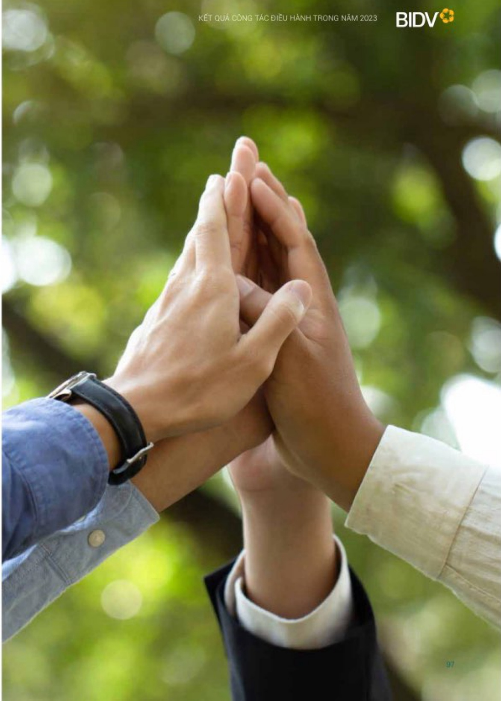

# KẾT QUẢ CÔNG TÁC ĐIỀU HÀNH TRONG NĂM 2023

Đấy mạnh hợp tác toàn diện

với đôi tác chiến lược Hana

Bank; Tăng cường trao đổi,

hợp tác và hội nhập kinh tế

quốc tế

Kiện toàn nhân sự và thành lập lại Ủy ban Hợp tác chiến lược BIDV với Hana Bank để tăng

cường nhân lực, tổ chức thành công nhiều sự kiện đối ngoại nội bật, góp phần cùng cơ và

phát triển mới quan hệ hợp tác chiến lược giữa BIDV và Tập đoàn tài chính Hana; Triển khai

dùng tiến độ 60 d.yán hợp tác kỹ thuật, chia sẻ hơn 145 dấu tài liệu nhằm cải tiến quy trình

nội bộ, đối mối nền tăng công nghệ, tối ưu hóa trái nghiệm khách hàng và năng cao chất

lượng quản trị điều hành theo chuẩn mực quốc tế

Phát triển và nàng tăm quan hệ hợp tác da dang vôi các đối tác quốc tế bao gồm các tổ chức phát triển da phuong như ADB, IFC, AIB, WB, và các DCTC lớn toàn cầu như HSBC, Standard Chartered Bank, SMTB... Trong năm 2023, BIDV và Tập đoàn Edmond de Rothschild - DCTC hàng đầu trên thế giới về đâu từ và quản lý tài sản đã chính thức kỳ kết Hợp đồng hợp tác chiến lược, song hành đem đến cho KHCN cao cấp tai Việt Nam cơ hội tiếp cần sử dụng dịch vu tài chính đăng cấp toàn cầu. Định hàng nhà phát hành và định hàng tiến gửi của BIDV vẫn duy trì ở mục đích định (Ba2), ngang trần quốc gia và thuộc nhóm các ngân hàng có định hàng tin nhiệm cao nhất tại thị trường Việt Nam.

Triển khai bài bán, có chất lượng công tác truyền thông và bồi đáp văn hóa doanh nghiệp; thực hiện trách nhiệm vì công đồng

#### GIÁ TRỊ THƯƠNG HIỆU 69

mục tăng trưởng nhanh nhất Việt Nam năm 2023

- Đây mạnh hoạt động truyền thống đã kênh, trong đó tăng cường truyền thống về thực đấy tín dụng xanh, phát triển bền vững theo mục tiêu ESG.

• BIDV được tổ chức định giá thương hiệu hàng đầu thế giới Brand Finance đánh giá năm trong Top 10 thương hiệu giá trị nhất Việt Nam năm 2023, xếp thứ 3 về giá trị thương hiệu ngành Ngân hàng và là thương hiệu có mục tăng trưởng nhanh nhất Việt Nam (69%), đạt 1,4 tỷ USD.

Phát triển các kênh truyền thống số, hiện diện mang xã hội BIDV trở thành kênh truyền thống chủ lục; Tăng cường thực hiện Số tay văn hóa BIDV, triển khai đào tạo, truyền thống sáng tạo lan tỏa văn hóa doanh nghiệp.

• Với những kết quả tích cực, năm 2023 BIDV tiếp tục được các tổ chức, công đông đánh giá cao với những giải thưởng uy tin: BIDV đã bút phá mạnh mẽ, tăng hơn 500 bắc, đùng thụ 1.081, trong Bảng xếp hang Forbes Global 2000 doanh nghiệp niệm yết kín nhất toàn cầu (Tap chí Forbes); Giải thưởng "Ngân hàng bản lẻ tốt nhất Việt Nam 2023", "Dịch vu ngân hàng cao cấp tốt nhất Việt Nam", "Thế tin dụng quốc tế tốt nhất Việt Nam", "Ngân hàng cung cấp dịch vu ngoại hồi tốt nhất Việt Nam" và "Ngân hàng Lưu ký - Giảm sát tốt nhất Việt Nam năm 2023" (The Asian Banker); Giải thưởng "Ngân hàng SME tốt nhất Việt Nam" (Alpha Southeast Asia); Giải thưởng "Ngân hàng cung cấp giải pháp số hàng đâu Việt Nam" (Asiamoney); 9 sản phẩm công nghệ thống tin của BIDV đạt giải Sao Khuế 2023; Top 10 thương hiệu mạnh Việt Nam 2023 (Vietnam Economic Times)...

- Triên khai 158 chương trình an sinh xã hội với tổng số tiền hồ trợ gần 330 tỷ đồng, tập trung vào các lĩnh vực ưu tiên như y tế, giáo dục, nhà đại đoàn kết, quà tết cho người nghèo trong đó một số chương trình nổi bật như Tài trợ xây dựng 1.748 nhà ở cho người nghèo với tổng giá trị tài trợ gần 75 tỷ đồng, Tặng 40.000 suất quà tết cho người nghèo với tổng giá trị 20 tỷ đồng; Hoàn thiện đưa vào sử dụng Nhà văn hóa cộng đồng tránh lũ tài các tỉnh miền Trung; Tổ chức giải chạy thường niên BIDV Tết ấm cho người nghèo Xuân Giáp Thần 2024.

