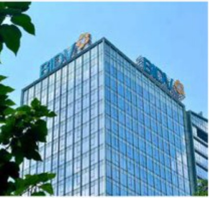

# ĐÁNH GIÁ CỦA HĐQT VỀ CÁC MẸT HOẠT ĐỘNG NĂM 2023

Năm 2023, bởi cảnh kinh tế xã hội trong và ngoài nước còn nhiều khó khăn, thách thức khó lường đoán, nhưng với sự chủ động, quyết tâm, nổ lực phát huy tối đa mọi nguồn lực, trên khai linh hoạt, sáng tạo các giải pháp, hoạt động kinh doanh của BIDV diễn ra an toàn, thông suối và hiểu quả, tạo nên một năm "chuyển minh bút phả" hoàn thành đăng bộ, vượt trội, toàn diện các chỉ tiểu, nhiệm vụ kinh doanh trên tất cả các phương diện: quy mô, cơ cấu, chất lượng, hiệu quả và phát triển thể chế, tiếp tục thực hiện tối chính sách tiền tệ, đảm bảo vai trò nông cốt, chủ lực, chủ đạo dân dất thi trưởng, góp phần ăn định kinh tế vi mỗ, kiểm soát làm phát, hỗ trợ phục hồi tăng trưởng kinh tế và đảm bảo sự phát triển an toàn của hệ thống các tổ chức tin dụng.

Với phương châm hành động "Kỷ cương - Hiệu quả - Chuyến đổi hoạt động", năm 2023, HDQT đánh giá toàn hệ thống BIDV đã nổ lực triển khai và quyết tầm năng cao năng lực hoạt động, tập trung các biện pháp mở rộng quy mô hoạt động gần với kiểm soát chất lượng tin dụng, cải thiện cơ cấu tài sản hợp lý, biết giảm chi phí, tinh giản quy trình, năng cao năng suất lao động và đầy mạnh chất lượng phục vụ khách hàng, gia tăng năng lực cạnh tranh trên thị trường, cụ thể.

Triển khai quyết liệt, đồng bộ, có hiệu quả các biện pháp, giải pháp để hoàn thành thắng lợi các mục tiêu, kế hoạch kinh doanh trong năm 2023, thực hiện đầy đủ nghĩa vụ với NSNN, bảo đảm quyền lợi của cổ đông và người lao động

Năm 2023, hoạt động kinh doanh của BIDV đã đạt được những kết quả tích cực, tiếp tục duy trì vị thế ngân hàng TMCP có quy mô Tổng tài sản lớn nhất Việt Nam (hoàn 2,3 triệu tỷ đồng); cơ cấu tin dụng tiếp tục chuyển dịch theo hướng bên vững, hướng dòng vốn vào các tính vực sản xuất kinh doanh, lĩnh vực use tiến theo định hướng của Chính phủ và NHNN, thúc đẩy tin dụng xanh, ngăn hàng xanh; cơ cấu nguồn vốn phú hợp với tăng trưởng tin dụng, đáp ứng đủ nhu cầu sử dụng vốn và tiếp tục chuyển dịch theo hiệu quả; thu dịch vụ rộng cũng ghi nhận kết quả tốt, gia tăng đóng góp trong cơ cấu tăng thu nhập của BIDV; hiệu quả hoạt động tăng trưởng rõ rệt, tăng thu nhập năm 2023 đạt 175.902 tỷ đồng, vượt kế hoạch NHNN giao, tăng 26.8% so với năm 2022, chi phụ quản lý kinh doanh kiểm soát phú hợp với điều kiện kinh doanh, lợi nhuận trước thuế khối NHTM năm 2023 đạt 26.706 tỷ đồng, tăng 19.1% so với năm 2022, vượt kế hoạch NHNN giao, lợi nhuận trước thuế hợp nhất đạt 27.589 tỷ đồng, tăng 20.4% so với năm 2022, vượt kế hoạch ĐHDCĐ giao, giữ vững vị thế là ngân hàng thuong mai có nền khách hàng lớn nhất thị trường với gần 500.000 khách hàng doanh nghiệp, gần 19 triệu khách hàng cá nhân và có quan hệ hợp tác với hơn 2.300 định chế tài chính từ 177 quốc gia và vùng lãnh thổ.

Trên cơ sở những kết quả kinh doanh ăn tượng, BIDV luôn thực hiện đầy đủ nghĩa vụ với NSNN, vốn nhà nước tại BIDV được bảo toàn và phát triển, đảm bảo quyền lợi của cổ đồng, đảm bảo việc làm, thu nhập và đối sổng vật chất, tinh thần cho gần 3 vạn người lao động toàn hệ thống. Năm 2023, BIDV thực hiện nghĩa vụ với ngàn sách Nhà nước hơn 6.448 tỷ đồng, thuộc nhóm các doanh nghiệp dân đâu về số nộp thuế thu nhập doanh nghiệp; vốn nhà nước tại BIDV tinh theo vốn điều lệ năm 2023 là 46,2 nghin tỷ, tinh theo vốn chủ sở hữu là 96,4 nghìn tỷ đồng, tăng 12,69% so với cuối năm 2022; giá trị cổ phiếu tăng 26,4%, vốn hóa đạt 10,5 tỷ USD, thuộc nhóm dân đâu thị trường.

Thực hiện nghiêm túc các

chủ trương, chỉ đạo của

Chính phủ, NHNN, phát huy

vai trò chủ lực, chủ đạo dẫn

đất thị trường, hỗ trợ người

dân và doanh nghiệp vượt

qua khó khăn, phục hồi và

phát triển

Năm 2023, BIDV luôn biên phong, di đầu thực hiện nghiêm túc các chủ trương, chỉ đạo của

Chính phủ và NHNN, là công cụ thực hiện chính sách tiên tế, đảm bảo các căn đối vị mở,

phục vụ hiệu quả các chương trình phát triển kinh tế - xã hội của đất nước, góp phần ổn định

thị trường tiến tế, báo đảm an toàn hệ thống các tổ chức tín dụng. Trong bối cảnh giải ngân

tín dụng còn khó khăn, BIDV thực hiện cung ứng lượng vốn làm và gia tăng khá năng hợp thụ

vấn cho nên kinh tế tiếp tục kháng định vị thế số 1 thư trưởng về quy mô, động góp tích cực

cho sự phát triển của các ngành, nghề, địa phương. BIDV dành nguồn lực tài chính phù hợp

để hạ lãi suất cho vay hỗ trợ các khách hàng gặp khó khăn, góp phần giảm lãi suất cho vay

của thư trưởng.

BIDV tiếp tục cơ cấu lại thời han trả nợ và giữ nguyên nhóm ng hộ trợ các khách hàng khó khăn theo quy định của NHNN; thực hiện nghiêm túc chuộng trình hộ trợ lãi suất tư Ngân sách nhà nước đối với khoản vay của doanh nghiệp, hợp tác xã, hộ kinh doanh theo Nghị định số 31/ND-CP của Chính phủ và Thông tư số 03/TT-NHNN của NHNN; triển khai chuộng trình tín dùng 120 nghìn tỷ đồng nhằm thảo gỡ khăn và thực đấy thị trưởng bất đỗng sản phát triển an toàn, lãnh mệnh, bền vững; tham gia hỗ trợ các ngăn hàng yếu kém theo định hướng, chỉ đạo của Chính phủ, NHNN, đóng góp vào đảm bảo an toàn và lãnh mệnh hóa hệ thống các tổ chức tín dung.

Quyết liệt triển khai Chuyển đổi số và ứng dụng CNTT trên tất cả các mặt hoạt động, tạo bước đà để chuyển đổi hoạt động toàn diện, động bộ theo mô hình kinh doanh tiến, hiện đại

Năm 2023 đánh dấu những dấu mốc quan trong trong hoạt động tổng thể của BIDV nói chung và hoạt động CNTT nói riêng – một trong những điểm sáng, nội bật nhất của toàn hệ thống. Bên cạnh thành công của việc chuyển đổi hệ thống Core Banking Profile vào ngày 03/9/2023 đúng thời han, lục lượng CNTT&NHS tại BIDV đã đảm bảo nguồn lực phú hợp để tự xử dụng, tự triển khai và phát triển các dự án CNTT trọng điểm, thế hiện khát vọng, tăm huyết và năng lực làm chủ công nghệ của cán bộ BIDV, kiến định mục tiêu là ngăn hàng có nền tảng số tốt nhất Việt Nam, đưa BIDV bước sang một trang sứ mới: chủ động, tự tin tiến nhanh, tiến mạnh, tiến vững chắc vào ký nguyên số.

Đấy manh việc phát triển kênh phân phối số: (i) Số hóa các sản phẩm truyền thống, phát triển sản phẩm mới trên kênh số dành cho cả KHCN và KHDN, tăng cường ứng dụng công nghệ môi, mang đến nhiều tính năng vượt trội, cải thiện trái nghiệm và tiến ích cho người dùng, qua đó, có số lượng và giá trị giao dịch trên môi trường số dễ đều tăng trưởng mạnh mẽ. Chỉ tính riêng năm 2023, BIDV có 93% số lượng giao dịch toàn hàng thực hiện trên kênh số (15 triệu khách hàng giao dịch trên kênh số với tăng doanh số hơn 14,2 triệu tỷ đồng); (ii) Hoạt động kết nối đối tác trên lĩnh vực số được tăng cường phát triển, mô rộng hệ sinh thái các lĩnh vực phí ngân hàng.

Chù trọng số hóa hoạt động quản trị nội bộ, dây mạnh ứng dụng công nghệ mới, đặc biệt là ứng dụng Robotic trong công tác tác nghiệp, quản trị nội bộ nhằm hỗ trợ tự động hóa, giảm thiếu sai sót, tiết kiệm thời gian và đặc biệt là đang tự nghiên cứu, triển khai Dự án số hóa quản trị nội bộ toàn hàng, góp phần năng cao năng suất lao động cho toàn hệ thống.