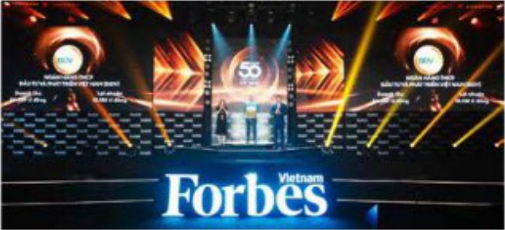

Điều hành cần đối với hiệu quả, chủ động; tiếp tục triển khai quyết liệt các biện pháp gia tăng thu nhập và quản lý chỉ phí hiệu quả

BIDV đã điều hành căn đối với lĩnh hoạt, bám sát thị trường, dăm báo an toàn thanh khoản. Tiếp tục ưu tiên, khuyến khích gia tăng nguồn vốn giá rẻ; triển khai các phương pháp nhằm đảm bảo các giới hạn tỷ lệ an toàn theo quy định của NHNN và gia tăng thu nhập cho ngăn hàng; điều hành giảm lãi suất huy động vốn theo chí đạo của Chính phủ. NHNN; ban hành ngăn sách cạnh tranh, cơ chế, chính sách động lực nhằm thực đấy chuyển dịch cơ cấu nguồn vốn, cơ cấu cho vay theo đùng định hướng tiết giảm chi phí vốn, gia tăng nguồn thu lãi cho ngăn hàng.

# ĐÁNH GIÁ CỦA HĐQT VÊ CÁC MẸT HOẠT ĐỘNG NĂM 2023 (tiếp theo)

BIDV tiếp tục triển khai các giải pháp gia tăng thu nhập và quản lý chi phí hiệu quả: (i) Xây dựng và triển khai Để ăn các giải pháp gia tăng thu nhập và kiểm soát chi phí giai đoạn 2023-2025; (ii) Tiết giám chí phí thông qua tăng cường áp dụng các giải pháp tự động hóa và triển khai thành công các giải pháp tập trung hóa, tư động hóa nhằm năng cao năng suất lao động, tiết giám chí phí; (iii) Quản lý chi phí công vụ, chi phí quản lý kinh doanh tại các đơn vị được thực hiện nhất quản trong hệ thống.

Đấy mạnh cổng tác đảo tạo, phát huy ý tưởng sáng tạo, ứng dụng nghiên cứu khoa học, sáng kiến cải tiến vào thực tiễn hoạt động kinh doanh; tăng cường rà soát, đánh giá và nâng cao chất lượng nguồn nhân lực, chủ trọng công tác luân chuyển, quy hoạch, bổ nhiệm cần bộ và triển khai động bộ các chuộng trình đảo tạo Lãnh đạo các cấp, hoàn thành lựa chọn nhân sự Chương trình lãnh đạo tuổi 30 (BL30) để xây dựng nguồn cần bộ kế cản và nguồn cản bộ trẻ, chất lượng cao của hệ thống.

Tiếp tục chỉ đạo kiện toàn, điều chỉnh mô hình tổ chức phú hợp với thực tiễn hoạt động kinh doanh, tiến tối tiệm cần các mô hình, thông lệ tiến biến trong hoạt động ngân hàng. Trong đó, năm 2023 tập trung hoàn thành việc cơ cấu, thành lập các đơn vị chức năng tại Trụ sở chính, thành lập Khối Đảng - Đoàn thể, hoàn thiện các phương án thành lập Trung tâm Khách hàng cao cấp (KHCC) tại TP/HCM và mô hình quản lý KHCC tại chi nhánh, bộ phận kinh doanh theo khu vực; thì điểm tập trung công tác định giá tại Trụ sở chính theo mô hình ngân hàng hiện đại.

Kiện toàn mô hình tổ chức và nhân sự cấp cao, gần với năng cao chất lượng nguồn nhân lực và năng suất lao động

Kiện toàn đôi ngũ lãnh đạo và cán bộ chủ chốt của ngăn hàng, nặng cao năng lực quản trí điều hành cấp cao, tăng cường vai trò lãnh đạo, chỉ đạo toàn diện các mặt host động của hệ thống BIDV.

Tăng cường trao đổi, hợp tác,

hội nhập quốc tế; đẩy mạnh

hợp tác toàn diện với đối tác

chiến lược Hana Bank

Trong quan hệ trao đổi, hợp tác quốc tế, BIDV văn tiếp tục nhận được sự tín nhịm cao thống

qua việc không ngừng phát triển và năng tầm quan hệ hợp tác địa dụng với các đối tác quốc tế. Năm 2023, BIDV lần thứ ba được Ngân hàng Phát triển Châu Á (ADB) vinh danh "Leading partner Bank in Vietnam 2023". Đặc biệt, ngày 16/11/2023, BIDV và Tập đoàn Edmond de Rothschild – ĐCTC hàng đầu trên thế giới về đầu tư và quản lý tài sản, có lịch sử lầu đổi tại Châu Á đã chính thức tổ chức lễ ký kết hợp đồng hợp tác chiến lược, song hành đem đến cho khách hàng cá nhân cao cấp tại Việt Nam cơ hội tiếp cận sử dụng dịch vụ tài chính đăng cấp toàn cầu.

Năm 2023, BIDV và đối tác chiến lược Hana Bank tiếp tục thực hiện có hiệu quả các giải pháp hợp tác chiến lược giữa hai bên với nhiều kết quả nổi bật, đặc biệt trong các hoạt động phát triển Ngân hàng Bán lẻ, Khách hàng cao cấp, QLRR, đa dạng hóa danh mục lợi nhuận, chuyển đổi số và phát triển nguồn nhân lực.

Đẩy mạnh tuyên truyền

thực hành và bối đập Văn

hóa doanh nghiệp; phát

triển và nâng cao giá trị

thương hiệu BIDV

Năm 2023, BIDV tiếp tục nhất quán tư duy, nhận thức và hành động về 05 giá trị cốt lối iBIDV;

đấy mạnh tuyên truyền thực hành Số tay Văn hóa BIDV, quyết tâm thực hiện tốt nhất các

Quy chuẩn đạo đức nghề nghiệp và Quy tắc ứng xử để môi người cân bộ BIDV có thể thấm

nhuẫn và ngày càng nắng cao, hoàn thiện hơn nữa phong cách, bản lĩnh trong công việc và

kỷ năng ứng xử với các mối quan hệ.

TẦNG HON 500 BẠC TRONG

Các chỉ số thương hiệu chính (nhận biết thương hiệu, sức mạnh thương hiệu và giá trị thương hiệu) đều đạt TOP 3 ngành ngân hàng. Đặc biệt, chỉ số về "giá trị thương hiệu BIDV" có sự tăng trưởng ấn tượng (tăng 69%), là thương hiệu có tốc độ tăng trưởng giá trị thương hiệu nhanh nhất Việt Nam, đạt 1,4 tỷ USD; bút phá mạnh mẽ trên bảng xếp hạng thể giới, tăng 524 bậc trong TOP 2.000 doanh nghiệp lân nhất toàn cầu; sức mạnh thương hiệu tăng tử A+ lên AAA-, vào Top 10 thương hiệu mạnh nhất Việt Nam. Các kết quả trên phần ảnh hiệu quả của các chương trình truyền thống quảng cáo, hoạt động công động và đặc biệt là năng cao chất lượng dịch vụ và hiệu quả kinh doanh của BIDV thời gian qua.

TOP 2000

doanh nghiệp niềm xử lý lớn nhất toàn cầu

TOP 10

thương hiệu mạnh nhất Việt Nam

