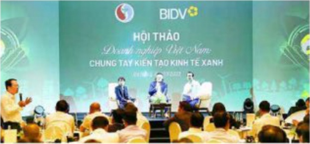
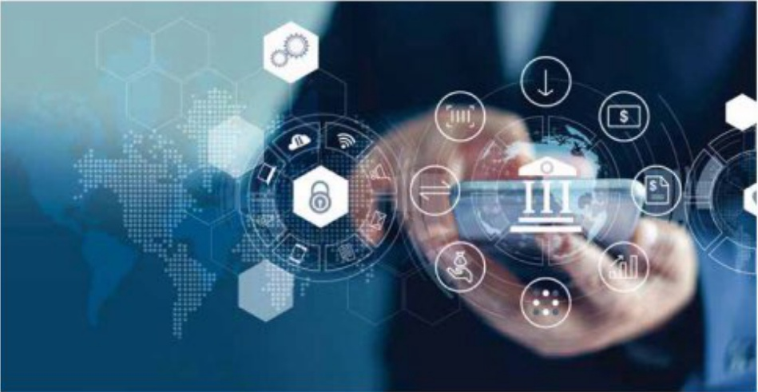

# ĐÁNH GIÁ CỦA HĐQT VỀ CÁC MẸT HOẠT ĐỘNG NĂM 2023 (tiếp theo)

Đấy mạnh phát triển bền vững, thực hành ESG tại BIDV; nổ lực góp phần xây dựng tương lai Xanh cho Việt Nam

Năm 2023, BIDV tiếp tục nổ lực hướng tới chiến lược toàn diện về phát triển bền vững và thực hành Môi trường - Xã hội - Quân trị (ESG), hiện thực hóa các cảm kết giám phát thải carbon, bảo vệ môi trường, thúc đẩy tín dụng xanh, trái phiếu xanh, năng lượng tải tạo và kinh tế xanh, kinh tế tuần hoàn tại Việt Nam theo định hướng của Chính phủ, các Bộ, Ban, ngành và phối hợp chất chế với các định chất tài chính quốc tế lớn trong quá trình tổ chức triển khai. BIDV đã ban hành Nghị quyết thực hiện chiến lược quốc gia về tăng trưởng xanh giai đoạn 2021-2030, tầm nhìn 2050 và chiến lược quốc gia về biến đổi khí hậu giai đoạn đến năm 2050 tại BIDV; thành lập Ban chỉ đạo xây dựng Chương trình hành động thực hiện ESG, phát triển tài chính bền vững giai đoạn 2023-2025, tâm nhìn đến năm 2030; chỉ đạo ban hành Khung Trái phiếu xanh theo nguyên tắc trái phiếu xanh của Hiệp hội thị trường văn quốc tế (ICMA Green Bond Principles) và được tổ chức xếp hàng Moody's đánh giá ở mức "rất tốt" và là ngân hàng đầu tiên phát hành thành công 2.500 tỷ đồng trái phiếu xanh tại thị trường trong nước để tài trợ cho các dự án xanh, tiết kiệm năng lượng, giám phát thải, bảo vệ môi trường.

BIDV cũng là ngăn hàng đầu tiên phục vu chuong trình chuyến nhuồng kết quả giám phát thái tại Việt Nam, tăng cường hợp tác tại COP28 tại Dubai như trao văn bản hợp tác với Ngân hàng Phát triển Châu Á (ADB) và Standard Chartered Bank về thức đấy các hoạt động tài trợ xanh, tài chính bền vững. Ngoài ra, BIDV cũng đã đồng hành cùng nhiều diễn đàn, hội thảo chia sẻ kinh nghiệm và lan tóa thông điệp phát triển bên vùng tối khách hàng, đối tác như Hội tháo “Doanh nghiệp Việt Nam - Chung tay kiến tạo Kinh tế Xanh” với sự tham gia của Lãnh đạo các Bộ, Ban, ngành có liên quan, BIDV cam kết tạo điều kiện thuận lợi nhất cho khách hàng tiếp cận sản phẩm tài chính bền vững; Hội nghị xúc tiến đâu tư tài chính trong khuôn khổ các chuong trình bền lệ Hội nghị Bộ trưởng Bộ Tài chính APEC tại Los Angeles - Mỹ (dại diện BIDV trình bày tham luận về “Trải phiếu xanh - động lực cho tăng trưởng bền vững” tại Hội nghị); Diễn đàn Doanh nghiệp Phát triển bền vững Việt Nam (VCCI); Tọa dâm Ngân hàng Xanh (VNBA);...

Về các sản phẩm, dịch vụ, BIDV cũng tích cực đầy mạnh triển khai các sản phẩm dịch vụ hướng tới phát triển bền vững như tiên phong chuyển đối sở tạo nên cuộc cách mạng Xanh cho hệ sinh thái toàn diện của BIDV; ưu tiên triển khai các Gói tín dụng xanh hỗ trợ thi trường; dân đâu các ngân hàng thương mại trong việc tài trợ các dự án thuộc lĩnh vực tín dụng xanh với tổng dương hơn 74.200 tỷ đồng, chiếm gần 5% tổng dưới của BIDV.

# ĐÁNH GIÁ HOẠT ĐỘNG CỦA BAN ĐIỂU HÀNH

Năm 2023, công tác giám sát, đánh giá của HDQT đối với hoạt động của Ban Điều hành tiếp tục được thực hiện đăng bố, bài bản và không ngừng được cái tiến, năng cao hiệu lực, hiểu quả, hướng tối thống lệ tiến tiến và chuẩn mực tốt trong quản trị điều hành. Theo đó, HDQT tiếp tục chỉ đạo hoàn thiện các công cụ, cơ chế phải hợp trao đổi thông tin để phục vụ công tác giám sát, đánh giá hoạt động của Ban Điều hành; (i) Ban hành cơ chế phải hợp hoạt động và trao đổi thông tin giữa HDQT, TGD, các đơn vị thuộc tuyến bảo về thử nhất, tuyến bảo về thử hai và Ban kiểm soát, bộ phận kiểm toán nội bộ; (ii) Chỉ đạo nghiên cứu xây dụng các công cụ, cơ chế vận hành, phần mềm ứng dụng phục vụ hoạt động giám sát, đánh giá của HDQT; (iii) Tăng cường chỉ đạo các đơn vị thường xuyên rà soát hệ thống phản cấp, ủy quyền, quy trình nội bố... để đảm bảo cung cấp thông tin đấy đủ, kịp thời phục vụ công tác giám sát, đánh giá của HDQT đối với hoạt động của Ban Điều hành.

Trên cơ sở các cộng cụ, cơ chế nêu trên, HDQT ghi nhận và đánh giá cao hoạt động của Ban Điều hành trong năm 2023 với một số kết quả nổi bật như sau:

Trên cơ sở phân tích và dự báo thị trường, cần cứ vào các mục tiêu, nhiệm vụ và định hướng KHKD đã được HĐQT giao, bám sát phương, chăm hành động của toàn hệ thống. Tổng Giám đốc đã ban hành Chương trình hành động với các công việc cụ thể, chi tiết, toàn diện trên tất cả các mặt hoạt động, đảm bảo rõ người, rõ việc, rõ trách nhiệm, kiến định với mục tiêu chung của toàn hệ thống.

Công tác chỉ đạo, điều hành của Ban Điều hành tới các đơn vị tại Trụ sở chính và các đơn vị thành viên cũng được đảm bảo thắng suất, hiệu quả, linh hoạt, góp phần năng cao hiệu quả hoạt động chung và kịp thời thảo gõ các khó khăn, vương mắc. Năm 2023, trên cơ sở định hướng và sự tham gia chỉ đạo trực tiếp của HĐQT, Ban Điều hành đã tối chức các Chương trình làm việc của Ban Lãnh đạo với toàn bộ các chi nhân tại tất cả cụm địa bàn để nằm bất các ý kiến để xuất, kiến nghị và chỉ đạo triển khai các giải pháp phát triển kinh doanh tại tùng địa bàn.

Ban Diều hành ban hành văn bản phần công cổng tác các thành viên theo từng thời kỳ, điều hành công việc theo nguyên tác tập trung dân chủ, xử lý công việc đứng thăm quyền và phạm vi trách nhiệm được giao, đảm bảo sự phối hợp công tác, trao đổi thông tin trong giải quyết công việc phú hợp với chức năng, nhiệm vụ và quyền hạn được quy định; tuần thú trình tự, thú tục và thời hạn giải quyết công việc, đảm bảo công việc được giải quyết rõ ràng, minh bạch, kịp thời và hiệu quả.

HĐỘT ghi nhận và đánh giá cao Tổng Giám độc và các thành viên Ban Biểu hành đã đoàn kết, thông nhất, phát huy tính thần trách nhiệm, tiến phong, gương mẫu, nổ lực phấn dấu thực hiện nhiệm vụ, góp phần hoàn thành xuất sắc các chí tiêu, kế hoạch kinh doanh được ĐHĐỘC và HĐỘT giao và không ngùng nâng cao hình ảnh, uy tín, vị thế của BIDV trên thị trường.