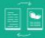

# ĐỊNH HƯỚNG HOẠT ĐỘNG CỦA HĐỘT NĂM 2024

Quân triệt chú trương của Chính phủ, định hướng điều hành của NH-NIN, nhằm triệt khai thành công các mục tiêu tại Chiến lược phát triển kinh doanh của BIDV đến năm 2025, tăm nhìn đến năm 2030 và các Chiến lược cấu phần của BIDV, đồng thời bám sát các mục tiêu tại Phương án cơ cấu lại BIDV giai đoạn 2021-2025, với phương châm hành động *Tinh giản quy trình - Chuyển đổi hoạt động", năm 2024, BIDV đặt mục tiêu phần đấu hoàn thành kế hoạch kinh doanh với các chỉ tiêu chính như sau:

- Dự ngữ tín dụng tăng trưởng tuân thủ giới hạn NHNN giao

Huy động vốn tăng trưởng phù hợp với tăng trưởng tin dụng, đảm bảo an toàn, hiệu quả và các tỷ lệ an toàn vốn theo quy định

Lợi nhuận trước thuế phần đấu tăng trưởng phù hợp với diễn biến thị trường, năng lực của BIDV và phê duyệt của cơ quan Nhà nước có thẩm quyền.

HĐQT BIDV quyết tâm tập trung chỉ đạo thực hiện tốt nhiệm vụ kế hoạch kinh doanh năm 2024 với 7 mục tiêu ưu tiên như sau:

Thủ nhất, nàng cao nàng lực phần tích dư bảo và hoạch định chiến lược của HDQT; chủ động năm bất và xử lý hiệu quả các vấn đề mới phát sinh, với các kịch bản, phương án phù hợp; chỉ đạo hệ thống thực hiện hiệu quả, đúng tiến đô Nghị quyết số 22/NQ-BIDV ngày 11/01/2021 về Chiến lược phát triển kinh doanh của BIDV đến năm 2025, tầm nhìn đến năm 2030, các Chiến lược cấu phần và Phương án cơ cấu lại BIDV giai đoạn 2021 - 2025.

Thư hai, chuyến đôi toàn diện, đồng bộ, thực chất, bài bản tất cả hoạt động theo định hướng phát triển xanh, bên vùng. Kiến quyết cái tiến, tính giản quy trình, số hoá quản trị nội bộ, tiết giảm chi phí, năng cao năng suất lao động và năng lực phục vụ khách hàng gần với ứng dụng công nghệ cao.

Thủ ba, tiếp tục nàng cao nàng lực tài chính của hệ thống; khai thác các nguồn thu trong hệ sinh thái; thực hiện

Đê án Quán trị chỉ phi hiệu quả.

Thứ tự, tập trung các biển pháp mở rộng quy mô hoạt động gần với kiểm soát chất lượng tin dung; cơ cấu lại nền khách hàng; xác định và thực hiện các cơ cấu hợp lý dảm bảo căn bằng giữa gia tăng hiệu quả và dảm bảo an toàn hệ thống.

Thư năm, thực hiện đùng tiến độ các dự án trọng điểm; văn hành tích hợp và phát triển các ứng dụng dịch vụ nâng cao năng lực cạnh tranh toàn hệ thống.

Thủ sâu, triển khai các dự án, các thỏa thuận hợp tác với các đối tác trong và ngoài nước, nâng cao vị thế và uy tín của BIDV trên thị trường trong nước và khu vực.

Thủ bảy, tăng cương đảo tạo và phát triển nguồn nhân lực; Năng cao năng lực quản trí điều hành của các cấp; tăng cương kỹ cưỡng, kỹ luật, kiểm tra, giảm sát; thực hành và phát huy các giá trị văn hóa doanh nghiệp, văn hóa kiểm soát rủi ro.

