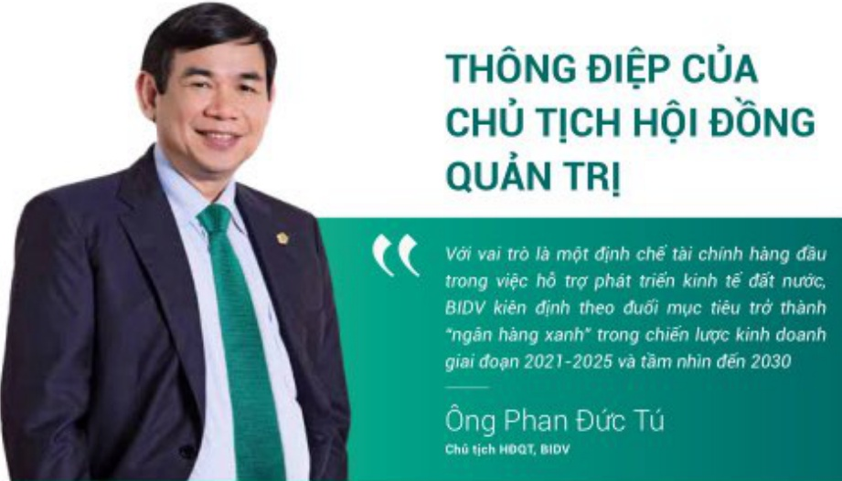

# THÔNG ĐIỆP CỦA CHỦ TỊCH HỘI ĐỒNG QUẢN TRỊ

Với vai trò là một định chế tài chính hàng đầu trong việc hỗ trợ phát triển kinh tế đặt nước, BIDV kiện định theo đuổi mục tiêu trở thành "ngân hàng xanh" trong chiến lược kinh doanh giai đoạn 2021-2025 và tăm nhìn đến 2030

Ông Phan Đức Tú

Chú sách HOOT, BIDV

##### Thưa quý khách hàng, quý cổ dòng, dối tác,

Kinh tế thế giới năm 2023 diễn biến phúc tap, khó lường, thách thức hom nhiều so với dư bào; các thị trường tài chính, tiền tế, bất động sản tiễm ăn nhiều rủi ro; hoạt động xuất, nhập khẩu giảm sút, chu tác động kéo dài do ảnh hưởng của đài dịch Covid-19, biến động địa chính trị... Trước bối cảnh đó, Việt Nam vận lạ điểm sáng trong bức tranh kinh tế chung với một số kết quả tích cực: tăng trưởng GDP đạt 5,05%, ở mức cao so với các nước trong khu vực; chỉ số giá tiêu đúng bình quản kiểm soát ở mức 3,25%; cần căn thương mại xuất siêu 28 tỷ USD. Trong thành công chung đó phải kế đến việc NHINN diễu hành chính sách tiễn tế chủ động, lĩnh hoạt song song với việc triển khai đồng bô các giải pháp nhằm tháo gỡ khô khăn cho sản xuất kinh doanh, thực dây tăng trưởng kinh tế, kiểm soát làm phát và bảo đảm an toàn hệ thống các tổ chức tin dụng. Trong năm, NHINN đã bốn lần giảm lải suất điều hành với mục giảm 0,5-2% nhằm thảo gỡ khô khăn cho nền kinh tế, tư đó giúp giảm mật bằng lải suất huy động và cho vay; điều hành tỷ giá phù hợp; Hoàn thiên các quy định pháp lý trong hoạt động ngân hàng, nâng cao khả năng tiếp cận tin dung của doanh nghiệp và người dân, tăng trưởng tin dụng toàn ngành năm 2023 dat 13,78%.

##### Khó khăn vượt qua, Chuyến mình bút phá

Năm 2023 đổi với BIDV có ý nghĩa quan trọng, là năm bản lề của Chiến lược phát triển kinh doanh gai đoạn 2021-2025, trong bối cảnh còn nhiều khô khăn, thách thức, với sự đoàn kết, đồng lòng, nổ lục vượt khó của toàn hệ thống đã tạo nên một năm "chuyến minh bút phá", tiếp tục khắng định vị thế, vai trò tiến phong trong thực thi hiểu quả chính sách tiễn tế, góp phần duy trí, ổn định hoạt động của hệ thống ngân hàng; tích cực đông hành, hỗ trợ doanh nghiệp, người dân theo chú trương của Chính phủ và NHHN nhằm thức dây sự phục hồi và phát triển của nền kinh tế. Kết thúc năm 2023, Tổng tài sản của BIDV đạt trên 2,3 triệu tỷ đồng, tiếp tục là Ngân hàng TMCP có quy mô lớn nhất Việt Nam; huy đồng vốn tố chức, dân cư đạt 1,89 triệu tỷ đồng, tăng 16,5%, chiếm khoảng 14% thị phản tiền gửi toàn ngành. Dự nợ tín dụng đạt 1,75 triệu tỷ đồng, tăng trưởng 16,66%, chiếm khoảng 13% dư nợ tín dụng toàn nền kinh tế, đùng dầu thi trưởng về thi phân tín dụng. Cơ cấu tín dụng chuyến dịch theo hướng bền vững, tỷ trọng dư nợ tín dụng nhóm khách hàng bán lẻ, SMEs và FDI trên Tổng dư nợ đạt 68,7%, tăng 1,2% so với năm 2022. Chất lượng tín dụng được kiểm soát trong giới hạn, tỷ lệ nợ xấu theo Thống tư 11 là 1,12%. Hiệu quả kinh doanh tăng trưởng tích cực so với cùng kỳ năm trước, đạt và vượt kể hoạch năm 2023 đã đề ra: (i) Chênh lệch thu chi đạt 47,932 tỷ đồng. Lợi nhuận trước thuế hợp nhất đạt 27,589 tỷ đồng, tăng trưởng 20,4%, vượt kế hoạch ĐHDCD giao; (ii) Năng lực tài chính được cái thiện, vốn điều lệ đạt 57,004 tỷ đồng, sau 10 năm niêm yết trên thị trường chúng khoán, vốn hóa của BIDV thuộc nhóm dân dâu thị trưởng, đạt trên 10 tỷ USD; (iii) Các chỉ tiêu sinh lôi được cái thiện tích cực so với năm trước: RDA đạt 0,99%; ROE đạt 19,36%; (iv) Trích lập DPRR đầy đủ theo quy định, tỷ lệ bảo phù nợ xấu khỏi ngân hàng thương mai đạt 183%, các chi số an toàn đảm bảo theo quy định và thống lệ tối. BIDV cũng luôn là một trong những ngân hàng đồng có góp tích cực vào ngân sách nhà nước với mục đông góp trong năm đạt trên 6,448 tỷ đồng.

##### Kiến tạo tương lai xanh, bên vùng

Nhận thức được xu thế tất yếu của phát triển bền vững trong dài han, với vai trò là một định chế tài chính hàng đầu trong việc hỗ trợ phát triển kinh tế đất nước, BIDV đã kiến định theo dưới mục tiêu trò thành "ngân hàng xanh" trong chiến lược kinh doanh giai đoạn 2021-2025 và tâm nhìn đến 2030: (i) Ban hành Nghị quyết thực hiện các Chiến lược quốc gia về tầng trường xanh và chống biến đối khí hậu, chủ trọng thực hành ESG thông qua xây dựng Chương trình hành động thực hiện ESG trên toàn hệ thống, thành lập đơn vị chuyên trách quản lý ESG theo chuẩn mực và thông lệ quốc tế, tích cực lan thóa thông điệp phát triển tài chính bền vững đến khách hàng, đối tác... (ii) Là ngân hàng thương mại cổ phân đầu biên tại Việt Nam công bố "Khung Khoản vay bền vững" và chuyên nghiệp hóa công tác quản lý nội rõ môi trường xã hội thông qua việc ban hành "Khung

quán lý rủi ro Môi trưởng - Xã hội", tao tiên đế cung cấp tối khách hàng các sản phẩm tài chính bền vững theo chuẩn mục quốc tế; (iii) Tiên phong thu hút nguồn vận phát triển bền vững, chuyển dịch kinh tế xanh, dân dầu thị trưởng về tài trợ tín dung xanh; là ngân hàng dầu tiến phát hành thành công 2.500 tỷ đồng trái phiếu xanh theo tiêu chuẩn quốc tế; (iv) Đồng hành cùng nhiều diễn đàn, hối thảo chia sẻ kinh nghiệm và lan tòa thông điệp phát triển bền vững tới khách hàng, đối tắc: Hội nghị năng lượng tải tạo 2023; Hội nghị cơ hội đầu tư vào ngành năng lượng tải tạo; Toa đảm thúc đẩy đầu tư cơ sở hạ tăng năng lượng bền vững...

##### Vùng bước tiến phong trên hành trình chuyển đổi số

BIDV nhận thức việc đối mói công nghệ là yếu tố chen chơi để thực hiện các mục tiêu phát triển bền vững, nâng cao năng lực cạnh tranh, cải thiện chất lượng sản phẩm dịch vụ, đáp ứng ngày một tốt han nhu cầu của khách hàng. Bông hành với hoạt động chuyển đổi số trong lĩnh vực tài chính ngân hàng, năm 2023 BIDV cũng đã tạo được những dấu ấn nổi bật khắng định vị thế tiến phong trong hành trình chuyển đối số: (i) Chính thức di vào hoạt động hệ thống ngân hàng lối Core Banking Profile, tích hợp toàn diện hơn 100 ứng dụng vào hệ thống ngân hàng lối, kỹ vọng mang lại những đột phá toàn diện, đặc biệt về định hướng, chiến lược phát triển kinh doanh, tư duy phát triển sản phẩm dịch vụ, mô hình tổ chức, quy trình tác nghiệp... góp phần năng cao chất lượng sản phẩm, dịch vụ, gia tàng mức độ hải lòng của khách hàng; (ii) Phát triển hệ thống Payment Hub để quy hoạch và xảy dụng một hệ thống thanh toán theo thông lệ quốc tế - dây là dự án công nghệ lâm nhất và phúc tạp nhất từ trước tôi nay được thực hiện bằng 100% nguồn lực nội bộ của BIDV; (iii) Là ngân hàng đầu tiên cho ra mắt hệ thống BIDV OPEN API phục vụ mô hình ngân hàng mô với trên 3.000 đối tác kết nối API; 47 trung gian thanh toàn, dịch vụ công, Kho Bạc nhà nước, Bảo hiểm xã hội,

##### Không ngừng phát triển thế chế, hướng tới sự tính gọn, hiệu quả

Kết thúc năm 2023, BIDV cũng đạt được nhiều bước tiến trong quản trị điều hành, phát triển thế chế, tạo tiền để vững chắc cho việc triển khai chiến lược kinh doanh giai đoạn 2021-2025 và các Chiến lược câu phản, hướng tới phát triển bền vững: (i) Kiến định bám sát các mục tiêu, chỉ tiêu Chiến lược phát triển tổng thể đến 2025, tầm nhìn 2030 và 07 chiến lược cấu phản... thường xuyên, đánh giá kỹ lưỡng tử đó để ra các giải pháp trong tầm để đảm bảo triển khai đùng định hướng đã đỡ ra; (ii) Tiếp tục kiện toàn mô hình tổ chức các cấp: Thành lập lai Khôi Ngân hàng bán lẻ và cơ cấu lại các đơn vị trong Khôi; Thành lập Trung tâm Định giá tài sản, Trung tâm KHCN cao cấp tại TP.HCM...; (iii) Tăng cường hợp tác chiến lược, các định chế da phương để nâng cao năng lực phục vu khách hàng, năng lực quản trị hệ thống, đặc biệt dịch vu khách hàng cá nhân cao cấp ghi dấu ăn với việc xác lập hợp tác chiến lược với Edmond de Rothschild - định chế tài chính hàng dầu thế giới về dấu tư và quản lý tài sản, dem tới cho khách hàng cá nhân cao cấp cơ hội sử dụng dịch vu tài chính đăng cấp toàn cầu; (iv) Tiếp tục đối mới thế chế theo hướng dây mạnh cải cách thủ lục hành chính, tính gọn quy trình nghiệp vu, nâng cao hiệu quả, năng suất lao động trên toàn hệ thống.

Thành công kế trên của BIDV là sự hợp lực của gần 3 vận cản bộ người lao động, trái qua 365 ngày đêm miệt mài từ khối ngân hàng thương mại cho tối khối công ty, các hiện diện quốc tế... Theo đó, năm 2023 BIDV tiếp tục được các tổ chức, công đăng đánh giá cao với những giải thưởng uy tin: đứng thú 1.081 - tăng hơn 500 bắc, trong Bảng xếp hàng Forbes Global 2000 doanh nghiệp niệm yết lớn nhất toàn cầu; Giải thưởng "Top 50 Công ty niệm yết tốt nhất" (Tạp chí Forbes Việt Nam); 9 năm liên tiếp nhân Giải thưởng "Ngân hàng bên lẻ tốt nhất Việt Nam", "Dịch vụ ngân hàng cao cấp tốt nhất Việt Nam", "Thế tin dung quốc tế tốt nhất Việt Nam", "Ngân hàng cung cấp dịch vụ ngoại hồi tốt nhất Việt Nam" và "Ngân hàng Lưu kỳ - Giám sát tốt nhất Việt Nam năm 2023" (The Asian Banker); Giải thưởng "Ngân hàng SME tốt nhất Việt Nam" (Alpha Southeast Asia); Giải thưởng "Ngân hàng cung cấp giải pháp số hàng đâu Việt Nam" (Asiamoney); 9 sản phẩm công nghệ thông tin của BIDV đạt giải Sao Khuê 2023; Top 10 thưởng hiệu manh Việt Nam 2023 (Vietnam Economic Times)...

##### Tinh giản quy trình, chuyển đổi hoạt động

Năm 2024 là năm tăng tốc, bút phá, có ý nghĩa đặc biệt quan trọng trong việc thực hiện thắng lợi mục tiêu Chiến lược kinh doanh 5 năm. BIDV xác định phương châm hành động của năm là "Tinh giản quy trình - Chuyến đối hoạt động". Theo đó, BIDV sẽ chuyển đổi toàn diện, đồng bộ, thực chất, bài bản tất cả các hoạt động, đặc biệt là chuyển đối mạnh mẽ, cần bản tứ tư duy nhận thức, tử xây dựng hoạch định mục tiêu định hướng, mô hình kinh doanh, mô hình hoạt động theo hướng phát triển xanh, bên vững (ESG). Kiến quyết cất bó, cái tiến, tính giản quy trình, tiết giám chi phí, năng cao năng suất lao động và năng lực phục vụ khách hàng gần với ứng dụng công nghệ thông qua hệ thống quản tri nội bộ (B.One). Tập trung các biện pháp mở rộng quy mô hoạt động gần với kiểm soát chặt chẽ chất lượng tin dụng, năng cao chất lượng tài sản, cơ cấu lại nền khách hàng... Nâng cao hiệu quả hoạt động gần với chuyển dịch cơ cấu thu nhập theo hướng gia táng thu nhập ngoài lãi; Nâng cao năng lực quản trị điều hành, năng lực quản lý rủi ro; Tập trung triển khai các phương ăn tăng vốn nhằm nâng cao năng lực tài chính, phát triển kinh doanh.

Thay mặt. Hội đồng quản trị BIDV, tôi xin gửi lời cảm on chăn thành diễn toàn thế Ban Lãnh đạo và gần 3 vạn người lao động đang công hiển hết mình tại BIDV. Đặc biệt tôi cũng xin gửi lời tri ăn sâu sắc đến Quý Khách hàng, Quý Nhà đâu tư và đối tác đã luôn tin tưởng và đồng hành cùng BIDV trong suất thôi gian qua và mong muốn tiếp tục hợp tác, đồng hành với quý khách hàng, nhà đầu tư, đối tác trong thời gian tôi để chúng ta cũng nhau kiến tạo nên những giá trị bên vững, hướng đến tương lai phần vinh và thịnh vượng!

Chúc Quỳ vị ngày càng phát triển và thành công! Trần trọng!

TM.HỘI ĐỒNG QUẢN TRỊ

CHỦ TÍCH

Phan Đức Tú