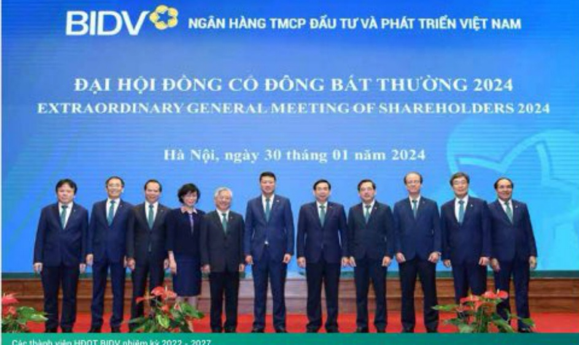

# HOẠT ĐỘNG CỦA HĐQT NĂM 2023 (tiếp theo)

# HOẠT ĐỘNG CỦA HĐQT (tiếp theo)

Quy trình, tiêu chí và kết quả đánh giá cụ thể đối với các thành viên HDQT

BIDV đã ban hành bộ chỉ tiêu đánh giá, xếp loại (KPIs) đối với Lãnh đạo cấp cao (Chủ tịch HDQT, thành viên HDQT, Tổng Giám đốc, Phó Tổng Giám đốc/ Trưởng khối, Kế toàn trường, Trưởng Ban Kiểm soát và thành viên Ban Kiểm soát). Năm 2023, cần cứ Chiến lược phát triển kinh doanh của BIDV, Nghị quyết định hướng mục tiêu, chỉ tiêu KHKD của toàn hệ thống. BIDV đã ban hành các bộ chỉ tiêu KPIs chỉ tiết áp dụng đối với Chú tịch HDQT và từng thành viên của HĐQT. Trong đó, đối với Chú tịch HDQT, bộ tiêu chỉ đánh giá bao gồm 04 chỉ tiêu chính: (i) Trách nhiệm tham gia lành đạo tập thể (được xây dựng trên cơ sở lựa chọn 3-5 chỉ tiêu tại Nghị quyết kinh doanh năm 2023); (ii) Đánh giá của các cấp liên quan (các thành viên HDQT và các thành viên Ban Diễu hành); (iii) Học hồi và phát triển; (iv) Điểm cộng. Đối với các thành viên HDQT, bộ chỉ tiêu đánh giá tương tự của Chủ tịch HDQT, bổ sung thêm tiêu chỉ về Trách nhiệm cá nhân trong chí đạo điều hành các hoạt động, lĩnh vực, đơn vị được phân công phụ trách. Công tác đánh giá, xếp loại Chủ tịch HDQT, thành viên HDQT đảm bảo công khai, minh bạch, phản ánh chính xác kết quả công việc của từng cá nhân.

Trên cơ sở kết quả kinh doanh năm 2023 của BIDV, kết quả đánh giá theo bộ chỉ tiêu KPIs, trong năm 2023, tất cả các thành viên HDQT BIDV đã hoàn thành xuất sắc nhiệm vụ được giao.

ĐẠI HỘI ĐỒNG CỐ ĐỒNG BÁT THƯỞNG 2024

EXTRAORDINARY GENERAL MEETING OF SHAREHOLDERS 2024

Các thành viên HDQT BIDV nhiệm kỳ 2022 - 2027

# ĐÁNH GIÁ HOẠT ĐỘNG CỦA THÀNH VIỆN ĐỘC LẬP HĐQT

Năm 2023, HDQT BIDV nhiệm kỳ 2022-2027 có 01 thành viên HDQT độc lập là ông Nguyễn Văn Thạnh.

Nhiệm vụ, quyền hạn và nghĩa vụ của thành viên HDQT độc lập theo quy định của pháp luật hiện hành và quy định nội bộ của BIDV, thành viên HDQT độc lập BIDV đã thảm gia vào các hoạt động của HDQT, tuần thủ quy định của pháp luật, Điều lệ BIDV và phản công công tác trong HDQT, cụ thể:

Thực hiện quyền hạn và trách nhiệm của thành viên HDQT

Thực hiện nhiệm vụ là thành viên của các Ủy ban thuộc HĐQT

Tham gia đấy dù các phiên hợp toàn thể của HDQT và các phiên hợp được triệu tập theo quy định.

Nghien cứu, có ý kiến độc lập để đánh giá tính hình, kết quả hoạt động và động góp vào việc xây dựng chiến lược, cơ chế, chính sách, phương hướng, kế hoạch hoạt động kinh doanh của BIDV trong từng thời kỳ.

Tham gia thảo luận và biểu quyết ban hành các chiến lược hoạt động, cơ chế, chính sách quy định nội bộ liên quan đến tổ chức, quản trị và hoạt động của BIDV thuộc thẩm quyền của HDQT phù hợp với quy định của pháp luật có liên quan.

Tham gia thảo luận và biểu quyết chương trình, kế hoạch hoạt động của HĐQT, chương trình, nội dung, tài liệu phục vụ hợp Đại hội cổ đăng và công tác triệu tập hợp Đại hội đăng cổ đăng hoặc lấy ý kiến cổ đăng bằng văn bản.

- Tham gia thảo luận, biểu quyết, có ý kiến độc lập về các vấn đề khác thuộc thẩm quyền của HĐT, nhằm ngăn ngừa xung đột lợi ích, đối xử công bằng giữa các cổ đông, tăng cường tính khách quan, minh bạch và đảm bảo hiệu quả chất lượng hoạt động của HĐT, bảo đảm quyền và lợi ích hợp pháp của BIDV và cổ đông của BIDV.

Tham gia tố chức triển khai, kiểm tra, giám sát thực hiện các nghị quyết, quyết định của Đại hội đồng cổ đồng và HDQT theo sự phân công của HDQT.

Đánh giá về hoạt động của HDQT để bảo cáo tại cuộc họp Đại hội đồng cổ đồng thương niên theo quy định.

Nghiên cứu báo cáo tài chính do kiểm toàn viên độc lập chuẩn bị, có ý kiến hoặc yêu cầu người quản trị, điều hành BIDV, kiểm toàn viên độc lập và kiểm toàn nội bộ giải trình các vấn đề có liên quan đến báo cáo.

Với tính chất độc lập khi tham gia HDQT, vai trò của thành viên độc lập trong HDQT BIDV đã góp phần tích cực trong việc năng cao tính khách quan, minh bệch, hiểu quả và chất lượng hoạt động của HDQT.

Tham gia thực hiện nhiệm vụ là thành viên của Ủy ban Quân lý rủi ro, Ủy ban Nhân sự và Ủy ban Chiến lược và Tổ chức; tham gia các cuộc hợp chuyên đế/định kỳ và cho ý kiến bằng văn bản đối với các nội dung liên quan đến công tác quản lý rủi ro của hệ thống, công tác quản trí chiến lược, chiến lược kinh doanh, công tác quản trị phát triển nguồn nhân lực, nhân sự, tiền thưởng, thú lao.