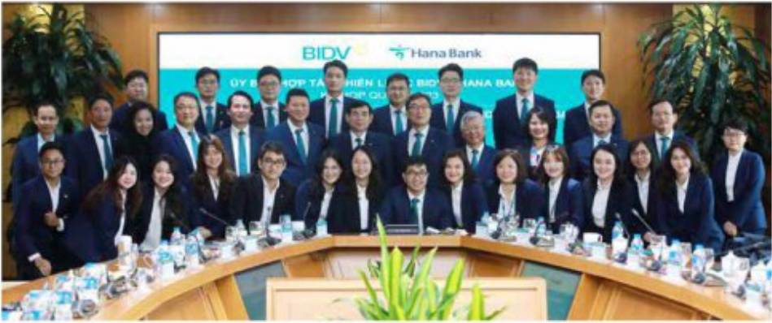

# HOẠT ĐỘNG CỦA HĐQT NĂM 2023 (tiếp theo)

# CÁC ỦY BAN (tiếp theo)

Ủy ban Công nghệ

thông tin (UBCNTT)

Ủy ban Công nghệ thông tin trực thuộc HĐQT với chức năng tham mưu, tư vấn cho HĐQT về nội dung liên quan đến công nghệ thông tin (CNTT) trong việc ban hành cơ chế, chính sách trong hoạt động CNTT, chỉ đạo, tổ chức kiểm tra giảm sát về hoạt động CNTT...

Kết quả thực hiện các nhiệm vụ của UBCNTT trong năm 2023 bao gồm:

Các phiên hợp đã tổ chức trong năm 2023: tổ chức 05 phiên hợp gồm:

- Các phiên hợp định kỳ theo Quý: 03 phiên hợp định kỳ theo Quý (Quý I, Quý II và Quý III/2023)

(i) Cấp nhất công tác thực hiện Kế hoạch CNTT, CDS và các chỉ đạo của UBCNTT hàng Quỹ;

(ii) Cập nhật tiến độ, giảm sát và chỉ đạo việc triển khai các dự án CNTT trong tâm/trọng điểm theo dùng Kế hoạch CNTT 2023 đã được phê duyệt.

(iii) Tháo gỡ các khó khăn/vương mắc trong quá trình triển khai Dự án/Phương án CNTT.

(iv) UB CNTT chỉ đạo các Ban/TT chủ động nghiên cứu các hình thức mua sầm dịch vụ CNTT mới xuất hiện trên thị trường mà chưa có văn bản quy phạm pháp luật điều chỉnh. Đến nay, BIDV đã ban hành được Văn bản số 648/QD-BIDV ngày 30/6/2023 về Quy định tam thời về việc mua sầm giải pháp phần mềm, nền tảng, hệ thống ha tăng CNTT theo hình thức thuê bao.

- Các phiên hợp chuyên đề: 02 phiên hợp chuyên đề nhằm thảo gỡ các khó khăn/vương mắc trong quá trình triển khai Dự án/Phương án CNTT.

- Tham mưu, tư vấn cho HĐQT và cho ý kiến chỉ đạo để chính sửa, hoàn thiện và ban hành Quy chế tổ chức và hoạt động của UB CNTT ban hành theo Quyết định số 423/QĐ-BIDV ngày 22/5/2023.

Tham muu và có ý kiến đối với các nội dung đâu tư mưa sớm tài sản, dịch vụ CNTT thuộc thẩm quyền phê duyệt của HDQT.

Ủy ban Hợp tác chiến

lược BIDV với Hana Bank

(UBHTCL)

Ủy ban Hợp tác chiến lược BIDV - Hana Bank được thành lập để hỗ trợ, tham mưu HĐQT

trong công tác triển khai các cam kết hộ trợ kỹ thuật, và tăng cường hiệu quả hợp tác chiến

lược giữa BIDV và Hana Bank, Tập đoàn Tài chính Hana. Các nội dung hoạt động chính

UBHTCL trong năm 2023 bao gồm:

Hoàn thành chuong trình công tác UBHTCL năm 2023 với 03 đợt xin ý kiến thành viên UBHTCL bằng văn bản, D3 chuong trình hợp UBHTCL và 01 chuong trình hợp cấp cao giữa Ban Lãnh đạo BIDV - Hana Bank vào tháng 6/2023 theo đùng Quy chế tổ chức và hoạt động của UBHTCL.

- Các nội dung kết luận, cho ý kiến của UBHTCL tập trung chỉ đạo xây dựng, hoàn thiện quy trình, đảm bảo triển khai đùng tiến độ và hiệu quả 60 dự án hợp tác hỗ trợ kỹ thuật, 12 chương trình tựa đảm chuyên môn với Hana Bank, 08 chương trình khảo sát và 01 chương trình cử cán bộ BIDV sang làm việc/học tập ngân hạn tại Hana Bank và đơn 04 đoàn chuyên gia Hana Bank sang chia sẻ trực tiếp tại BIDV.

- Tham muu, tư vấn cho HDQT nghiên cứu triển khai, áp dụng các giải pháp năng cao năng lực quản trị điều hành, kiến toàn thể chế, chuyển dối quy trình nội bộ để tiệm cận thông lệ quốc tế trên cơ sở tham khảo kinh nghiệm của Hana Bank trong ứng dụng công nghệ, phát triển sản phẩm số, quản trị rủi ro, quản trị dưới lưu, và phát triển nhân lực thông qua các dự án hợp tác kỹ thuật tiêu biểu như: Hợp tác phát triển nên khách hàng FDI Hàn Quốc, xây dựng quan hệ tin dụng với các tập đoàn lâm, đa dạng hóa các sản phẩm dành cho khách hàng doanh nghiệp trên phần mềm iBank; Hỗ trợ công tác chuyển dối Core Banking, hoàn thiện hệ thống quy định an ninh bảo một và năng lực về phòng chống thất thoát dữ liệu; Chuẩn hóa quy trình phục vụ khách hàng cá nhân cao cấp, triển khai tinh năng đối tiền ngoại tế, nhận tiền một tại quày trên SmartBanking; cải biến quy trình nghiệp vụ nội bộ thông qua dự án B.One...

