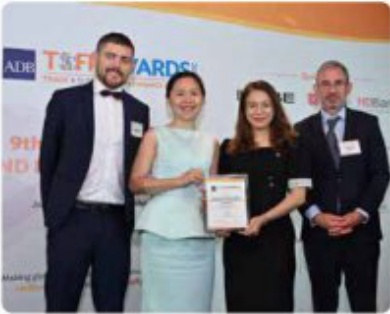
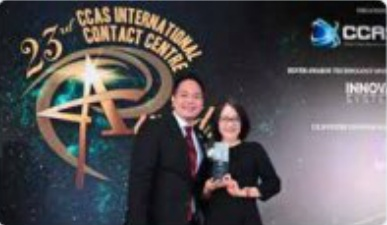
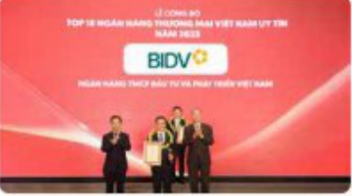
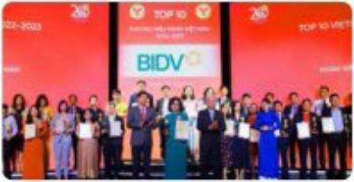
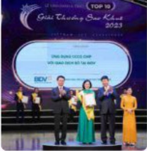
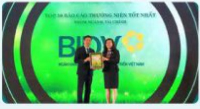
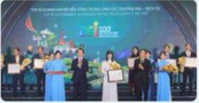

# GIẢI THƯỞNG TRONG NĂM 2023

GIẢI THƯỞNG QUỐC TẾ

ADB

NGÀN HÀNG ĐỐI TÁC HÀNG ĐẦU TẠI VIỆT NAM NĂM 2023

##### Mastercard

NGẬN HÀNG DẦN DẦU VỀ THỂ DOANH NGHIỆP NĂM 2023

NGẬN HÀNG DẦN DẦU VỀ DOANH SỐ TRÊN THỂ GHỸ NỘ

2023

### J.PMorgan

JPMorgan Chase

NGẬN HÀNG CỐ TỸ LỆ THANH TOÁN TỰ DỘNG (STP)

VỤT TRỐI

— Hiệp hội Contact Centre tại Singapore (CCAS) —

TRUNG TÂM CHẤM SỐC KHÁCH HÀNG TỰ TRIỂN KHÁI

TỐT NHẬT

J.P. Morgan Recognises

Joint Stock Commercial Bank for Investment and Development of Vietnam

##### Bank of New York Mellon

NGẬN HÀNG CÓ TỶ LỆ THANH TOÁN TƯ ĐỘNG (STP)

VƯỚT TRỐI

##### VISA

NGẬN HÀNG TẢNG TRƯỜNG ĐẦN TƯƠNG VỀ DOANH SỐ

GIAO DÍCH THỂ PHẢN KHỨC CAO CẤP NĂM 2023

NGẬN HÀNG DẦN DẦU DOÀNH SỐ THANH TOÁN THỂ

#### GIẢI THƯỞNG TRONG NƯỚC

TOP 10 NGĂN HÀNG THƯỜNG MAI VIỆT

NAM UY TÍN NHẤT

Tạp chí Kinh tế Việt Nam (VnEconomy)

- TOP 10 THƯƠNG HIỆU MẠNH NHẤT VIỆT NAM

- THỂ TÍN DỤNG QUỐC TẾ BIDV JCB ULTIMATE - TOP 50

SÁN PHẨM - DICH VỤ TIN DỪNG VIỆT NAM 2023

Giải thưởng Sao Khuê 2023 cho các sản phẩm:

HỆ THỐNG TÀI KHOÁN ĐỊNH DANH CÁ NHẬN

HỆ THỐNG CHUYỄN TIỀN QUỐC TẾ ĐA KÊNH 24/7

##### Hiệp hội Phần mềm và Dịch vụ Công nghệ thông tin Việt Nam (VINASA)

- TIẾN ICH CẢM CỔ TIẾN GỮN ONLINE TỰ ĐỘNG TRÊN ỨNG DỤNG BIDV

SMARTBANKING

- GIÁI PHÁP BIDV ICONNECT

- GIÁI PHÁP RỬT TIẾN OR HÀN QUỐC TRÊN ATM BIDV

##### Tổng Liên đoàn lao động Việt Nam

- DICH VU KHÁCH HÀNG VU TIẾN TIỂU BIỂU

• BIDV NOTIFICATION HUB (NỄN TẤNG THỒNG BÁO ĐẠY ĐA KÊNH)

THÀNH TÍCH ĐẶC BIỆT XUẤT SẮC TRONG CHƯƠNG TRÌNH

"01 TRIỆU SÁNG KIỄN - NỘ LỤC VUỘT KHỚ, SÁNG TẠO,

QUYẾT TÂM CHIẾN THẢNG DẠI DÍCH COVID 19"

HỆ THỐNG GIAO DỊCH HÀNG HÓA VĂN PHÁI SINH

HỆ SINH THÁI BIDV SMART LOYALTY

GIÁI PHÁP TÀI CHÍNH CÁ NHẨN SÁNG TẠO CHO ỨNG

DỪNG BIDV SMART KIDS

Diễn đàn cấp cao cổ vấn tại chính Việt Nam (VWAS)

- ỨNG DỤNG CẢN CƯỚC CỔNG DẠN CHIP VỚI GIAO DỊCH SỐ TẠI BIDV

Tổng Công ty lưu kỳ và bù trừ chúng khoản Việt Nam

NGẢN HÀNG LƯU KỸ GIÁM SÁT TIẾU BIỂU NĂM 2023

Số Giao dịch chúng khoản TP. HCM

NGẬN HÀNG THANH TOÁN TIẾN GIAO DÍCH CHỮNG

KHOÁN CỔ SỐ 2023

TOP 10 BÁO CÁO THƯỜNG NIỆN TỐT NHẤT

- NHỐM NGÀNH TÀI CHÍNH

NGÀN HÀNG TIỀU BIỂU 2023

Công ty Cổ phần Thanh toàn Quốc gia Việt Nam (NAPAS)

— Liên đoàn Thương mại và Công nghiệp Việt Nam (VCCI)

TOP 10 DOANH NGHIỆP BẾN VỮNG LỄNH VỰC

THƯƠNG MAI - DICH VU