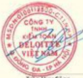

# BÁO CÁO KIỂM TOÁN ĐỘC LẬP

#### Deloitte.

S6:0981/VNIA-HN-BC

Công ty TNHH Kiểm toán

Deloitte Việt Nam

Tăng 15. Tôi mất Viwanne,

34 Làng Hạ, Phương Làng Hạ,

Quận Đồng Đà, Hạ Hạ, Việt Nam

Bán thun: +84 24 7105 6000

Fax: +84 24 6288 5678

www.deloitte.com/en

BẢO CẢO KIẾM TOÁN ĐỘC LẬP

kinh gai:

Các cổ đông

Hội đồng Quản trị và Ban Điều hành

Ngìn hàng Thương mại Cổ phần Đầu tư và Phật triển Việt Nam

Chúng tôi đã kiểm toàn báo cáo tài chính hợp nhất kèm theo của Ngân hàng Thương mại Có phần đầu từ và Phát triển Việt Nam (gọi tất là "Ngân hàng"), được lập ngày 22 tháng 3 năm 2024, từ trang 05 đến trang 68, bao gồm báo cáo tính hình tài chính hợp nhất tại ngày 31 tháng 12 năm 2023, báo cáo kết quả hoạt động hợp nhất, báo cáo lưu chuyển tiền tệ hợp nhất cho năm tài chính kết thúc cùng ngày và Bản thuyết minh báo cáo tài chính hợp nhất.

##### Trách nhiệm của Ban Điều hành

Ban Điều hành Ngân hàng chịu trách nhiệm về việc lập và trình bày trung thực và hợp lý bảo cáo tài chính hợp nhất của Ngân hàng theo chuẩn mực kế toàn, chế độ kế toàn áp dụng cho các tổ chức tín dụng tại Việt Nam và các quy định pháp lý có liên quan đến việc lập và trình bày bảo cáo tài chính hợp nhất và chịu trách nhiệm về kiểm soát nội bộ mà Ban Điều hành xác định là cần thiết để đảm bảo cho việc lập và trình bày bảo cáo tài chính hợp nhất không có sai sát trong yếu do giản lãnh hoặc nhằm lẫn.

##### Trách nhiệm của Kiểm toán viên

Trách nhiệm của chúng tôi là đưa ra ý kiến về bảo cáo tài chính hợp nhất dựa trên kết quả của cuộc kiểm toàn. Chúng tôi dễ tiến hành kiểm toàn theo các chuẩn mực kiểm toàn Việt Nam. Các chuẩn mực này yêu cầu chúng tôi tuần thù chuẩn mực và các quy định về đạo đức nghề nghiệp, lập kế hoạch và thực hiện cuộc kiểm toàn để đạt được sự đảm bảo hợp lý về việc liệu bảo cáo tài chính hợp nhất của Ngân hàng có còn sai sát trọng yếu hay không.

Công việc kiếm toán bao gồm thực hiện các thủ tục nhằm thu thập các bảng chứng kiếm toàn về các số liệu và thuyết minh trên báo cáo tài chính hợp nhất. Các thủ tục kiếm toàn được lựa chọn dựa trên xét đoán của Kiểm toàn viên, bao gồm đánh giá rủi ro có sai sát trong yếu trong báo cáo tài chính hợp nhất do gian liên hoặc nhằm liễn. Khi thực hiện đánh giá các nội ro này, Kiểm toàn viên đã xem xét kiếm soát nội bộ của Ngân hàng liên quan đến việc lập và trình bày báo cáo tài chính hợp nhất trung thực, hợp lý nhằm thiết kế các thú tục kiếm toàn phú hợp với tính hình thực tế, tuy nhiên không nhằm mục đích dura ra ý kiến về hiệu quả của kiếm soát nội bộ của Ngân hàng. Công việc kiếm toàn công bao gồm đánh giá tính thích hợp của các chính sách kế toán được áp dụng và tính hợp lý của các ước tính kế toán của Bản Điều hành công như dành gửi việc trình bày tổng thể báo cáo tài chính hợp nhất.

Chúng tôi tin tưởng rằng các bằng chứng kiểm toàn mà chúng tôi đã thu thập được là đầy đủ và thích hợp làm cơ sở cho ý kiến kiểm toàn của chúng tôi.

#### Deloitte.

##### BÁO CÁO KIẾM TOÁN ĐỘC LẬP (Tiếp theo)

### Y kiểm của kiểm toàn viên

Theo ý kiến của chúng tôi, báo cáo tài chính hợp nhất đã phần ảnh trung thực và hợp lý, trên các khía cạnh trong yếu, tính hình tài chính hợp nhất của Ngân hàng tại ngày 31 tháng 12 năm 2023, cũng như kết quả hoạt động hợp nhất và tính hình lưu chuyển tiền tệ hợp nhất cho năm tài chính kết thúc cùng ngày, phù hợp với chuẩn mực kế toàn, chế độ kế toàn áp dụng cho các tổ chức tín dụng tại Việt Nam và các quy định pháp lý có liên quan đến việc lập và trình bày bảo cáo tài chính hợp nhất.

Tran Huy Công

Phó Tổng Giám độc

Giấy chứng nhận đăng ký hành nghệ

kiểm toàn số 0891-2023-001-1

CỘNG TY TNHH KIỂM TOÁN DELOITTE VIỆT NAM

Đoàn Điệu Huyền

Kiểm toàn viên

Giấy chứng nhận đăng ký hành nghệ

kiểm toàn số 5593-2020-001-1

Ngày 22 tháng 3 năm 2024

Hà Nội, CHUHCN Việt Nam